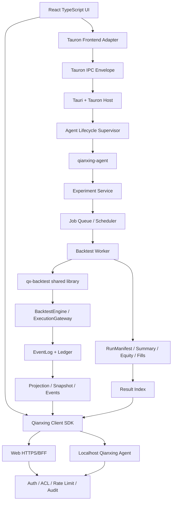

# Qianxing × Tauron 一体化桌面客户端终版方案

> 目标产品：Qianxing Desktop —— 以 Tauron 为桌面客户端底座，以 Qianxing 为量化研究、回测、Paper 和交易核心，同时提供可复用的 Web 界面。
> Qianxing 审计基线：`f574572ca039f4553ce9a4362ebfb827c3768302`。
> 基线状态（V13 R1-F 补注，2026-10-04）：`f574572` 现在是 HEAD `c07ad22` 的祖先、相隔 3 个提交。`c07ad22` 是一次按上游树整体裁定 22 份冲突的合流——下游第 8 轮（`532cea0` + `7e8f3db`）交付的一批门禁判据与模块被上游版本覆盖，已按用户裁定「以上游发布线为准（现状）」登记为**已回退，未排期**，不整批重落（名册见 `docs/自研量化框架审计与重构方案-V13.md` §9.48 / 台账 #283）。因此本文对 Qianxing 侧的行号引用与"当前实现"清单在用于 HEAD 之前必须重新实测；产品结构与 Tauron 侧的**方案本身不受此影响**。
> Tauron 审计基线：`74bf2ccd05d2e3252aa34f7b535af72faee7d88e`。
> 参考仓库：[Qianxing](https://github.com/coeasy/qianxing) · [Tauron](https://github.com/coeasy/tauron)。

## 1. 最终决策

采用“一个前端、两种宿主、一个 Qianxing 核心服务”的产品结构：

```text
React / TypeScript UI
  ├─ Web 浏览器模式：HTTPS -> BFF -> Qianxing API
  └─ Tauron 桌面模式：Tauri WebView -> Tauron IPC + 本机 Qianxing Agent
                                      │
                                      ├─ 回测 Experiment Service
                                      ├─ Paper / Runtime API
                                      ├─ EventLog / Ledger / Projection
                                      └─ Artifact / RunManifest / Result Index
```

核心原则：

- Tauron 负责桌面窗口、插件治理、权限、生命周期、设置、主题、托盘、崩溃恢复、更新入口和宿主能力。
- Qianxing 负责数据、策略、回测、撮合、费用、风险、Ledger、EventLog、账户投影和运行产物。
- Web UI 与桌面 UI 使用同一套 TypeScript 页面和客户端契约。
- 桌面端不把 Qianxing 内核复制进前端，也不把所有 Qianxing API 改写成一套重复的 Tauri command。
- Qianxing 的本地服务只监听回环地址和随机端口；远程 Web 部署仍通过 HTTPS、BFF、Operator 认证和审计访问。
- Tauron 插件不能直接写 Qianxing 状态；所有研究、回测和交易动作必须经 Qianxing 服务端校验。

## 2. Tauron 当前能力与接入边界

Tauron 是基于 Tauri 2 的插件化桌面客户端基础设施，不是已经完成的 Qianxing 成品客户端。当前仓库提供的真实接入面包括：

- `plugin_invoke`、`plugin_cancel`、`plugin_emit` 信封和进度通道。
- Tauri 静态 ACL + Tauron 动态 ACL 的双层授权。
- 插件注册表、事件总线、生命周期状态机、配置合并、设置中心、主题、i18n、通知、菜单和托盘。
- React/Vue/Svelte 适配层与 TypeScript/Rust 跨语言契约。
- `tauron-host`、`tauron-shell`、`tauron-settings`、`tauron-recovery`、`tauron-distribute` 等宿主能力。
- 示例应用 `examples/minimal-app` 展示 Tauri 2 装配、命令注册和 capability 配置。

必须显式保留的成熟度边界：

| Tauron 能力 | 当前判断 | Qianxing 产品处理 |
| --- | --- | --- |
| JS / Process 插件执行 | 有真实执行路径 | 用于 UI 扩展、分析任务和受控 worker |
| Rust / Wasm 插件形态 | 当前会诚实失败或尚无生产 runtime | 不作为 MVP 策略运行时依赖 |
| dual-world 进程内沙箱 | 当前为 fail-closed 模拟边界 | 自定义策略先使用独立 Process worker |
| Shell 矩阵 | 接口已定义，部分运行时为模拟原型 | MVP 只使用本地 Tauri WebView 和本机 Agent |
| 更新下载、验签、替换、重启、回滚 | Tauron 提供抽象和测试组件，应用侧仍需装配生产执行链 | Qianxing Desktop 单独完成签名、sidecar 更新和回滚验收 |
| 插件市场安装 | 部分宿主市场命令仍是接入点或桩 | MVP 不开放任意第三方插件市场，只允许签名白名单包 |

因此，最终产品不能直接宣称“继承 Tauron 后自动获得完整插件沙箱和自动更新”；这些能力必须在 Qianxing Desktop 集成层接线并通过独立验收。

## 3. 产品分层

### 3.1 Qianxing Desktop Host

使用 Tauron Application Layer 和 Tauri 2 作为桌面宿主，负责：

- 主窗口、设置窗口、日志窗口、任务窗口和策略编辑窗口。
- 启动、停止、重启和恢复 Qianxing Agent。
- 管理本地工作区、数据目录和缓存目录。
- 管理桌面权限、文件选择、导入导出、通知、快捷键和托盘。
- 展示 Qianxing Agent 健康状态和版本状态。
- 处理客户端更新、崩溃恢复、诊断包和安全退出。

### 3.2 Qianxing Agent

建议把 Qianxing 的 API、实验编排、回测 worker 管理和本地存储装配为独立本机进程 `qianxing-agent`，而不是直接塞进 Tauri UI 线程。

Agent 负责：

- 监听 `127.0.0.1` 的随机端口。
- 使用一次性 session token 与桌面端建立可信连接。
- 提供现有 qx-api 读面和新增 `/research` 回测实验 API。
- 启动和监督回测 worker。
- 维护 Experiment、Run、Dataset、Artifact Index。
- 写入 EventLog、Ledger、RunManifest、summary、equity、fills。
- 在 Agent 重启后恢复 queued/running 任务状态。

这样可以让 Web 模式与桌面模式共用同一套后端协议，也可以把 Agent 单独部署到服务器或研究集群。

### 3.3 Web UI

Web UI 是唯一业务界面代码，桌面端只提供 Tauron 宿主能力。推荐 React + TypeScript，使用 Tauron 的 React 适配层和统一的 Qianxing client SDK。

UI 不直接调用 Tauri 原生能力以外的隐藏接口；所有量化业务请求都走：

- Web 模式：HTTPS/BFF -> Qianxing API。
- 桌面模式：本机 Agent HTTP/WebSocket。
- Tauron IPC：仅用于窗口、文件、通知、插件能力和 Agent 生命周期。

## 4. 总体架构



### 4.1 三个权限边界

```text
Tauri ACL
  -> Tauron dynamic ACL
    -> Qianxing API authentication / scope / rate limit
      -> domain validation / risk gate / audit
```

权限不能只停留在 Tauri capability 文件中。即使恶意前端成功调用 Tauron IPC，也必须在 Qianxing API 和领域层再次校验。

## 5. 桌面端启动与生命周期

### 5.1 启动流程

```text
Tauri app start
  -> Tauron HostState init
  -> load desktop settings and workspace
  -> validate app capability and local paths
  -> allocate random loopback port
  -> generate in-memory session token
  -> spawn qianxing-agent
  -> wait /ready
  -> negotiate schema and engine version
  -> load Web UI
  -> connect snapshot + scoped WebSocket
```

启动失败必须按阶段返回稳定状态：

- `host_starting`：宿主已启动，Agent 尚未就绪。
- `agent_starting`：Agent 进程已启动，依赖检查进行中。
- `agent_ready`：API、存储、数据目录和运行时配置均可用。
- `agent_degraded`：只读能力可用，但某项依赖不可用。
- `agent_failed`：启动失败，带稳定错误码和诊断引用。

### 5.2 停止与恢复

- 关闭窗口先发送 graceful shutdown。
- Agent 停止接收新任务，已有 worker 进入取消或收口流程。
- WebSocket 发送 `server_shutdown` 后关闭。
- 保存当前 Experiment/Run 状态和最后事件游标。
- Tauron recovery 记录上次退出原因。
- 下次启动先恢复状态，再决定是否重试；不能把 running 直接伪装成 succeeded。

### 5.3 Tauron Host 命令

建议仅增加少量宿主命令，不把 Qianxing 所有 API 展平成 Tauri commands：

| 命令 | 作用 |
| --- | --- |
| `host_qx_agent_start` | 启动本机 Agent |
| `host_qx_agent_stop` | 优雅停止 Agent |
| `host_qx_agent_restart` | 受控重启 Agent |
| `host_qx_agent_status` | 返回 pid、端口、版本、状态和诊断引用 |
| `host_qx_workspace_open` | 打开受控工作区 |
| `host_qx_diagnostics_export` | 导出脱敏诊断包 |
| `host_qx_update_apply` | 进入已验签的应用更新流程 |

回测、数据集、实验和结果接口继续通过 Qianxing HTTP/WebSocket API 提供，确保 Web 和桌面端协议一致。

## 6. Qianxing 回测 Web 功能

### 6.1 MVP 功能

- 选择 BarFrame/Dataset、标的、周期、日期范围和数据质量状态。
- 选择内置策略或声明式策略。
- 配置费用、滑点、延迟、撮合模型、市场规格和初始资金。
- 运行单次回测。
- 运行参数网格、用户组合列表和固定 seed 的随机搜索。
- 查看任务状态、进度、日志、错误、取消和恢复。
- 查看收益、回撤、成交、费用、换手和风险指标。
- 比较多个 run，绘制曲线、热力图和 Pareto 前沿。
- 下载 summary、equity、fills、RunManifest 和复现配置。

### 6.2 实验领域模型

```text
Experiment
  -> ExperimentSpec
  -> ParameterPlan
  -> Run[]
  -> ResultIndex
  -> AnalysisView
```

核心实体：

| 实体 | 说明 |
| --- | --- |
| Dataset | 已验证 BarFrame/深度帧及输入指纹 |
| StrategyPackage | 策略 manifest、schema、版本和代码哈希 |
| Experiment | 一组参数计划和运行约束 |
| Run | 一个确定参数组合的一次不可变执行 |
| Artifact | summary、equity、fills、manifest、log 引用 |
| Analysis | 对多个兼容 run 的聚合、排序和可视化结果 |

### 6.3 Run 状态机

```text
draft -> validating -> queued -> running
                               ├-> succeeded
                               ├-> failed
                               ├-> cancelled
                               └-> expired
```

状态约束：

- `queued` 必须经过完整 schema、数据指纹、权限、配额和参数数量校验。
- `running` 必须绑定 worker lease 和心跳。
- `succeeded` 必须同时有 RunManifest、summary、result_hash 和 metrics index。
- `failed` 必须包含阶段、稳定错误码和可读诊断。
- 终态不可回退；重跑必须生成新的 run 或明确命中幂等缓存。

## 7. 自定义策略和 Tauron 插件结合方式

### 7.1 插件分类

| 插件 | 承载方式 | 能力 |
| --- | --- | --- |
| UI Plugin | Tauron JS plugin | 增加页面、面板、图表和分析视图 |
| Analysis Plugin | Tauron JS/Process plugin | 读取受控结果，生成额外指标和图表 |
| Strategy Package | Qianxing Strategy Worker | 产生受控 StrategyIntent，不直接写账簿 |
| Data Provider | Qianxing Agent adapter | 导入并生成已指纹化 Dataset |
| Host Capability Plugin | Tauron Host plugin | 文件、通知、窗口、设置和诊断 |

不建议把量化策略直接当成普通 UI 插件。策略应由 Qianxing Strategy Worker 运行，并经过独立的输入、输出、资源和风险校验。

### 7.2 策略开放顺序

| 阶段 | 方式 | 说明 |
| --- | --- | --- |
| P0 | 内置策略 + 声明式 JSON/YAML 策略 | 无任意代码执行，最容易复现 |
| P1 | 独立 Process strategy worker | 资源限制、网络隔离、只读数据、可取消 |
| P1 | WASM strategy worker | 等 Tauron WASM runtime 真正可用并完成沙箱验收后再开放 |
| P2 | Rust/C++ 编译策略包 | 签名、编译隔离和 ABI 兼容成熟后开放 |

### 7.3 策略包 manifest

必须包含：

- `strategy_id`、版本、作者和代码包哈希。
- 参数 schema、默认值、类型、上下界和枚举。
- 输入数据层级、周期、市场类型和必需字段。
- 输出 schema，只允许信号或标准 OrderIntent。
- 依赖锁定、运行时版本和资源预算。
- 是否允许网络、文件、随机数和时间读取。
- 签名、信任来源和撤销状态。

策略执行环境必须不能读取交易所密钥、不能访问公网、不能写入 Qianxing 正式存储，超时和输出异常必须进入 failed 终态。

## 8. API 与 IPC 契约

### 8.1 Qianxing API

保留现有 `/health`、`/ready`、`/metrics`、账户投影、`/events/live` 和控制面。新增研究命名空间：

| 方法 | 路径 | 作用 |
| --- | --- | --- |
| `POST` | `/research/datasets` | 注册或导入 Dataset |
| `GET` | `/research/datasets` | 查询授权数据集 |
| `POST` | `/research/strategies/validate` | 校验策略 manifest |
| `POST` | `/research/experiments` | 创建实验并校验参数计划 |
| `GET` | `/research/experiments/{id}` | 实验详情和展开统计 |
| `POST` | `/research/experiments/{id}/runs` | 展开并入队 run |
| `POST` | `/research/experiments/{id}/cancel` | 取消实验 |
| `GET` | `/research/experiments/{id}/runs` | 分页查询 run |
| `GET` | `/research/runs/{id}` | 单次运行详情 |
| `POST` | `/research/runs/{id}/cancel` | 取消单次运行 |
| `GET` | `/research/runs/{id}/artifacts/{name}` | 下载受控产物 |
| `GET` | `/research/compare` | 对比兼容 run |
| `POST` | `/research/analysis` | 创建分析任务 |
| `GET` | `/research/analysis/{id}` | 获取分析结果 |

所有接口进入统一的认证、限流、CORS、账户/项目 scope、schema、审计和错误码边界。

### 8.2 Tauron IPC

Tauron IPC 只承载桌面宿主能力：

- `host_qx_agent_start/stop/status`。
- `host_qx_workspace_open`。
- 文件选择和受控导入。
- 通知、托盘、窗口、设置和诊断。
- 插件页面的 invoke/cancel/progress。
- 更新检查、验签状态、安装进度和回滚结果。

不建议通过 `plugin_invoke` 传输大规模 equity/fills 数据；大数据走 Qianxing artifact API，IPC 只传引用、进度和状态。

### 8.3 事件

Qianxing 事件通过 scoped WebSocket 推送：

- `experiment_created`。
- `run_queued`、`run_started`、`run_progress`。
- `run_succeeded`、`run_failed`、`run_cancelled`。
- `analysis_completed`。
- `agent_degraded`、`server_shutdown`。

进度事件必须采样和限频，完整日志、成交和资金曲线使用 artifact 分页读取。

## 9. 数据与存储

### 9.1 桌面目录

```text
Qianxing Desktop Data/
  config/
  workspaces/
  datasets/
  runs/
  artifacts/
  logs/
  cache/
  recovery/
  updates/
```

Tauron 只负责授权目录访问和设置管理；Qianxing 负责内部文件 envelope、原子替换、锁、指纹和恢复。

### 9.2 存储分层

| 数据 | 存储 |
| --- | --- |
| Experiment/Run/Job 元数据 | SQLite（桌面）/Postgres（服务端） |
| BarFrame/深度帧 | 文件或对象存储，按 digest 寻址 |
| summary/metrics | 数据库索引 + 原始 JSON |
| equity/fills/logs | artifact store |
| EventLog/Ledger | Qianxing 现有存储边界 |

Result Index 只做查询加速，不能替代 RunManifest 和原始产物。成功状态必须在产物完整写入后提交。

## 10. 安全设计

### 10.1 桌面本地连接

- Agent 仅绑定 `127.0.0.1`，不监听局域网地址。
- 端口随机生成，不固定使用常见端口。
- Tauron Host 生成内存 session token，UI 通过安全启动握手获取。
- Agent 校验 Origin、token、协议版本和客户端实例 ID。
- token 不写入配置文件、URL、日志和崩溃报告。
- 关闭应用时 token 立即失效。

### 10.2 Tauron ACL

至少配置三层 capability：

1. `desktop-core`：窗口、设置、通知、托盘和生命周期。
2. `qianxing-agent`：启动、停止、状态、诊断和 workspace。
3. `research-plugin`：只允许读取授权结果和提交实验，不允许任意文件和网络。

Tauri 静态 ACL 和 Tauron 动态 ACL 都必须 fail closed；未声明命令不能因前端传入名称而自动可用。

### 10.3 Qianxing 领域安全

- Dataset、StrategyPackage、Experiment、Run 和 Artifact 全部带 owner/project scope。
- 结果下载必须验证权限，不能通过 run_id 枚举其他项目。
- 控制命令继续走 Operator、权限、审计和幂等校验。
- 自定义策略不能接触 venue secret、控制面存储和正式 Ledger。
- Web 模式优先使用同源 BFF；直接浏览器访问时必须精确 CORS 和 CSRF 防护。

## 11. 更新、安装和发布

### 11.1 发布物

每个平台发布一个经过签名的 Qianxing Desktop 安装包，内部包含：

- Tauron/Tauri 宿主。
- 前端静态资源。
- `qianxing-agent` sidecar。
- 受信任的策略模板和 UI plugin manifest。
- schema、OpenAPI、版本和构建身份。

Qianxing Agent 与桌面壳必须有兼容矩阵：

| Desktop | Agent | Web/API schema | 结果 |
| --- | --- | --- | --- |
| 同版本 | 同版本 | 同版本 | 直接使用 |
| 新壳 | 旧 Agent | 兼容版本 | 提示升级或受限模式 |
| 旧壳 | 新 Agent | 不兼容版本 | 禁止启动，要求升级 |

### 11.2 Tauron 更新能力的接线

Tauron 的 `tauron-distribute` 提供更新 manifest、签名验证、下载器和升级状态抽象，但当前接入方仍需要把执行链装配到真实应用。

Qianxing Desktop 必须补齐：

- Windows/macOS/Linux 产物签名。
- 更新包签名和公钥轮换。
- sidecar、前端和宿主的原子替换。
- 旧版本备份、失败回滚和启动自检。
- 下载中断恢复和磁盘空间检查。
- 1% -> 5% -> 25% -> 100% 灰度发布。
- 崩溃率和 Agent 启动失败率自动停发。

未完成上述接线和演练前，UI 只能显示“有新版本”，不能宣称“一键安全更新已生产可用”。

### 11.3 开发依赖策略

Tauron 当前源码版本与 registry 发布状态可能不同，Qianxing Desktop 的依赖必须固定到已审计 commit 或已发布的不可变版本，禁止依赖 `main` 或浮动 `latest`。

推荐：

- 开发阶段：git revision `74bf2ccd05d2e3252aa34f7b535af72faee7d88e` 或本地 path dependency。
- 预发布阶段：发布已验证的 Tauron 版本，并锁定 Cargo.lock/pnpm-lock。
- 生产阶段：只消费签名、可复现、经过 SBOM 和构建证明的 Tauron/Qianxing 组件。

## 12. 工程仓库组织

推荐新增独立产品仓库 `qianxing-desktop`，不直接把 Tauri 依赖塞入 Qianxing 核心 workspace：

```text
qianxing-desktop/
  apps/desktop-ui/
  src-tauri/
  packages/qianxing-client/
  packages/qianxing-contract/
  packages/qianxing-plugin-sdk/
  crates/qianxing-agent/
  crates/qianxing-desktop-bridge/
  tauron.lock / Cargo.lock / pnpm-lock.yaml
```

Qianxing 核心仓库增加可被 Agent 复用的库 crate：

```text
qianxing/
  crates/qx-backtest/
  crates/qx-experiment/
  crates/qx-api/
  crates/qx-runtime/
```

CLI、Agent 和未来远程服务都依赖 `qx-backtest` 与 `qx-experiment`；不要从客户端仓库复制 `qx-cli/src/backtests`。

## 13. 实施阶段与优先级

### P0：形成可运行桌面产品

- 抽取 `qx-backtest` 共享库，CLI 与 Agent 统一调用。
- 建立 `qianxing-agent`，接入现有 qx-api、存储和事件。
- Tauron Tauri app 接入 Agent 生命周期、状态、恢复和安全本地 token。
- React Web UI 接入同一 Qianxing client SDK。
- 完成单次回测 API、Run 状态和基础 summary 页面。
- 固定 Tauron commit，完成最小 capability 和签名构建。

### P1：参数实验和研究工作台

- Experiment/Run/Dataset/Artifact schema。
- 参数 grid/list/random、并行度、配额和幂等。
- fast-backtest 复用为 worker pool。
- scoped research events、进度、取消、重启恢复。
- equity、fills、回撤、指标表、曲线和多 run 对比。
- 结果索引、导出、复现包和审计。

### P1.5：受控策略扩展

- 声明式策略。
- Process strategy worker 沙箱。
- 策略签名、依赖锁定、资源配额、无网络和只读数据。
- Tauron UI plugin 与 Qianxing Strategy Package 解耦。

### P2：高级能力和规模化发布

- WASM 策略 runtime，前提是 Tauron 对应 runtime 不再是占位。
- 深度回测、多腿组合和跨市场归因。
- 远程研究集群和对象存储。
- 插件市场、灰度更新、自动回滚和多租户。
- finkit 已验证研究快照接入。

## 14. 测试和验收

### 14.1 客户端链路

- Tauri 启动后能启动 Agent 并通过 `/ready`。
- Agent 重启不丢 Experiment/Run 状态。
- UI 能识别 Agent starting/ready/degraded/failed。
- 窗口关闭能优雅停止 Agent，旧 WebSocket 收到 `server_shutdown`。
- Agent 端口、token 和 workspace 不泄漏到日志。

### 14.2 回测一致性

- CLI、Agent、桌面端对同一输入得到相同 `result_hash`。
- 相同 experiment/input/engine/parameter 命中幂等结果。
- 改数据、策略、成本、规则、撮合或引擎版本会改变对应指纹。
- 篡改 RunManifest、summary、equity 或 fills 会被检测。
- 取消、超时、worker 崩溃和重启不会生成虚假成功。

### 14.3 插件和策略安全

- 未授权 plugin command 被 Tauron ACL 拒绝。
- UI plugin 不能读未授权文件或网络。
- Strategy Worker 不能访问 secret、正式存储和公网。
- 大输出、恶意依赖、路径穿越、压缩炸弹和超时均被拒绝。
- Rust/Wasm 未有真实 runtime 时明确失败，不伪造成功。

### 14.4 发布验收

- Windows/macOS/Linux 安装包可安装、启动、升级和回滚。
- Agent sidecar 与宿主版本兼容矩阵通过。
- 包、sidecar、前端和 manifest 均完成签名验证。
- 灰度发布能按崩溃率停发。
- 崩溃恢复和诊断包不包含策略密钥、交易所密钥和 Operator 私钥。
- workspace tests、clippy、fmt、Tauron TS tests、契约测试、E2E 和长时间运行测试通过。

## 15. 最终产品链路

```text
用户安装 Qianxing Desktop
  -> Tauron/Tauri 宿主启动
  -> HostState + ACL + settings + recovery
  -> 启动 qianxing-agent
  -> Agent /ready + schema negotiation
  -> React UI 建立本机 HTTP/WebSocket 连接
  -> 用户选择 Dataset、策略和参数
  -> Experiment Service 校验并展开 Run
  -> Backtest Worker 调用 qx-backtest
  -> Engine 生成 EventLog/Ledger/RunManifest/summary/equity/fills
  -> Result Index 建立可查询指标
  -> scoped events 推送进度
  -> UI 展示曲线、热力图、对比和复现信息
  -> Tauron 负责通知、诊断、更新和桌面生命周期
```

## 16. 终版结论

Qianxing 与 Tauron 的正确结合方式不是把 Qianxing 改造成 Tauron 插件，也不是把所有 Qianxing API 改成 Tauri command，而是：

- Tauron 做受控桌面宿主。
- Qianxing Agent 做本机或远程业务服务。
- Qianxing 核心库做唯一回测、撮合、Ledger 和事实链。
- React/TypeScript 做唯一业务界面。
- Web 和桌面共享同一个客户端契约。
- UI 插件、策略包、数据适配器分别受 Tauron ACL 和 Qianxing 领域校验约束。

采用该架构后，桌面客户端、Web 客户端、参数实验、策略扩展、Paper 和后续生产交易可以共用同一条事实链，同时避免 UI、Tauron 插件和 Qianxing 核心之间形成循环依赖或重复状态机。

---

## 归档状态（2026-10-09，本节由归档动作追加）

本文于 2026-10-09 从 `docs/` 移入 `docs/archive/`。原因：本仓代码里**没有** Tauron / Tauri 集成的任何实现面（2026-10-09 全仓扫描 `crates/`、`web/`、`python/`、`deploy/`、`tools/`、`schemas/`、`.github/` 七处目录，`tauron` 与 `tauri` 关键字 0 命中）；桌面 Host 属 M4' 未关闭项，本文留在归档里只作为当时的设计取舍记录。

文中所有行数、门禁条数、用例数与「已落地」表述都是**那一轮工作树的快照**，不代表今天。现状只有一个来源：
根目录 [`README.md`](../../README.md) 的「交付面一览」与「版本与现状」、[`../../deploy/README.md`](../../deploy/README.md)、
[`../自研量化框架审计与重构方案-V13.md`](../自研量化框架审计与重构方案-V13.md) 与 [`../../CHANGELOG.md`](../../CHANGELOG.md)。

归档动作只改三处：文件位置、本节，以及把指向同批归档文档的路径提及补上 `archive/` 那一段。
正文结论一字未改，也不追改。本节刻意追加在**文末**而不是标题下：活文档里有按行号的取证
（例如 V13 记录了本文某几行按代码事实重写），插在顶部会让那些行号整体下移。索引见 [`README.md`](README.md)。
