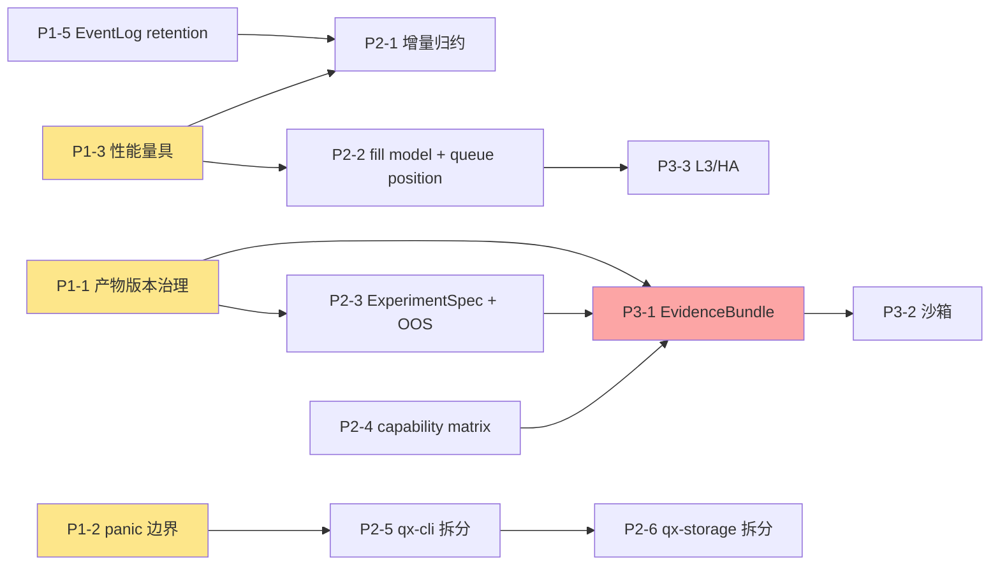

# 牵星 Qianxing — 架构不合理清单、细节改进项与优化重构方案

> 报告日期：2026-10-10 ｜ 分析对象：`D:/aex_work/qianxing`（HEAD = `166eca1`，V13 R30）
> 报告类型：Competitive Analysis Stage 3（差距分析）+ Stage 4（竞争战略与优先级排序）
> 输入：本项目源码实测 + 既有 12 份自研文档 + `竞品全景图与架构对标-牵星Qianxing-2026-10-10.md`
> 事实口径：仓库内事实为**代码级确认**（文件:行）；竞品事实为**文档级**（沙箱内 git clone 被阻断，未做本地克隆）

---

## 0. 结论摘要（Top 10，按严重度排序）

| # | 问题 | 等级 | 一句话 |
|---|---|---|---|
| 1 | **深档撮合没有队列位置/延迟模型** | 🔴 致命 | L2 按帧全深度吃单会系统性高估成交；hftbacktest 的 `partialfillexchange` + queue model 已是行业标准 |
| 2 | **研究层空白**：无实验规格 / walk-forward / OOS / 参数寻优 | 🔴 致命 | 研究者第一天就会回到 vectorbt（API 更顺、图更直观、扫描更快） |
| 3 | **`qx-cli` 50,231 行 / 全仓 37.9%**，是唯一 binary 且承载装配中枢 + 全部子命令 + 184 个测试文件 | 🔴 致命（工程可持续性） | 单 crate 熵增已经越过「可维护」临界点 |
| 4 | **EventLog 每 tick 重放整本日志（O(n) per tick → 近似 O(n²) per run）**，且无 retention/compaction | 🔴 致命（性能上限） | 确定性内核本身就是性能瓶颈，N=8000 时单 tick 空转已 0.09s |
| 5 | **文档-代码强耦合门禁**：940 条不变量把 README 计数当断言，门禁脚本自身 15,605 行 | 🟠 重要 | 门禁成了第二套代码库；贡献者「改错一个字就红」，同时它只证明「已登记的没坏」 |
| 6 | **产物层版本治理有真实漏洞**：16 份 blessed summary 停在 schema_version 1（代码已 v5）且无用例守护；多腿链无 RunManifest | 🟠 重要 | 「可审计」是护城河，但产物版本治理在漏水 |
| 7 | **无性能基线**：无 criterion，`targets.yaml` 全 `unmeasured` | 🟠 重要 | 「高性能」是未证主张；没有量具就不该谈重构收益 |
| 8 | **`unwrap/expect` 面大**：src 非测试约 1,340 + 745，热点在 HTTP/存储/管线/执行 | 🟠 重要 | 长运行 worker 里 panic = 可用性事故，而这是唯一 binary 的致命点 |
| 9 | **数据平面三 crate 边界模糊**（`qx-data` 2,359 / `qx-guanxing` 577 / `qx-provider` 743） | 🟡 次要 | 25 个 crate 与实际复杂度不匹配，认知与编译成本虚高 |
| 10 | **自研 HTTP 无协议级验证**（`http_surface.yaml` 自陈 chunked=gap） | 🟡 次要 | 自造的协议正确性缺 fuzz/长头/慢客户端验证 |

> **定量结论**：架构「正确性/信任层」领先全部对照竞品；「研究层/性能层/生态层」落后主流；「工程可持续性」是当前最被低估的风险。

---

## 第一部分：架构设计不合理清单（含根因与影响）

### A1 🔴 深档撮合缺队列位置与延迟模型

| 项 | 内容 |
|---|---|
| **证据** | 三套硬编码内核：`BarMatchingEngine`（`qx-xingban/src/backtest.rs:305-420`）、`TickBacktestEngine::run`（`tick_backtest.rs:175`）、`OrderBookBacktestEngine::run`（`orderbook_backtest.rs:266`）；README 明确「`l2` 按帧带的全部深度吃单」 |
| **根因** | 撮合模型是**编译期硬编码的三条分支**，不是可组合的 processor 链。加一个 fill model 必须改内核、加门禁、加文档计数 |
| **竞品对照** | hftbacktest `proc/{nopartialfillexchange, partialfillexchange, l3_*}` 把撮合做成可组合 processor，并显式建模**队列位置**（queue position）与 entry/response latency |
| **影响** | ①L2 回测系统性高估成交率与收益；②「档位不足即拒」的诚实姿态，在**档位足够但模型不足**时失灵——这是对项目核心价值主张的内部反讽；③无法承接高频/L2 目标用户 |
| **严重度** | 致命（对深度档可信度） |

### A2 🔴 研究层空白：没有实验规格、样本外验证与寻优

| 项 | 内容 |
|---|---|
| **证据** | `qx-cli` 46 个入口中无 `optimize`；`maturity/targets.yaml` 无实验相关目标；README 未提 walk-forward/OOS；既有文档 `竞品对比与易用性改进优化计划-V1.md` 已把 F1/F2（可视化/寻优）列为未完成 |
| **根因** | 项目架构重心在**「执行事实的可信度」**（Ledger/事件溯源/门禁），研究层被显式推迟（既有文档 §7 把「不自研 Web GUI」列为非目标）——这是**合理取舍**，但没有留出**最小研究闭环**的接口 |
| **竞品对照** | LEAN `project/optimize/live` CLI 链；Qlib Data/Feature/Model/Workflow + `qrun`；vectorbt 参数扫描；freqtrade hyperopt |
| **影响** | 目标用户（量化研究者）的核心工作流走不通：能跑出可信结论，但**没有可信的「结论搜索」**。可审计回测的价值被「只跑一次、手调参数」限制 |
| **严重度** | 致命（对用户留存） |

### A3 🔴 `qx-cli` 单 crate 熵增（50,231 行 / 37.9%）

| 项 | 内容 |
|---|---|
| **证据** | `qx-cli` = 50,231 行 / 184 个 `.rs` 文件；依赖其余 20 个 crate；内部大文件 `strategy_host.rs` 908 / `strategy_contract.rs` 860 / `event_pipeline.rs` 787；`crates/qx-cli/src/tests/` 承载 184 个门禁耦合用例 |
| **根因** | 「唯一 binary + 装配中枢」的定位让**所有编排逻辑天然落在 CLI crate**：worker 入口、策略宿主、管线、回测产物、配置命令、报告、控制台、示例查找……没有一个独立的 application 层 |
| **影响** | ①编译时间与增量构建成本线性增长；②业务逻辑不可被库化复用（Python/服务端无法调）；③**测试文件与生产代码同 crate**，导致业务语义与门禁断言耦合，重构时「改逻辑 = 改用例 = 改文档计数」三连；④多团队并行开发冲突率高 |
| **严重度** | 致命（工程可持续性） |

### A4 🔴 EventLog 全量重放 + 无保留策略

| 项 | 内容 |
|---|---|
| **证据** | `EventLog { events: Vec<Event>, seqs: BTreeSet<u64>, next_seq: u64 }`（`qx-core/src/sourcing.rs:63`）；归约器**每个 tick 重放整份日志**（`seqs` 的注释自陈：原先每条扫一遍导致「整场重放 O(n²)」）；`deploy/README.md:1221` 实测 N=1000→8000 时空转 `refresh` 0.01149→0.09007 s/tick（同一文件 `:1204` 自陈「事件日志本身没有任何保留、压缩或归档策略，只有增长没有上限」「`ingest_once` 每次追加仍先 `self.clone()` 整份状态」）；**全仓只有 control commands 有保留上界** `FINALIZED_COMMAND_RETENTION = 4096`（`qx-control/src/lib.rs:207`），EventLog 本身无 retention/compaction（grep 无 `retention`/`compact`/`prune` 命中） |
| **根因** | 架构把「事件即事实」推到极致：**为了可重放，必须保留全部事件；为了正确性，每步都全量重放**。这在确定性上是最优解，在性能上是 O(n²) 陷阱 |
| **影响** | ①回测时长随数据量平方增长；②Paper 长跑进程内存无界；③Nautilus/hftbacktest 的吞吐优势无法追赶；④`targets.yaml` 全 unmeasured 意味着这个瓶颈**没有被量化过** |
| **严重度** | 致命（性能上限），且与 A7 互为因果 |

### A5 🟠 门禁与文档强耦合（940 条不变量的双刃剑）

| 项 | 内容 |
|---|---|
| **证据** | `tools/check_architecture.py` **15,605 行 / 151 个 `*_check` 函数**；`gate_snapshot.json` `checks=940`、`gate_check_floor=882`；断言内容包含「`help` ≡ clap 命令表 ≡ `cli.rs` 派发分支」「`deploy/README.md` 端点表 ≡ `handle_inner` 路由集」「README 交付面计数」「行数棘轮」「`WORKSPACE_TEST_FLOOR=1233`」 |
| **根因** | 用**「文档即契约」的断言**替代「接口即契约」的强类型——因为跨语言（Rust/Python/C++）与跨产物（JSON/CSV/HTML）没有统一的类型系统承载契约 |
| **影响** | ①**贡献门槛极高**：改一行 CLI help 文案可能触发门禁红，新贡献者无法判断「哪些字是契约」；②门禁自身成为最大的单文件（15,605 行），无测试的门禁即隐性风险；③它是**白名单式的**：证明「已登记的东西没被破坏」，但**不证明未登记的东西正确**——新增能力若忘记登记，门禁不会说话；④`gate_check_floor`/`WORKSPACE_TEST_FLOOR` 是手写常量，需人工 `--snapshot` 刷新 |
| **严重度** | 重要（但**不建议删除**——这是牵星最独特的资产，应降耦合而非降强度） |

### A6 🟠 数据平面三 crate 边界模糊、小 crate 过碎

| 项 | 内容 |
|---|---|
| **证据** | `qx-data` 2,359 行、`qx-guanxing` 577 行、`qx-provider` 743 行；三者均在 README 的「数据」语义域内；`qx-guanxing` 注释自称「数据平面」（`src/lib.rs:1-7`） |
| **根因** | 领域名词驱动拆 crate（观星/多源 provider/数据摄取），而非「变化原因驱动」拆 crate。质量门、PIT 可见性、多源主备选择、摄取契约**共享同一组数据模型**，却被切成三个编译单元 |
| **影响** | ①跨 crate 的类型往返与 `pub(crate)` 边界成本；②新人理解成本；③`qx-guanxing` 577 行独立成 crate 的收益（编译并行）远小于成本 |
| **严重度** | 次要（但 25 个 crate 的数字已被 README 当卖点，改动需同步文档） |

### A7 🟠 无性能基线与量具

| 项 | 内容 |
|---|---|
| **证据** | `Cargo.toml` 无 `criterion`；`benchmarks/` 只有 `run_baseline.py`（标准库，驱动已构建 CLI 测端到端墙钟 + `result_hash` 稳定性）；唯一 Rust 微基准是 `crates/qx-strategy/examples/ring_bench.rs`（共享内存环，非端到端）；`maturity/targets.yaml` 全部 `measurement_status: unmeasured` / `evidence: unavailable` |
| **根因** | 项目把「正确性证据」做到了工业级（940 条不变量、契约测试、RNG 固定），但**性能证据链完全没有建立**——因为性能不是当前的核心承诺 |
| **影响** | ①A4 的 O(n²) 无法被量化 / 无法被 CI 拦住；②任何「重构提升性能」的主张都没有验收基线；③对外不能宣称「高性能 Rust 内核」（README 也确实没宣称）——**丢掉了 Rust 最大的营销点** |
| **严重度** | 重要（是 A4/A1 的前置） |

### A8 🟠 产物层版本治理漏洞

| 项 | 内容 |
|---|---|
| **证据** | git 跟踪的 **16 份 `summary.json` 全部 `schema_version: 1`**，而代码写出的当前版本已是 **5**（`crates/qx-cli/src/backtests/artifacts.rs:345`）；测试只避让 `deploy/data`，**没有用例守护这些 blessed 产物**；多腿链（`crates/qx-cli/src/backtests/multi_builtin.rs`）**无 RunManifest 符号** |
| **根因** | 版本常量、仓库契约、Python 桥三处「必须同步的版本号」靠门禁检查**声明**，但**仓库内的存量产物**没有被纳入同一治理 |
| **影响** | ①`report` 读旧产物可能静默走错分支；②归档/回归对比不可信；③多腿策略产物**不可复算**——直接违反「产物自己说得出结论压在哪些输入上」的产品承诺 |
| **严重度** | 重要（护城河在漏水，且是数值可验证的硬伤） |

### A9 🟠 panic 面与超长参数函数

| 项 | 内容 |
|---|---|
| **证据** | 全仓 `.unwrap()` **2,994**（src 非测试约 **1,340**）、`.expect()` **745**、panic 系 233；热点：`storage/lib.rs`(125)、`api/lib.rs`(111)、`runtime/pipeline.rs`(79)、`zhenlu/lib.rs`(73)；`#[allow(clippy::too_many_arguments)]` **13** 处（表明存在超长参数函数） |
| **根因** | 大量 `unwrap` 出现在**「不可能失败」的路径上**（锁、序列化、静态表），这在单进程内是合理假设；但项目同时有**长运行 worker** 与**唯一 binary**，一次 panic 就终止整条链路 |
| **影响** | ①可用性：存储/HTTP/管线 panic = 进程死；②`api/lib.rs` 内 111 处 unwrap 与「API 锁中毒 fail-closed」（V13 R27-R29 已修）说明此类问题**已经真实发生过**；③RLS 风险（panic 后状态半提交） |
| **严重度** | 重要（README/门禁已修部分，但缺系统性策略） |

### A10 🟡 自研 HTTP 缺协议级验证

| 项 | 内容 |
|---|---|
| **证据** | 自研服务器（未用成熟框架），18 路由在 `handle_inner`（`qx-api/src/lib.rs:1533-1716`）；`maturity/http_surface.yaml` 逐格登记覆盖/缺口，**自陈 chunked = gap** |
| **根因** | 为了「零依赖 / 单 binary / 完全可控」，用自研替代 hyper/axum——这是**刻意的取舍**，且已经用 `http_surface.yaml` 诚实登记缺口 |
| **影响** | 分块传输、超长 header、慢客户端（Slowloris）、畸形请求行的行为**只在登记表里被承认，没有被测试证明**；对外暴露（`qx-cli console` 已限制仅回环，风险可控） |
| **严重度** | 次要（因仅回环部署而降级） |

### A11 🟡 信息组织膨胀：CHANGELOG 7,569 行 / README 62 KB

| 项 | 内容 |
|---|---|
| **证据** | `CHANGELOG.md` 919 KB / 7,569 行单文件；`README.md` 62,036 字节，内嵌大量「当轮实测」数字与判据说明 |
| **根因** | 「文档即门禁」文化让变更必须逐条记录判据，累积成不可读的流水账 |
| **影响** | ①新人无法从 CHANGELOG 建立版本心智；②README 承担了「安装 / 使用 / 设计底线 / 边界 / 交付面 / 实测快照」六种职责，超出 README 认知容量；③门禁断言 README 计数 → 拆分文档会触发大规模门禁改动（被自己的门禁锁死） |
| **严重度** | 次要（但阻碍 A5 的降耦合改造） |

### A12 🟡 唯一的结构性反向依赖：dev 边

| 项 | 内容 |
|---|---|
| **证据** | 生产依赖图为 DAG 无环（核验通过）；唯一反例面是 `qx-adapter →(dev) qx-runtime`、`qx-execution →(dev) qx-adapter`，由 `contract-tests` 隔离 |
| **根因** | 契约测试需要真实运行时，而运行时依赖 adapter → 为打破环用 dev 依赖 |
| **影响** | 当前无害且有门禁。但**这是「DAG 无环」结论唯一的成立前提**；一旦有人把某条 dev 边提为生产边，环会静默形成，而 clippy/cargo 都不会报错（dev 环不报错） |
| **严重度** | 次要（应显式登记为架构约束） |

---

## 第二部分：详细细节改进清单

编号 D#，按主题分组。**「对应劣势」列指向 A# 或竞品劣势 L#。** ROI 见第四部分。

### D2.1 撮合与数据精度（对应 A1 / L1）

| # | 改进项 | 现状 | 目标 | 证据/落点 |
|---|---|---|---|---|
| D1 | **L2 队列位置模型** | 按帧全深度吃单 | 引入 queue position 估计（先进先出假设 + 成交量前推），产出 `queue_position_at_fill` | `qx-xingban/src/orderbook_backtest.rs` |
| D2 | **fill model 可组合化** | 三套硬编码内核 | `trait FillModel` + processor 链，回测/Paper 共用可组合模型表 | 新增 `qx-xingban/src/fill/` |
| D3 | **延迟模型显式化** | 有延迟模型但未在 L2 显式注入 | `LatencyModel::{entry, response}` 按 venue 配置注入 | `qx-xingban`、`deploy/*.json` |
| D4 | **L3 摊还路径声明** | 无 L3 | 明确「L3 不做」或登记为 Phase 3（诚实优于假装支持） | `maturity/capabilities.yaml` |

### D2.2 性能与确定性内核（对应 A4 / A7）

| # | 改进项 | 现状 | 目标 | 证据/落点 |
|---|---|---|---|---|
| D5 | **增量归约 + 快照** | 每 tick 重放整本日志 | `snapshot(seq) + delta` 投影，重放复杂度降为 delta 级 | `qx-core/src/sourcing.rs` |
| D6 | **EventLog retention/compaction** | 无上界（仅 control commands 有 4096） | 段式清理 + 归档到 `SegmentedEventLogStore`，内存有界 | `qx-core`、`qx-storage/src/lib.rs:170` |
| D7 | **criterion 基准套件** | 无 | 端到端 + 内核微基准（回测吞吐、append、digest、重放） | 新增 `benches/` |
| D8 | **targets 实测化** | 全 `unmeasured` | 每项目标有实测值 + CI 趋势门（不达标即红） | `maturity/targets.yaml`、`tools/` |
| D9 | **`refresh` 路径归因** | 整本读回 | 记录「为什么整本读回」的次数与耗时至 metrics | `qx-runtime/src/pipeline.rs` |

### D2.3 研究层与实验闭环（对应 A2 / L2）

| # | 改进项 | 现状 | 目标 | 证据/落点 |
|---|---|---|---|---|
| D10 | **`ExperimentSpec`** | 无 | 一份声明式规格：数据区间/参数集/指标集/成本假设/随机种子 | 新增 `qx-spec` 扩展 + `schemas/experiment_spec_v1.json` |
| D11 | **`qx-cli optimize`** | 无 | 网格/随机/贝叶斯三档，输出 `ExperimentReport` | 新增 CLI 入口 |
| D12 | **Walk-forward / OOS** | 无 | `--walk-forward window=180d step=30d`，自动产出 IS/OOS 分离报告 | 复用 `qx-factor`、`RunRecord` |
| D13 | **实验比较** | 无 | `qx-cli compare a.json b.json`，按指标与 `result_hash` 双列对照 | `RunRecord` 扩展 |
| D14 | **过拟合护栏** | 无 | 参数扫描自动报 PBO / Deflated Sharpe（只报不算，保持内核纯净） | 新增 `qx-factor/src/robustness.rs` |

### D2.4 结果呈现（对应 L3）

| # | 改进项 | 现状 | 目标 | 证据/落点 |
|---|---|---|---|---|
| D15 | **交互式 HTML 报告** | 静态 SVG | 内联无外链的交互图（净值/回撤/持仓/换手联动） | `qx-cli report --html` |
| D16 | **回撤归因** | 无 | 按标的/策略腿/费用/滑点四维拆解回撤区间 | `qx-factor` |
| D17 | **交易点标注** | 无 | 图上标注 fills 与拒单原因 | `fills.csv` + 报告 |
| D18 | **控制台只读增强** | M1'-M3' 基础 | 加实验对比视图（仍不引入前端工程） | `web/console/` |

### D2.5 易用性与认知（对应 L4 / A11）

| # | 改进项 | 现状 | 目标 | 证据/落点 |
|---|---|---|---|---|
| D19 | **术语双语化** | 观星/星板/针路/更路无对外解释 | 每个 crate/概念在 help 与文档中带一行英文职能 | `README`、`qx-cli help` |
| D20 | **`qx-cli guide`** | 无 | 按「我是谁」分流：研究者 / 策略作者 / 运维 / 集成 | 新增入口 |
| D21 | **错误信息统一模板** | 各 crate 自定 | `[阶段 · 原因 · 下一步 · 证据路径]` 四段式 | 全部 crate |
| D22 | **quickstart 扩展到三链** | 仅 Bar 档 | `init --track book|paper` 各生成可跑项目 | `qx-cli/src/quickstart.rs` |
| D23 | **策略模板库** | 17 内置策略 | 每类新增「最小可读模板 + 常见错误示例」 | `qx-strategy`、`examples/` |
| D24 | **CHANGELOG 分片** | 7,569 行单文件 | 按 V 轮次分片 + 索引，README 拆为 `docs/` 系列 | `CHANGELOG.md`、`docs/` |

### D2.6 契约与产物治理（对应 A8）

| # | 改进项 | 现状 | 目标 | 证据/落点 |
|---|---|---|---|---|
| D25 | **blessed 产物版本治理** | 16 份停在 v1，无守护 | 全量迁移到当前版本 + CI 用例守护（读旧版本必须显式走迁移） | `crates/qx-cli/src/tests/` |
| D26 | **多腿 RunManifest** | 缺失 | 补齐 manifest + `result_hash` + `record.json` | `backtests/multi_builtin.rs` |
| D27 | **schema 迁移工具** | 靠常量与门禁声明 | `qx-cli schema migrate --from 1 --to 5 <artifact>` | 新增入口 |
| D28 | **产物兼容矩阵** | 无 | 一张「产物版本 × 可读性」机读表 | `maturity/` |

### D2.7 生态与连接器（对应 L5）

| # | 改进项 | 现状 | 目标 | 证据/落点 |
|---|---|---|---|---|
| D29 | **adapter capability matrix** | 无统一声明 | 每 venue 声明支持的市场/订单类型/数据档/对账能力 | `schemas/venue_capability_v1.json` |
| D30 | **conformance suite** | 无 | 新 adapter 必须过统一契约套件才能标 official | `crates/contract-tests/` |
| D31 | **官方/社区/实验性分级** | 无 | manifest 中 `tier` 字段 + 文档说明 | `qx-adapter` |

### D2.8 工程可持续性（对应 A3 / A5 / A6 / A9）

| # | 改进项 | 现状 | 目标 | 证据/落点 |
|---|---|---|---|---|
| D32 | **application 层下移** | 编排逻辑在 `qx-cli` | 新增 `qx-app` 库 crate，CLI 只做参数解析与派发 | 新增 `crates/qx-app` |
| D33 | **测试与生产代码分离** | `qx-cli/src/tests/` 184 文件 | 迁到 `qx-cli/tests/` 或 `contract-tests` | 目录搬迁 |
| D34 | **`qx-storage` 按存储域拆分** | 11,985 行 / 7 个存储域 | `qx-storage-{log,outbox,queue,audit,lease}` 或 feature 内分模块 | `qx-storage` |
| D35 | **数据平面收敛评估** | 三 crate 边界模糊 | 评估 `qx-guanxing`/`qx-provider` 并入 `qx-data` | `qx-data` |
| D36 | **panic 边界策略** | 1,340 unwrap（src） | worker/API/serve 顶层 `catch_unwind`/`panic = "abort"` + 分级 unwrap 白名单门禁 | 全部 crate + `tools/` |
| D37 | **门禁降耦合** | README 计数当断言 | 判据对象从「文档文本」改为「机读清单」，文档由清单生成 | `tools/check_architecture.py` |
| D38 | **API 协议验证** | chunked=gap | 补齐 chunked/长头/慢客户端用例 | `qx-api/tests/` |
| D39 | **架构约束显式登记** | dev 边口头约定 | 门禁断言禁止 dev 边升为生产边 | `tools/check_architecture.py` |

---

## 第三部分：六维度差距对标

| 维度 | 牵星现状（文档/代码依据） | 竞品实现（依据） | 差距 | 等级 |
|---|---|---|---|---|
| **1. 撮合与数据保真** | 三档内核 + 档位不足即拒（`qx-xingban`）；无队列位置 | hftbacktest `partialfillexchange` + queue model + latency（`proc/*`）；LEAN 数据档更全 | 档位纪律领先，**模型精度落后一代** | 致命 |
| **2. 研究闭环** | 无实验规格/寻优/OOS（README 无 `optimize`；`targets.yaml` 无相关项） | LEAN optimize CLI；Qlib `qrun`+Model Zoo；vectorbt 扫描；freqtrade hyperopt | 完全缺失 | 致命 |
| **3. 工程可持续性** | `qx-cli` 50,231 行（37.9%）；`qx-storage` 7 域；1,340 unwrap；门禁 15,605 行 | Nautilus 8 crate；barter 6 crate；crate 数与领域复杂度匹配 | 结构熵显著高于同业 | 致命 |
| **4. 性能** | 逐事件 + 每 tick 全量重放（O(n²) 风险）；无 criterion；`targets.yaml` 全 unmeasured | Nautilus mimalloc+tokio+ParquetCatalog；hftbacktest 分片时间流 | 未量化，结构性劣势 | 重要 |
| **5. 生态与连接器** | 2 个 venue 入口（Binance 直连 + CCXT）；无 capability matrix | vnpy gateway 生态；Hummingbot connector conformance；Nautilus adapter 分层 | 起步期 | 重要 |
| **6. 产品与易用** | 46 CLI 入口 / 53 模板 / 静态 HTML；术语无解释 | freqtrade 向导+WebUI；Jesse 本地 Web；LEAN 完整文档 | 门槛高、反馈弱 | 重要 |

**差距的结构性结论**：牵星的技能点全在「**正确性与诚实性**」，短板全在「**效率与顺滑度**」。这不是随机分布——**是「文档即门禁 + 每步可重放」这套方法论的必然副产品**：方法论把正确性做到极致，代价是复杂度与性能。

---

## 第四部分：优化重构方案

### 4.1 Phase 1（短期，1 个月内）：低垂果实

**目标：把「护城河在漏水」的洞补上，同时建立性能量具。不引入新架构。**

#### P1-1 blessed 产物版本治理（对应 A8 / D25 / D26 / D28）

- **做什么**：把 16 份 git 跟踪的 `summary.json` 迁移到当前 `schema_version`；为多腿链补 `RunManifest` + `result_hash` + `record.json`；新增 `maturity/artifact_version_matrix.json`。
- **验收标准**：
  - `git grep '"schema_version": 1' -- '*.summary.json'` 返回 **0 行**；
  - 新增用例 `blessed_artifacts_are_current`：读全部 blessed 产物，断言版本 == 当前常量；
  - `qx-cli backtest multi-builtin ...` 产出的目录中 **`*.run.json` 存在**且 `report` 能重算摘要（当前会拒绝）。
- **技术实现**：
  ```rust
  // crates/qx-cli/src/backtests/artifacts.rs
  pub const SUMMARY_SCHEMA_VERSION: u32 = 5; // 已存在

  // 新增迁移：读侧对旧版本走显式升级，不静默兜底
  pub fn read_summary(path: &Path) -> QxResult<Summary> {
      let raw: serde_json::Value = read_json(path)?;
      let declared = raw["schema_version"].as_u64().unwrap_or(0) as u32;
      match declared {
          SUMMARY_SCHEMA_VERSION => parse_current(raw),
          1..=4 => parse_current(migrate_summary(raw, declared, SUMMARY_SCHEMA_VERSION)?),
          v => Err(QxError::BusinessViolation(format!(
              "{path:?} 声明 schema_version={v}，本构建最高支持 {SUMMARY_SCHEMA_VERSION}；\
               若为旧产物请跑 `qx-cli schema migrate`（阶段: 产物读取 · 原因: 版本超前 · 证据: {path:?}）"
          ))),
      }
  }
  ```
- **工时**：3 人日 ｜ **ROI**：高（护城河自证）

#### P1-2 worker/API 顶层 panic 边界（对应 A9 / D36）

- **做什么**：在 `api`/`serve`/各 worker 的**进程顶层**加 `catch_unwind` 包装，panic 转为「结构化错误 + 非零退出码 + 已落盘 fact 不丢」；同时把锁中毒路径统一为 `fail-closed`（延续 V13 R27-R29 的做法）。
- **验收标准**：
  - 注入 panicking 策略 worker，断言：进程退出码 ≠ 0、stderr 含四段式错误、已提交 `Ledger` 未被破坏（`verify` 仍绿）；
  - `#[allow(clippy::too_many_arguments)]` ≤ 8 处（当前 13）；
  - 新增门禁 `panic_boundary_check`：`api`/`serve`/worker 入口的 `main` 必须经过统一包装。
- **技术实现**：
  ```rust
  // crates/qx-cli/src/worker_entry.rs
  pub fn run_guarded<F: FnOnce() -> QxResult<()>>(role: WorkerRole, f: F) -> ! {
      let outcome = std::panic::catch_unwind(std::panic::AssertUnwindSafe(f));
      match outcome {
          Ok(Ok(())) => exit(0),
          Ok(Err(e)) => { eprintln!("[ · 原因] {e}", role.label()); exit(2) }
          Err(p) => {
              let msg = panic_message(&p);
              eprintln!("[ · 原因] 进程内 panic: {msg} · 下一步: 检查该 worker 的日志与最近的 fact 落盘 · 证据: 见 outbox/runs 目录", role.label());
              exit(70) // EX_SOFTWARE
          }
      }
  }
  ```
- **工时**：3 人日 ｜ **ROI**：高

#### P1-3 性能量具与基线（对应 A7 / D7 / D8）

- **做什么**：引入 `criterion`，建立回测吞吐 / `append_checked` / `digest` / 重放四条微基准 + 一条端到端基准；把 `targets.yaml` 的 `unmeasured` 换成实测值（哪怕不达标也如实填）。
- **验收标准**：
  - `cargo bench` 可跑；`targets.yaml` 中 `measurement_status: unmeasured` 计数为 **0**；
  - CI 记录基准趋势（允许波动阈值 ±20%，超阈告警不阻塞）；
  - 产出「N=1k/8k/64k 事件的单 tick 成本曲线」，**证明或证伪 A4 的 O(n²) 判断**。
- **技术实现**：
  ```rust
  // crates/qx-core/benches/replay.rs
  use criterion::{black_box, criterion_group, criterion_main, BenchmarkId, Criterion};
  fn replay_scaling(c: &mut Criterion) {
      let mut g = c.benchmark_group("replay");
      for n in [1_000usize, 8_000, 64_000] {
          g.bench_with_input(BenchmarkId::from_parameter(n), &n, |b, &n| {
              let log = synthetic_log(n);
              b.iter(|| ReplayVerifier::replay(black_box(log.events())).unwrap());
          });
      }
      g.finish();
  }
  criterion_group!(benches, replay_scaling);
  criterion_main!(benches);
  ```
- **工时**：2 人日 ｜ **ROI**：高（是 P2-1 的前置）

#### P1-4 认知门槛与错误信息（对应 L4 / D19 / D20 / D21）

- **做什么**：`qx-cli guide` 按角色分流；每个中文名 crate 在 `help`/文档带一行英文职能；错误信息统一四段式。
- **验收标准**：
  - `qx-cli guide --json` 输出四类角色 × 最短路径，机器可读；
  - 新用户从零到「跑出第一份 verified report」的操作步数 ≤ 5（现有 quickstart 已可达，需补 `book`/`paper` 两档）；
  - 门禁 `error_template_check`：`clap` 层用户可见错误必须含「阶段 · 原因 · 下一步」三段。
- **工时**：3 人日 ｜ **ROI**：中高

#### P1-5 EventLog retention/compaction（对应 A4 前半 / D6）

- **做什么**：对**已完成且已归档**的日志段引入清理与归档（内存有界），不改变重放语义（归档仍可回读）。
- **验收标准**：
  - Paper 长跑 100 万事件，RSS 增长 ≤ 常数上界；
  - `verify` 对归档+内存混合日志仍绿（归档段必须参与 digest）；
  - 新增门禁 `log_retention_bound_check`。
- **技术实现**：复用既有 `SegmentedEventLogStore`（`qx-storage/src/lib.rs:170`），为 `EventLog` 加 `retained_from_seq`，`digest_of_prefix`（`sourcing.rs:221`）已有前缀摘要能力，可作为归档段摘要锚点。
- **工时**：5 人日 ｜ **ROI**：中高

> **Phase 1 合计：约 16 人日（约 3 周 / 1 人）**

---

### 4.2 Phase 2（中期，3 个月内）：架构升级

**目标：把「正确性优势」转化为「可用的研究产品」，并拆掉两处结构性熵。**

#### P2-1 EventLog 增量归约 + 段式重放（对应 A4 / D5 / D9）

- **做什么**：把「每 tick 整本重放」改为「快照 + delta 增量归约」，`verify` 仍保留全量重放作为**对账路径**（正确性不回退）。
- **验收标准**：
  - 回测吞吐（事件/秒）相比 Phase 1 基线 **≥ 5×**（N=64k）；
  - `log_digest`/`result_hash` 与全量重放**逐字节相同**（新增对拍用例 `incremental_replay_matches_full_replay`，1000 随机日志）；
  - 单 tick 成本随 N **近似常数**（曲线斜率 < 0.1×基线）。
- **数据模型**：
  ```rust
  pub struct LedgerSnapshot {
      pub at_seq: u64,
      pub at_ts: u64,
      pub log_digest_prefix: u64,   // 复用 digest_of_prefix 作为锚
      pub ledger: Ledger,
      pub oms: OmsState,
  }
  /// 归约器：从 snapshot 出发，只吃 delta
  pub struct IncrementalReducer { snapshot: LedgerSnapshot, applied_to: u64 }
  ```
- **API**：`ReplayVerifier::replay` 语义不变；新增 `ReplayVerifier::replay_incremental(snapshot, events)`，**两者必须逐字节一致**（门禁断言）。
- **工时**：15 人日 ｜ **ROI**：高（性能上限解锁）

#### P2-2 fill model processor 化 + queue position（对应 A1 / D1 / D2 / D3）

- **做什么**：把三套内核的撮合分支抽成**可组合 `FillModel` 链**；实现 L2 队列位置估计与延迟注入；Paper 与回测共用同一模型表（仍然允许 Paper 用简化默认值）。
- **验收标准**：
  - `deploy/` 新增 `qianxing.fill-model.{fifo,queue-position,l1-prob}.example.json` 三份模板，且通过 `deploy_template_coverage` 登记；
  - 同一 L2 数据集，`fifo` 与 `queue-position` 两模型的成交率差异可解释（差异写入报告，不隐藏）；
  - 现有 17 个内置策略回测结果**在当前默认模型下 `result_hash` 不变**（默认行为不破坏，新增能力用显式 flag 开启）；
  - 新增门禁 `fill_model_single_dispatch_check`（防止又长出第二条撮合分支）。
- **技术实现**：
  ```rust
  pub trait FillModel {
      fn decide(&self, order: &Order, book: &DepthFrame, ctx: &FillCtx) -> FillDecision;
  }
  pub struct FifoModel;                 // 现有行为，默认
  pub struct QueuePositionModel { decay: Ratio, trade_through_ratio: Ratio }
  pub struct L1ProbModel { fill_prob: Ratio }
  impl FillModel for QueuePositionModel {
      fn decide(&self, o: &Order, book: &DepthFrame, ctx: &FillCtx) -> FillDecision {
          let ahead = book.queue_ahead(o.price, ctx.arrival_seq, self.decay);
          let traded = ctx.traded_volume_since(o.price, ctx.arrival_seq);
          FillDecision::from_queue(ahead, traded, o.qty, self.trade_through_ratio)
      }
  }
  ```
- **工时**：20 人日 ｜ **ROI**：高（补致命短板）

#### P2-3 ExperimentSpec + walk-forward/OOS（对应 A2 / D10-D14）

- **做什么**：一份声明式实验规格 + `qx-cli optimize` + IS/OOS 报告 + 实验比较；**不进入执行内核**（实验层只消费回测/纸面结果）。
- **验收标准**：
  - `qx-cli optimize <spec.json>` 产出 `*.experiment.json`，含 train/OOS 分段指标、参数热力数据、`result_hash` 说明**每个参数点的运行可复算**；
  - `walk-forward` 至少支持 `window=180d step=30d`；
  - 实验报告可被 `report --html` 渲染（Phase 1 P1-6 依赖）；
  - 门禁 `experiment_isolation_check`：`ExperimentSpec` 不得引用执行内核的私有类型（实验层与执行层单向依赖）。
- **Schema（草案）**：
  ```json
  {
    "schema_version": 1,
    "experiment_id": "macd-opt-20261010",
    "dataset": { "fingerprint": "<input.fingerprint>", "fidelity": "bar" },
    "strategy": { "kind": "builtin", "name": "macd", "params": { "fast": [8,12,16], "slow": [20,26,32] } },
    "costs": { "fee_bps": 4, "slippage_bps": 2 },
    "objective": { "metric": "sharpe", "maximize": true },
    "search": { "kind": "grid" },
    "split": { "kind": "walk_forward", "window_days": 180, "step_days": 30, "oos_ratio": 0.3 },
    "robustness": { "pbo": true, "deflated_sharpe": true }
  }
  ```
- **工时**：18 人日 ｜ **ROI**：高（补致命短板）

#### P2-4 adapter capability matrix + conformance suite（对应 L5 / D29-D31）

- **验收标准**：每个 venue 声明支持的市场/订单类型/数据档/对账能力；新 adapter 必须过统一契约套件；未声明能力时**拒绝订单而非降级**。
- **工时**：12 人日 ｜ **ROI**：中高

#### P2-5 `qx-cli` 拆分（对应 A3 / D32 / D33）

- **做什么**：新增 `qx-app` 库 crate（application service 层），`qx-cli` 退化为参数解析 + 派发 + 输出格式化；184 个门禁耦合用例迁出 `src/`。
- **验收标准**：
  - `qx-cli` ≤ 15,000 行（当前 50,231）；
  - 46 个 CLI 入口行为与产物 `result_hash` **零变化**（门禁 `cli_behavior_parity_check` 逐入口比对）；
  - `qx-app` 可被独立库调用（新增一个非 CLI 消费者示例）；
  - 编译时间（增量、单 crate 改动）下降 ≥ 40%。
- **工时**：20 人日 ｜ **ROI**：中（长期收益大）

#### P2-6 `qx-storage` 按域拆分（对应 A3 邻接 / D34）

- **做什么**：7 个存储域（EventLogOut / Outbox / Consumer / JobQueue / ControlCommand / Audit / Lease）拆为独立模块或子 crate。
- **验收标准**：单文件 ≤ 800 行；feature 组合矩阵（sqlite/postgres/nats/全关）全部可编译且 CI 覆盖。
- **工时**：12 人日 ｜ **ROI**：中

> **Phase 2 合计：约 97 人日（约 4.5 人月）**

---

### 4.3 Phase 3（长期，6 个月以上）：护城河建立

#### P3-1 **EvidenceBundle：把「可审计回测」做成产品** ★ 核心战略

- **为什么是它**：竞品全景图 §6.4 的结论——这是**唯一无人占据、且与现有内核强匹配**的生态位。牵星已有的能力（`input.fingerprint`、`log_digest`、档位拒绝、`null≠0`、RunManifest/RunRecord）**天然就是 EvidenceBundle 的原料**，唯一缺的是「把它打包成别人能验收的凭证」。
- **做什么**：`qx-cli evidence <run>` 产出一份可交付、可离线验签的审计包：
  ```
  evidence-<run_id>/
    ├── evidence.json           # 机器可读的结论声明
    ├── run.json / summary.json / equity.csv / fills.csv / record.json
    ├── fidelity.json           # 数据档位与「因此不可信」的指标清单
    ├── inputs/                 # 输入指纹与最小复现指令
    ├── unverified.json         # 明确列出「本地未验证」的部分（真实账户/外部数据源）
    └── verify.md               # 第三方复算步骤（逐步可执行）
  ```
- **验收标准**：
  - 第三方可在**无网络、无原项目仓库**的机器上按 `verify.md` 复算出相同 `result_hash`（沙箱内自动化验证）；
  - `fidelity.json` 必须显式声明档位，并**逐指标标注可信度**（例如 bar 档禁止出现 queue-position 相关字段）；
  - `unverified.json` 由 `maturity/capabilities.yaml` **自动生成**（诚实性由数据驱动，不靠人工记忆）；
  - 门禁 `evidence_bundle_check`：`evidence.json` 中每个「已验证」声明都必须能在包内找到对应证据文件。
- **技术实现**：
  ```rust
  pub struct EvidenceBundle {
      pub run_id: String,
      pub conclusion: Conclusion,       // result_hash / metric 值
      pub fidelity: Fidelity,           // 档位 + 每指标可信度
      pub provenance: Provenance,        // input.fingerprint + 复现指令
      pub verified_locally: Vec<Claim>,
      pub unverified: Vec<UnverifiedClaim>, // 由 capabilities.yaml 生成
      pub signature: Option<Ed25519Sig>,    // 复用 qx-plugin 已有签名栈
  }
  ```
- **工时**：25 人日 ｜ **ROI**：极高（唯一独占生态位）

#### P3-2 策略沙箱与资源计量（对应 L8）

- **做什么**：为不受信策略引入 WASM（wasmtime/extism 式 deny-by-default + fuel/epoch 计量），或至少为子进程加 rlimit/cgroup 级资源上限。
- **注意**：wasmtime/cap-std 曾有沙箱逃逸 CVE（GHSA-vqjp-4c8c-hfgg）——**不要把 WASM 当银弹**，牵星现有「独立进程 + 签名 manifest」路线本身合理，缺的是**资源计量**。
- **验收标准**：恶意策略（死循环/超内存/超 fd）被计量拦截且不影响主机；策略资源用量进 metrics。
- **工时**：25 人日 ｜ **ROI**：中（安全/多租户场景才刚需）

#### P3-3 L3 撮合与跨节点 HA（按需立项）

- **原则**：**不因 feature 开关存在就宣称完成**（README 已确立此纪律）。建议保持 `maturity/capabilities.yaml` 的 `false`，直到有真实外部证据。
- **工时**：≥ 60 人日 ｜ **ROI**：低（除非有明确商业需求）

#### P3-4 社区与生态（对应 L10）

- **做什么**：策略模板市场（沿用静态 manifest + 签名，不做运行时热加载）、贡献者指南、门禁「新人友好」改造（D37）。
- **验收标准**：首个外部贡献者能在 **不改门禁** 的前提下合入一个 adapter 或策略。
- **工时**：持续 ｜ **ROI**：中（长期）

---

### 4.4 核心技术实现要点（细节展开）

#### 要点 1：门禁降耦合（D37）——把「判断文档」改为「文档由清单生成」

**问题**：现在门禁断言 `deploy/README.md` 的端点表 ≡ `handle_inner` 路由集。文档是**输入**，代码是**被测对象**，改任一方都可能不一致。

**解法**：反转数据流——路由表成为**唯一机读清单**，文档**生成**自清单并在 CI 里做「生成物 ≡ 仓库文件」校验。

```rust
// crates/qx-cli/src/api_endpoint_table.rs（新）
#[derive(Serialize)]
pub struct EndpointRow { pub method: &'static str, pub path: &'static str, pub auth: &'static str, pub cursor: bool }
pub const ENDPOINTS: &[EndpointRow] = &[ /* 由 handle_inner 的 match 分支人工登记一次 */ ];

// 门禁两步：
//   1) ENDPOINTS ≡ handle_inner 的 match 分支（现有逻辑，保留）
//   2) render_markdown(ENDPOINTS) == deploy/README.md 中标记区段（生成物校验）
```
**收益**：改路由 → 只需登记一次 → 文档自动一致；且**未登记的新路由会被第 1 步抓住**（补上「白名单式门禁」的盲区）。

#### 要点 2：增量归约与全量重放的对拍（P2-1）

```rust
#[test]
fn incremental_replay_matches_full_replay() {
    for seed in 0..1000u64 {
        let log = randomized_log(seed, /*n=*/ 1 + seed as usize % 500);
        let (full_log, full_ledger) = ReplayVerifier::replay(log.events()).unwrap();

        let snap = LedgerSnapshot::at(&log, /*seq=*/ log.events().len() / 2);
        let (inc_log, inc_ledger) = ReplayVerifier::replay_incremental(&snap, &log.events()[snap.at_index..]).unwrap();

        assert_eq!(full_log.digest(), inc_log.digest(), "seed={seed}");
        assert_eq!(full_ledger, inc_ledger, "seed={seed}");
    }
}
```
**这是 P2-1 的核心安全网**：性能改造不得改变一个字节的确定性结果。

#### 要点 3：queue position 的「诚实披露」（P2-2）

队列位置是**估计**，不是事实。牵星的产品哲学要求把它诚实地暴露出来：

```json
// fidelity.json 片段
{
  "fidelity": "l2",
  "fill_model": "queue_position",
  "assumptions": [
    { "field": "fill_price", "basis": "observed", "confidence": "high" },
    { "field": "fill_quantity", "basis": "estimated", "confidence": "medium",
      "model": "queue_position(v1)", "sensitivity": "±18% on fill rate (in-sample)" }
  ],
  "not_derivable_from_this_fidelity": ["queue_position_at_arrival", "hidden_liquidity"]
}
```
**这才是「分级校准」方法的完整表达**：不仅数据要分级，**模型假设也要分级**。

#### 要点 4：EvidenceBundle 的验签与离线复算（P3-1）

```rust
// 复用 qx-plugin 已有的 Ed25519 签名栈，不引新依赖
pub fn seal_bundle(bundle: &mut EvidenceBundle, key: &SigningKey) -> QxResult<()> {
    let canonical = bundle.canonical_bytes()?;   // 字段序稳定，复用既有稳定序行机制
    bundle.signature = Some(Ed25519Sig::sign(key, &canonical));
    Ok(())
}
// 第三方离线校验：
//   qx-cli evidence --verify ./evidence-<run_id>  → 校验签名 + 重算每个产物摘要 + 重算 result_hash
```

#### 要点 5：`qx-app` 抽层时的行为等价门禁（P2-5）

```python
# tools/check_architecture.py 新增 cli_behavior_parity_check
# 对 46 个入口逐条：在重构前后各跑一次固定输入，比对
#   (exit_code, stdout 规范化后, 全部产物的 result_hash 多重集)
# 任一入口不等即红。这样"拆 crate"不可能悄悄改变对外行为。
```

#### 要点 6：性能回归门禁（P1-3 → P2-1 闭环）

```yaml
# maturity/targets.yaml（从 unmeasured 变为实测契约）
- id: backtest_throughput_64k
  metric: events_per_second
  baseline: 0            # Phase 1 实测填入
  target: 5x_baseline    # Phase 2 目标
  measurement_status: measured
  evidence: benchmarks/results/backtest_64k.json
  gate: reason_and_ignore_only   # 下降必须写理由，不允许静默
```

---

## 第五部分：ROI 四象限与优先级排序

### 5.1 四象限分布

| 功能/改造 | 痛点等级 | 成本（人日） | 象限 | 优先级 |
|---|---|---|---|---|
| P1-1 blessed 产物版本治理 | 高 | 3 | 低成本×高痛点 | **第一** |
| P1-3 性能量具与基线 | 高 | 2 | 低成本×高痛点 | **第一** |
| P1-2 worker/API panic 边界 | 高 | 3 | 低成本×高痛点 | **第一** |
| P1-4 认知门槛与错误信息 | 中 | 3 | 低成本×中痛点 | 第三 |
| P1-5 EventLog retention | 中 | 5 | 中成本×中痛点 | 第四 |
| P2-2 fill model + queue position | 高 | 20 | 高成本×高痛点 | 第二（分阶段） |
| P2-1 增量归约 + 段式重放 | 高 | 15 | 高成本×高痛点 | 第二（分阶段） |
| P2-3 ExperimentSpec + OOS | 高 | 18 | 高成本×高痛点 | 第二（分阶段） |
| P2-4 capability matrix | 中 | 12 | 中成本×中痛点 | 第四 |
| P2-5 `qx-cli` 拆分 | 中 | 20 | 高成本×中痛点 | 第五（但长期必要） |
| P2-6 `qx-storage` 拆分 | 低 | 12 | 高成本×低痛点 | 第五 |
| P3-1 EvidenceBundle | 高 | 25 | 高成本×高痛点 | 第二（战略级，分阶段） |
| P3-2 策略沙箱 | 低 | 25 | 高成本×低痛点 | 第五 |
| D19-D24/D35-D38 细项 | 低 | 各 1-3 | 低成本×低痛点 | 第五 |

### 5.2 最终开发优先级排序（1-N）

| 排序 | 事项 | 象限 | 工时 | 排序理由 |
|---|---|---|---|---|
| 1 | P1-1 blessed 产物版本治理 + 多腿 RunManifest | 第一 | 3 | 护城河在漏水，且是数值可验证的硬伤；改动小、风险低 |
| 2 | P1-3 性能量具与基线 | 第一 | 2 | 是 P2-1/P2-2 的前置；没有量具不该谈重构 |
| 3 | P1-2 panic 边界 | 第一 | 3 | 唯一 binary 的可用性命门，且已有 R27-R29 的同类经验 |
| 4 | P2-2 fill model processor 化 + queue position | 第二 | 20 | 唯一「致命」技术短板，直接决定深度档可信度 |
| 5 | P2-1 增量归约 + 段式重放 | 第二 | 15 | 性能上限解锁，且 P1-3 已给基线 |
| 6 | P2-3 ExperimentSpec + walk-forward/OOS | 第二 | 18 | 研究层从 0 到 1，决定用户留存 |
| 7 | P1-5 EventLog retention | 第四 | 5 | 长跑稳定性；与 P2-1 同域，可合并 |
| 8 | P1-4 认知门槛与错误信息 | 第三 | 3 | 低垂果实，配合 P1-1 一起做 |
| 9 | P2-4 adapter capability matrix | 第四 | 12 | 生态起步，为 P3-1 的「unverified」清单提供数据 |
| 10 | P3-1 EvidenceBundle（分两期） | 第二 | 25 | 战略级，但依赖 1/6/9 的产物基础 |
| 11 | P2-5 `qx-cli` 拆分 | 第五 | 20 | 长期必要，行为等价门禁先建 |
| 12 | P2-6 `qx-storage` 拆分 | 第五 | 12 | 纯工程收益 |
| 13 | P3-2 策略沙箱 | 第五 | 25 | 多租户场景才刚需 |
| 14 | P3-3 L3/HA | 第五 | ≥60 | 需明确商业需求 |

### 5.3 关键路径依赖图



**关键路径**：`P1-3 → P2-1 → （性能解锁）` 与 `P1-1 → P2-3 → P3-1`。两条路径可以并行，但**都必须先做 Phase 1 的三件小事**。

---

## 第六部分：非目标与风险

### 6.1 明确的非目标（继承既有文档，不在本方案范围内）

1. 不接真实外部凭据、不做 live 真单编排（`sandbox_tested`/`production_approved` 保持 false，直到有外部 evidence 记录）。
2. 不把向量化研究路径替代 L1/L2 事件撮合（会破坏延迟、盘口与因果语义）。
3. 不为了「连接器数量」放宽凭据、未知回报、市场规格与对账门禁。
4. 不引入前端工程 / 不自研重 GUI（报告与 console 保持「只读投影 + 单写面」）。
5. 不做运行时热插拔插件（保持启动期静态装配 + 签名）。
6. 不为 PostgreSQL/NATS 补 CI 之外的部署面，不宣称跨节点 HA。
7. 不用 stars 或社区规模替代正确性判断。

### 6.2 主要风险

| 风险 | 等级 | 缓解 |
|---|---|---|
| Phase 2 改动触及确定性内核，可能引入难以察觉的确定性回归 | 🔴 高 | P2-1 必须带「1000 随机日志全量 vs 增量逐字节对拍」；任何 `result_hash` 变化必须是显式、可解释的 |
| P2-5 拆 crate 改变对外行为 | 🟠 中 | 先建 `cli_behavior_parity_check`（46 入口逐条比 exit_code + 产物 hash） |
| P2-2 引入队列位置模型后，默认行为变化导致历史结论不一致 | 🟠 中 | **默认模型不变**，新模型必须显式 flag 开启；报告写入模型名与假设 |
| 门禁降耦合（D37）过程中出现「文档与代码短暂不一致窗口」 | 🟠 中 | 两步落地：先加「生成物校验」（可并行），再删旧断言 |
| 25 crate → 结构变动触发 README 计数断言大面积变红 | 🟠 中 | 与 D37 同时做，用清单生成文档，一次改到位 |
| 研究者仍不买账（研究层做了但生态不足） | 🟡 低 | P2-3 先做「最小可用」（网格 + OOS + 单页报告），不追 vectorbt 的扫描速度 |
| 「可审计」定位无客户 | 🟡 低 | Phase 1/2 的价值不依赖该定位；P3-1 属于增量押注，可停可续 |

---

## 第七部分：总结陈述

**未来 6 个月最核心的 3 件事：**

1. **把「性能」从不可证变成可证，再把 O(n²) 拆掉（P1-3 → P2-1）。**
   理由：EventLog 每 tick 全量重放是牵星唯一的结构性性能陷阱，而它**至今没有被量化过**（`targets.yaml` 全 `unmeasured`）。在 940 条正确性不变量之下藏着一个平方复杂度，这是最危险的组合——因为所有人都会以为「门禁全绿 = 系统健康」。先建量具，再增量归约，并用「全量 vs 增量逐字节对拍」守住确定性。

2. **补上深档撮合的模型精度（P2-2），否则「数据分级」的诚实姿态会被自己的撮合模型背叛。**
   理由：牵星最独特的价值主张是「档位不足即拒绝运行，绝不读出不存在的东西」。但当数据档位**足够**（L2）却用「按帧全深度吃单」的撮合模型时，产出的是**同样虚假的成交**。hftbacktest 已经用 queue position + 延迟注入把这件事做对了。这是唯一一处「致命」的技术短板，且补它不需要放弃任何现有优势。

3. **把「可审计回测」做成产品（P1-1 → P2-3 → P3-1 EvidenceBundle）。**
   理由：竞品全景图的结论是——在全部对照竞品中，**没有第二家把「结论能被第三方复算」做成可交付凭证**。Nautilus/LEAN 有「可复现」，没有「可审计」；vectorbt/Qlib 追求「更快更多」，不关心「凭什么信」。牵星已有的原料（`input.fingerprint`、`log_digest`、档位拒绝、`null≠0`、RunRecord）**只差一个打包动作**。先修好产物版本治理（1），再建实验层（2），最后把整套东西封印成 EvidenceBundle——这是唯一没人抢、且与现有内核强匹配的生态位。

> 一句话：**不要去和 freqtrade 比连接器、不要和 vectorbt 比扫描速度、不要和 hftbacktest 比 L3。把「可审计」做成产品，同时先把自己的性能陷阱量出来。**

---

## 附录 A：与既有文档的关系（避免重复造轮子）

| 既有文档 | 本报告的处理 |
|---|---|
| `docs/archive/牵星qianxing_架构梳理与缺点分析.md` | 其缺陷分级（A–G）中的「账户 5 字段无生产者」「ingest_once 整本 clone」「权益 8 入口」「legacy_spot_spec」「门禁数字改 --snapshot」已被后续轮次部分收口；本报告**未重复**，只保留仍在册项并更新证据 |
| `docs/qianxing-架构设计与工业级优化改进方案-2026-10-06.md` | P0/P1/P2 编号体系与本报告 D#/P# **不合并**（避免双轨编号，V13 已暴露双轨 R 编号的引述风险）；本报告在其基础上补充**代码级证据与量化验收标准** |
| `docs/qianxing-项目结构与GitHub竞品对比及优化方案-2026-10-06.md` | 其竞品集（Nautilus/LEAN/Hummingbot/Freqtrade/Jesse/vectorbt/Backtrader/QUANTAXIS/QuantDinger/quantdigger/Qlib/vn.py/RQAlpha/FinRL）已完整覆盖；本报告**新增** barter-rs、hftbacktest、ArcticDB、WonderTrader、Hikyuu、zipline-reloaded、backtesting.py，并把「queue position」这一具体技术差距标为致命 |
| `docs/archive/竞品对比与易用性改进优化计划-V1.md` | 其 U/F/P 计划与本报告 P1-4/P2-3 部分重叠；本报告给出**量化验收标准**而非再列功能名 |
| `docs/自研量化框架审计与重构方案-V13.md`（542 KB） | 其 R1-R7 / 全局 R22-R30 轮次是**执行台账**；本报告定位为**战略层方案**，不复述台账条目，只引用其未收口结论 |
| `docs/archive/README-历史实测快照-2026-10-09.md` | 作为 README 计数的历史快照引用，不做新的实测替代 |

## 附录 B：核验记录

| 主张 | 核验结果 |
|---|---|
| 25 workspace 成员 | ✅ 确认（`Cargo.toml:2-31`） |
| `qx-cli` 49,985 行 / 37.8% | ⚠️ 漂移 → 实测 **50,231 行 / 132,538 行全仓 = 37.9%** |
| 生产依赖无环 + 两条 dev 边 | ✅ 确认（另有 contract-tests 7 条 dev 边） |
| 门禁 940 条 / 15,605 行 / floor 882 | ✅ 确认 |
| `WORKSPACE_TEST_FLOOR = 1233` | ✅ 确认 |
| 18 路由（17 GET + 1 POST） | ✅ 确认（`lib.rs:1533-1716`） |
| 53 份顶层 deploy JSON | ✅ 确认（递归 93） |
| unwrap 2,994 / expect 745 / allow 20 | ✅ 确认；⚠️ src 非测试 unwrap 约 **1,340**（非 1,260） |
| 无 criterion / targets 全 unmeasured | ✅ 确认 |
| qx-plugin 仅静态装配、2 扩展点 | ✅ 确认（无 dlopen/libloading） |
| blessed 摘要停 v1、多腿无 RunManifest | ⚠️ 部分成立：**代码已写到 v5**（`artifacts.rs:345`），问题依然成立 |
| TODO/FIXME 共 2 | ✅ 确认 |
| `docs/competitive-analysis/` 已存在 | ❌ 不成立（当时不存在，本报告已创建） |
| capabilities 全 false | ✅ 确认（true=0 / false=50） |
| nautilus LGPL-3.0 / barter MIT / hftbacktest MIT / vectorbt Apache+CC | ✅ 联网多源确认 |
