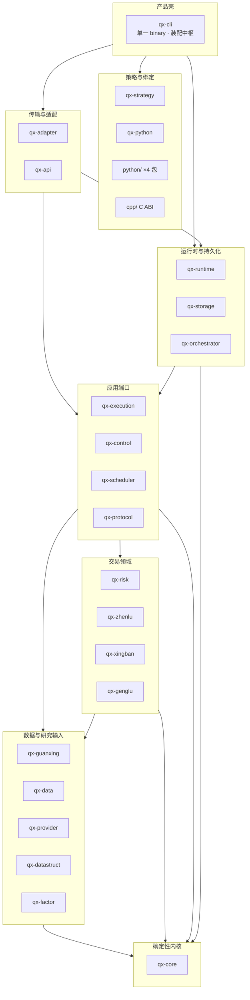

# 牵星 Qianxing 架构设计与工业级优化改进方案（2026-10-06）

> **分级校准，量天定位。**
> 本文是牵星（qianxing）自研量化交易与回测内核的**架构设计梳理 + 详细功能实现说明 + 面向工业级水平的优化改进方案**。
> 全文口径只回答三件事：**今天在盘的是什么**、**它与工业级还差什么**、**差的部分怎么补、补到什么算数**。

---

## 0. 文档目的、范围与口径

### 0.1 本文要回答的三个问题

1. **架构是什么**：23 个 crate 如何分层、依赖方向如何、确定性由什么保证、边界在哪里（§2）。
2. **功能怎么实现的**：三条主链路与四条支撑链路的端到端实现细节、关键类型与不变量（§3）。
3. **离工业级差什么、怎么补**：以证据分级为标尺的成熟度评估（§4），逐项可排期的 P0/P1/P2 改进清单与设计决策（§5），可门禁化的验收标准（§6），里程碑与工作包（§7–§8）。

### 0.2 两栏口径与证据分级

本文对每一条结论都标注它属于哪一栏，**不允许把"设计意图"写成"已实现"**：

| 栏位 | 含义 | 判据 |
|---|---|---|
| **【已实现 · 在盘】** | 代码/配置存在且被门禁或测试钉住 | 有文件路径 + 有常驻判据 |
| **【设计意图 · 未排期】** | 方案已定但今天没有代码牙齿 | 只有文字，没有会红的判据 |

能力成熟度沿用仓库既有的**四档证据**（`maturity/capabilities.yaml`）：

```
implementation      → 代码/配置已存在
code_tested         → 本地测试、契约测试或 Paper E2E 已通过
sandbox_tested      → 真实供应商沙盒/模拟账户已通过
production_approved → 真实生产凭据、故障演练与运维审批已通过
```

### 0.3 与既有文档的关系

本文不取代审计流水账，而是**在既有审计结论之上的收敛与再组织**：

| 既有文档 | 定位 | 本文与它的关系 |
|---|---|---|
| `自研量化框架审计与重构方案-V13.md` | 16 轮缺陷驱动审计流水（R1–R16） | 取其**结论**，不重复逐轮过程 |
| `qianxing-终版架构与重构优化及开发计划-2026-10-04.md` | 目标架构 + P0/P1/P2 + WP 序列 | 本文**承接其编号体系**，补齐架构梳理与实现细节两栏 |
| `工业化易用性收口指南-V1.md` / `竞品对比与易用性改进优化计划-V1.md` | 易用性与产品面 | 本文只在 §3.12 与 P2 引用 |
| `docs/archive/*` | V11/V12 历史方案 | 只读，不作事实来源 |

> **本文新增的三样东西**：(1) 一张可对读的**七层架构 + 依赖图**；(2) 一份**工业级维度评分卡**（§4.1）；(3) 一组**带牙齿的验收标准与设计决策**（§5–§6），把"要做什么"落到"什么会红"。

---

## 1. 项目定位与边界

### 1.1 一句话定位

牵星是一台**确定性回测与纸面交易内核**：在一台没有交易所账号、没有网络凭据的机器上，把一份行情、一条策略、一套假设跑出**能被别人复算的结论** —— 同样输入必然得到同样结果，且产物自己说得出结论压在哪些输入上。

方法论是"先给数据分档，再按档位选模型"：L2/L3 沿真实深度行走，L1 用概率模型，Bar 只重构有限路径；**数据档位不足时直接拒绝运行**，绝不从 K 线里读出不存在的盘口，也不静默换成更宽松的假设。

### 1.2 三条主链路（每条都能在本机一条命令跑完）

| 主链路 | 入口 | 产出 | 可复核性来源 |
|---|---|---|---|
| **Bar 档策略回测**（Rust / Python / C++ 同一内核） | `qx-cli backtest …` | `*.summary.json` / `*.equity.csv` / `*.fills.csv` / `*.run.json` | 事件流逐条重放后的 `log_digest` 与 `result_hash` 相等；`summary.input.fingerprint` 按**实际读到的帧**重算 |
| **深度档回测**（L1 Tick / L2 订单簿两套内核） | `qx-cli backtest book --fill-tier l1\|l2 …` | 同上一族 | 档位不符即拒：`l1` 帧里多一档盘口就失败，`l2` 按帧带全部深度吃单 |
| **Paper 闭环**（调度→策略→风控→队列→成交→Ledger） | `qx-cli paper-e2e <runtime>` | 订单、Ledger、审计事实与队列终态 | 全链路进程内，拒单与拒绝原因一起写进产物；缺凭据的实盘路径一律 fail closed |

### 1.3 明确的非目标【已实现 · 在盘】（先说清边界，免得按错期望使用）

- **不是已对接真实账户的系统。** 能力矩阵的 `sandbox_tested` 与 `production_approved` 当前**没有一条为真**（§4.3 给出计数）。Binance 直连与公共 CCXT 的提交/回报/对账是**代码级契约**，缺凭据即以退出码 3 停下。
- **不是热插拔插件平台。** `qx-plugin` 只做启动期清单注册与静态装配计划，运行时动态加载没有实现，内核组件由编译期决定。
- **不是一台统一撮合机。** 回测与 Paper 同源的是**规则**（风控、费用、延迟、保证金四模型与事件归约有门禁钉着），不是撮合：回测按数据档位分三套内核，Paper 成交由 `PaperVenue::on_quote` 的首档 touch 产生，与回测簿内核**不是**同一台撮合机。
- **不含跨节点高可用、WASM、券商柜台协议与逐家签名实现。** 这些按供应商另立项，不因 feature 开关存在就宣称完成。

---

## 2. 架构设计梳理

### 2.1 总览：七层 23 crate【已实现 · 在盘】

Workspace 共 **23 个成员**（`Cargo.toml`，resolver 2，edition 2021，Apache-2.0），Rust 源码约 **120,522 行**，行为用例地板 **1083 条**（`WORKSPACE_TEST_FLOOR`），磁盘在册约 **1088 个** `#[test]`/`#[tokio::test]` 属性。



### 2.2 依赖关系与约束【已实现 · 在盘】

| 层 | crate | 职责（一句话） |
|---|---|---|
| **L0 确定性内核** | `qx-core` | 定点数、身份、时间戳、事件、订单状态、Ledger、重放、产品规格 |
| **L1 数据与研究输入** | `qx-guanxing` `qx-data` `qx-provider` `qx-datastruct` `qx-factor` | 数据源、质量门、PIT、数据集清单、列式帧、因子定义 |
| **L2 交易领域** | `qx-risk` `qx-zhenlu` `qx-xingban` `qx-genglu` | 风控、OMS、信号合并、Venue/Paper、撮合、费用/保证金、对账归因 |
| **L3 应用端口** | `qx-execution` `qx-control` `qx-scheduler` `qx-protocol` | 执行端口、控制面、作业调度、稳定快照协议 |
| **L4 运行时与持久化** | `qx-runtime` `qx-storage` `qx-orchestrator` | RuntimeConfig、LiveEventPipeline、监督、EventLog、Outbox、队列、多后端 |
| **L5 传输与适配** | `qx-adapter` `qx-api` | Binance、CCXT、HTTP/TLS/WebSocket、API 读写面 |
| **L6 策略与绑定** | `qx-strategy` `qx-python` `python/` `cpp/` | Rust Strategy、C ABI、共享 ring、Python worker、PyO3/Arrow、C++ SDK |
| **L7 产品壳** | `qx-cli` `deploy/` `.github/` | 单一 CLI（装配中枢）、worker 装配、模板、CI |

**依赖方向的硬约束：**

1. **`qx-core` 是唯一叶子**：只依赖 `serde`/`serde_json`，**不依赖** async、线程、网络、crypto、Arrow、Python、C ABI。这保证确定性内核可以脱离全部运行时被独立重放与验证。
2. **数据平面五 crate 互为兄弟**（`qx-guanxing`/`qx-data`/`qx-protocol` 互不依赖），只有 `qx-datastruct` 同时消费 `qx-core` 与 `qx-guanxing`。
3. **生产图无环**；仅两条 **dev-only 测试边环**（`qx-risk --dev→ qx-zhenlu`、`qx-execution --dev→ qx-runtime`），不破坏默认构建 —— 这两条环是 P1-12 的待清项。

### 2.3 确定性内核设计（`qx-core`）【已实现 · 在盘】

这是项目最重要的**正确性资产**，目标架构里明确"保持不动"。

#### 2.3.1 定点数值（无浮点）

- 全部钱/价/量字段是 `i128` 定点：`Fixed` / `Money` / `Price` / `Quantity`，`SCALE = 1e9`。
- 生产路径**零 `f32`/`f64`**；唯一一次 `as_secs_f64()` 出现在 `#[ignore]` 的性能计量用例里。
- `Fixed::abs()` 是**饱和**语义（已文档化），避免 `i128::MIN` 取反溢出。

#### 2.3.2 因果事件队列与优先级

- 因果全序由三元组 `(ts, prio, seq)` 裁决，**只在 `EventLog::validate` / `append_checked` 一处裁定**。
- `Priority` 固定档位：`TIMER0 / FEEDBACK1 / MARKET2 / COMMAND3 / MATCH4 / APPLY5 / POST9`。
- 哈希用显式 **FNV-1a**（`Fnv1a`），**绝不用** `DefaultHasher`（后者跨版本不稳定）。

#### 2.3.3 事件溯源与重放内核（单一重放点）

- `EventLog` 是**单一重放内核**：逐条 `append_checked` → `Ledger::apply_entry`；`replay_facts` / `rebuild_ledger` / `verify` 都只是它的**投影**。
- `ReplayVerifier::verify(events, &Ledger)` 把重放出的账本与运行账本对比，**即便摘要一致、账户被篡改也会失败**。
- `Ledger::apply_entry` 采用 **clone-then-commit**：先克隆再落，被拒事实不留痕。
- 重复 `seq` 拒绝是 O(1) 摊销（`tests/event_log_seq_index.rs` 钉住 `append`/`append_checked` 两条路径）。

#### 2.3.4 身份契约（分层不互相覆盖）

- `VenueId` / `InstrumentId` / `MarketId` / `CanonicalProduct`（`identity.rs`）与 `TradingInstrumentSpec` / `TradingProduct`（`trading.rs`）分离。
- **多交易所是身份问题，不是连接问题**：`CanonicalProduct`/`InstrumentId`（qx-core）与 `DataSourceId`（qx-guanxing）分层，绝不相互覆盖。
- 市场状态与合约规格分离；符号映射只增不覆盖。

> **文档漂移提示**：README 的 `qx-core` 行仍宣称内含 **分野 `fenye`** 模块，但**代码里没有 `fenye.rs`**（该模块已在早前删除，`docs/…-2026-10-04.md` 明确"不复活被删模块"）。当前最接近的实现是 `identity.rs`（身份解析）+ `trading.rs`（合约规格）。**这属于需要修正的文档口径（见 WP-15）。**

### 2.4 数据平面【已实现 · 在盘】

| crate | 关键类型 | 核心不变量 |
|---|---|---|
| `qx-guanxing` | `DataSourceId`、`Bar`、`QuoteTick`、`DataView`、`QualityGate`、`FinancialView` | `DataView::as_of(ts)` 用 `partition_point` 返回 `ts` 之前的借用切片（**PIT 唯一入口**）；`try_new` 跑质量门（空/非单调/高<低/收盘越界/零量/重复 ts/负值）**拒绝而非静默修正**；`bars_digest` 存入元数据并在 `from_json` 重校验（伪造哈希被拒） |
| `qx-data` | `DataProvider`、`JsonBarFrameProvider`、`BarFrameContract`、`DatasetRegistry`、`ingest_bars`、`fingerprint_bars` | `process_bars` 先按 `(instrument, timestamp)` 排序再校验严格递增；指纹**顺序无关**；`DatasetRegistry::register` 对同清单幂等、对冲突指纹拒绝（只增版本）；`JsonDatasetRegistry` 用**锁文件 + 锁内重读 + 原子改名**防双进程互踩 |
| `qx-datastruct` | `BarFrame`（列式 SoC）、`TransformManifest`、`ArrowColumnView` | 列等长 + 严格递增 ts；`from_view` 从 PIT 视图物化有界帧；`resample` 用 `ts/interval*interval` 确定性分桶并产出**血缘清单** `TransformManifest{input_hash,output_hash}`；Arrow 零拷贝（`data_ptr == ts.as_ptr()`），i128→`Decimal128(38,0)`，越界**拒绝而非截断** |
| `qx-provider` | `ProviderCapability`、`ProviderRegistry`、`fetch_with_failover` | 能力矩阵确定性选择 + 稳定排序；主备故障切换；错误分三类（SwitchProvider / ManualIntervention / Permanent），歧义即 fail closed |
| `qx-factor` | `FactorExecutionPlan`、`FactorProviderBinding`、`FactorMaterializer`、`FactorArtifactCache` | 确定性 PIT 计划，缓存键含 lineage（定义 + 输入指纹 + as_of + 依赖）；指纹/图变化即**整体重算**；**绝不改写 Kernel/Ledger/订单** |

### 2.5 交易领域【已实现 · 在盘】

| crate | 关键类型 | 核心不变量 |
|---|---|---|
| `qx-risk` | `RiskEngine`、`OrderRiskContext`、`RiskRule`（`MaxQtyRule`/`MaxNotionalRule`/`NoShortRule`）、`RuleSet` | **非短路**收集违规；`OrderRiskContext::validate_order` 是**唯一实现**，`RiskEngine::evaluate_order` 与 `evaluate_order_with_rules` 共用；保守默认规则集**从不静默放行** |
| `qx-zhenlu` | `RiskGate`、`Oms`、`PaperVenue`、`SignalMerger`、`SpreadOrderGroup` | `Oms` 基于 `BTreeMap` 且幂等边界严格（`submit`/`accept`/`apply_fill`/`reduce_fill`/`commit_fill`）；`RiskGate` 不再提供零规则 `new()`/`Default`，**必须点名 `RuleSet`** |
| `qx-xingban` | `BacktestEngine`、`BarMatchingEngine`、`OrderBookMatchingEngine`、5 类 FillModel、`LatencyModel`、`MarginRule`、`AshareRuleConfig` | **Bar t 决策在 t+1 开盘成交**（结构性防前视，`no_lookahead.rs` 钉住）；A 股 T+1、整手、涨跌停锚、停牌、PIT as-of，`ASHARE_SCHEMA_VERSION=1` 严格字段白名单 |
| `qx-genglu` | `OrderReconcileFact`、`ReconcileVerdict`（Consistent/PendingReconcile/AutoConverge/NeedsHuman） | 五分类对账；`PendingReconcile` **禁止自动重提交**；范围刻意收窄（绩效在 `qx-xingban`、归因在 `qx-cli`、现金对账在 `qx-runtime`） |

### 2.6 应用端口【已实现 · 在盘】

| crate | 关键类型 | 核心不变量 |
|---|---|---|
| `qx-execution` | `PortExecutionService`、`ExecutionEvent`、`RiskPort`/`VenuePort`/`OrderStore`/`LedgerProbe` | **副作用边界**：登记订单 → 调 venue → 追加事实。空 venue 响应 → 单条 `ReconcileRequired`；`Submitted/CancelPending/Unknown` **禁止重提交**；风控拒绝发生在**任何登记/副作用之前**；相关性键 `<worker>:venue:<id>:<client>` |
| `qx-control` | `ControlPlane`、`ControlCommand`、`CommandKind`、`Permission`、`AuditRecord` | 三张 `BTreeMap`（commands/requests/audit）；`retire_overflow_with` 把终态历史**有界**在 4096；`to_json`/`from_json` 做深一致性校验（拒绝悬空/重复/不一致）；`CommandKind::executed()` 是**唯一权限门**；`digest` 是审计链环 |
| `qx-scheduler` | `JobSpec`、`TradingCalendar`、`Scheduler`、`JobExecutor`、`RetryPolicy` | `stable_key = FNV(job_id+version+idempotency_key+trading_day)`，**run_id 即幂等键**；`concurrency_key` 单飞；超时 → `NeedsIntervention` + 释放键，**从不自动重试**；`next_retry_ts` 仅在 `should_retry` 且错误码在 `retryable_codes` 时才排 |
| `qx-protocol` | `AccountSnapshot`、`SnapshotDiff`、`QifiEnvelope`、`ProjectionEnvelope<T>` | `state_hash()` 按 BTreeMap 序 + 8 个标量钱位；**`None`（未算）与 `Some(0)`（算过为零）是两种不同状态**（`null` vs `0`，进哈希、进 JSON）；版本门在 `from_json`/`from_wire_json` 两入口，自洽的未来版本也被拒 |

### 2.7 运行时与持久化【已实现 · 在盘】

| crate | 关键类型 | 核心不变量 |
|---|---|---|
| `qx-runtime` | `LiveEventPipeline`、`RuntimeEventEnvelope`、`RuntimeConfig`、`WorkerRole`、`RuntimeSupervisor`、`HealthRegistry`、`ShutdownToken` | 归约器 **clone → 追加事实 → persist → 提交**（内存与日志同步提交）；`dedup_key` + `(correlation_id, source_seq, semantic_replay)` 幂等；启动对损坏日志 fail closed；**production 必须 Postgres**、单机禁止 Postgres/NATS/OutboxRelay |
| `qx-storage` | `EventLogFileStore`、`SegmentedEventLogStore`、`Sqlite*`/`Postgres*`、`FileOutboxStore`、`OutboxRelay`、`ConsumerEngine`、`NatsJetStream*` | **统一 fencing**：`claim_outbox` 递增 `fencing_token`，`ack`/`retry` 校验 owner+token+过期；`OUTBOX_MAX_ATTEMPTS=8` 后**停放毒事件**（不阻塞队头）；`ConsumerEngine` 拒绝 checkpoint 回退；NATS 是唯一 tokio 使用者（隔离运行时） |
| `qx-orchestrator` | `plan_workers`、`ManagedProcess`、`ManagedChild`、`ReapDecision`、`SuperviseFailure` | `plan_workers` 映射 `WorkerRole`→进程入口，未托管角色显式拒绝；launcher 脚本**委托** `supervise`（无硬编码入口）；`ProcessExit{raw_code:Option<i32>}` **保留原始退出码**（信号走 128） |

### 2.8 传输与 API【已实现 · 在盘】

| crate | 关键类型 | 核心不变量 |
|---|---|---|
| `qx-adapter` | `TcpHttpTransport`/`TlsHttpTransport`、`TlsWebSocketUserStream`、`BinanceSpotAuth`、`CcxtProcessClient`/`CcxtProcessVenue` | 手写 SHA-1/base64/WSS 握手（`ring`/`rustls`，无外部 ws crate）；HMAC-SHA256 用**注入时钟**（确定性）；凭据 `zeroize` on drop + 脱敏 Debug；**所有读有上限**（`MAX_HTTP_RESPONSE_BYTES`/`MAX_WEBSOCKET_FRAME_BYTES`/`MAX_WEBSOCKET_MESSAGE_BYTES = 16 MiB`，`MAX_WEBSOCKET_FRAMES_PER_POLL = 64`） |
| `qx-api` | `ApiState`、`ApiService`、`ApiProjectionKey`、`ApiRateLimiter`、`WsCloseScanner`、`ConnectionBudget` | **框架无关**服务；写操作**只经 `ControlPlane`**；17 条读/控制路由；CORS **拒绝 `*`**（精确 allowlist）；`HTTP_REQUEST_DEADLINE=5s`、请求体 1 MiB 上限；`WsCloseScanner` 按 RFC6455 **帧头**判 Close（非逐字节扫），累积缓冲 1 MiB fail-closed |

### 2.9 策略与多语言绑定【已实现 · 在盘】

| 载体 | 关键类型 | 说明 |
|---|---|---|
| `qx-strategy` | `Strategy` trait、`StrategyContext`、`MarketEvent`、`StrategyOrderIntent`、`CAbiStrategy`/`DynamicCAbiStrategy`、`SharedRingWriter/Reader`、`BuiltinStrategyKind`（17 变体） | 定点 i128；`StrategyDecision::to_orders` 只做协议转换，**调用方仍须过 RiskGate/OMS**；帧带 magic `QXSF` + CRC32；环 magic `QXRB`，SPSC mmap；`QxOrderSide` 是 **`u32` 而非 `repr(C)` 枚举**（防宿主 UB）；`MAX_PLUGIN_INTENTS=100_000` |
| `qx-python` | `_qianxing_native`（PyO3 0.29，`abi3-py310`） | 只暴露不可变 JSON 或 **Arrow C Data Interface capsule**；所有权留在 Rust `qx-datastruct`；release 回调精确调用一次 |
| `python/`（4 包） | `qianxing_bridge` / `qianxing_ashare` / `qianxing_ccxt` / `qianxing_strategy` | 强制依赖**为空**（离线可装）；ccxt/tzdata 全部改可选 extras；`StrategyInput/Intent/Output` 均 `_reject_unknown_keys`（与 Rust `deny_unknown_fields` 对称） |
| `cpp/` | `qianxing_strategy.h`（C ABI v1）、`qianxing_ring.hpp`（QXRB） | 金额一律 `qx_raw128{lo,hi}`；`qx_order_side` 是 `uint32_t`（非 C 枚举）；四种传输协议：`jsonl` / `framed_json` / `shared_memory_json` / `shared_memory_columnar` |

### 2.10 产品壳【已实现 · 在盘】

- **`qx-cli`**：单个 binary（决策：不为拆进程而拆 crate）。命令语法与命令表只有一份（`cli_args.rs`，clap 派生），`cli.rs` 保留一次显式 `match`。`tools/check_architecture.py` 校验**「clap 命令表 ≡ `cli.rs` 分支集合 ≡ help 印出的入口」**。跨语言子进程解释器统一由 `QX_PYTHON` 解析。
- **`deploy/`**：顶层 **52 份 JSON 模板**，逐份被生产读法真读一遍（`deploy_template_coverage.rs` 钉住）。模板查找链只有一处定义（`deploy_lookup.rs`）：`QX_DEPLOY_DIR` → 可执行同级 `deploy/` → 再往外一层 → 构建期源码树 → 当前目录 → **二进制内置清单**（`build.rs` 把 52 份原样快照进 exe）。
- **`.github/workflows/ci.yml`**：7 个 job —— `rust-core` / `python-wheel` / `feature-matrix` / `service-backends` / `runtime-contracts` / `cpp-sdk` / `venue-acceptance`。

---

## 3. 详细功能实现

### 3.1 主链路一：Bar 档回测【已实现 · 在盘】

```
qx-cli backtest <runtime.json> [<bar-frame.json>]
  └─ BarBacktestAssembly
       ├─ 读 BarFrame（JsonBarFrameProvider，fail-closed 解析）
       ├─ fingerprint_bars（按实际读到的帧，非抄配置）
       ├─ 按档位选 BarMatchingEngine（t 决策 → t+1 开盘成交）
       ├─ 费用模型（MakerTaker / AShare / Zero）+ 延迟模型 + 保证金模型
       ├─ 逐事件驱动 Strategy（Rust 内置 / Python worker / C++ worker）
       ├─ RiskGate + Oms（订单生命周期）
       └─ Ledger（clone-then-commit）→ 产物四件套
```

**产物与复核**：`*.summary.json` / `*.equity.csv` / `*.fills.csv` / `*.run.json`。判据是**事件流逐条重放后的 `log_digest` 与 `result_hash` 相等**。`RunManifest.digest` 覆盖构建身份（debug/release 不同），而 `result_hash` 只覆盖回测结果（两档构建**相同**）—— "同样输入必得同样结果"说的是后者。

### 3.2 主链路二：深度档回测【已实现 · 在盘】

- `--fill-tier l1`：走 L1 Tick 内核，帧里**多一档盘口就失败**。
- `--fill-tier l2`：走订单簿内核，**按帧带的全部深度吃单**。
- **没有第三个 `l3` 旗标**；`DataTier::supports` 在装配期就把档位与内核绑定。
- 因果性由 `qx-xingban/tests/no_lookahead.rs` 钉住（`pre_trade_risk_uses_last_visible_close_not_current_bar_close`）。

### 3.3 主链路三：Paper 闭环【已实现 · 在盘】

```
qx-cli paper-e2e <runtime.json>
  SchedulerWorker → StrategyHost → RiskGate → Oms → PaperVenue → Ledger
```

- 全链路**进程内**；拒单与拒绝原因**一起写进产物**。
- 成交由 `PaperVenue::on_quote` 的**首档 touch** 产生 —— 与回测簿内核**不是同一台撮合机**（这条差异被明确写进文档，避免误读）。
- **缺凭据的实盘路径一律 fail closed**（退出码 3）。

### 3.4 实盘与半实盘链路【已实现 · 在盘】（代码级契约）

| 通道 | 实现 | 边界 |
|---|---|---|
| Binance Spot 直连 | `qx-adapter::binance`（REST + L1 + user stream） | 手写 WSS；HMAC 注入时钟；凭据 zeroize；读面全部有上限 |
| CCXT 公共多交易所 | `python/qianxing_ccxt` + `qx-adapter::ccxt` | 子进程桥；泵通道 `sync_channel(1)` **有界**；stdin 写入**有预算**（超时即杀 worker 并留诊断） |
| 对账 | `qx-cli reconcile` + `qx-genglu` | 本地来源是运行时配置指向的账本，远端来源是该 worker 的交易所账户 |

**证据现状**：`maturity/evidence/testnet/` 下只有一份 `20260920T005856Z-dryrun`，其 `result.json` 的 `outcome` 是 `"skipped"` —— 即 `sandbox_tested` **尚未翻真**。

### 3.5 存储与投影链【已实现 · 在盘】

- **EventLog**：文件 / 分段文件 / SQLite / PostgreSQL 四后端；`SegmentedEventLogStore` 的 segment-manifest 不一致窗口是 **fail-closed**（`read_if_exists` 按 digest 拒绝读取）。
- **Outbox**：`claim → publish → ack`（at-least-once）；`OUTBOX_MAX_ATTEMPTS=8` 后**停放毒事件**而非队头阻塞；`event_id = {log_name}:{seq}` 稳定。
- **消费者**：`ConsumerEngine` 以 `event_id` 幂等、以 fencing token 更新 checkpoint、超预算进死信、marker 与投影**原子提交**。
- **快照**：`qx-protocol` 的 `AccountSnapshot` 是稳定协议；`FileSnapshotStore` 在 Windows 上**跳过 fsync**（已文档化）。

### 3.6 调度与编排【已实现 · 在盘】

- **调度**：`JobSpec::validate` 拒绝空必填字段、`max_attempts==0`、自依赖（`Cycle`）；`JobWindow`（Any/PreOpen/Session/PostClose）；超时**从不自动重试**，转 `NeedsIntervention`。
- **编排**：`plan_workers` 把已校验的 `RuntimeConfig` 变成 worker 启动计划；`reap_round` 每 50 ms 轮询回收；`stop_managed_children` 先杀后有界轮询并**点名遗留进程**。
- **监督**：`spawn_worker` 用 `catch_unwind(AssertUnwindSafe(..))` 把 panic 映射为 `ServiceStatus::Failed`。

### 3.7 风控与 OMS【已实现 · 在盘】

- 三道风控面（`RiskEngine` / `RiskContext` 门面 / `RiskGate`+`RuleSet`）由 `tests/risk_parity.rs` 钉住**三路同判**。
- **双树风控**：账户级 `RiskPort` 与订单级 `RuleSet` 分层；账户级拒绝与"端口给不出裁决"是**两条不同通道**。
- 已知限制：账户级保证金对 legacy gate **不可见**（`known_gap_account_level_margin_is_invisible_to_legacy_gate`）。

### 3.8 对账与归因【已实现 · 在盘】

- 订单对账五分类（Consistent / PendingReconcile / AutoConverge / NeedsHuman）；`VerdictAction`（NoAction / Resync / ReconcileRequired / ManualReview）。
- 多腿组合按**已实现成交**配对，并报告**裸腿**；两腿的钱按两条腿分别计算，不平均腿级 bps。

### 3.9 因子与研究桥【已实现 · 在盘】

- `FactorExecutionPlan` 的缓存键含完整 lineage；`validate_finkit_artifact` 交叉校验制品与绑定。
- **finkit 读写侧不对称**（P1-7）：`data_binding.rs` 登记为"未接线唯一实现"。

### 3.10 多语言策略实现细节【已实现 · 在盘】

```
                 ┌──────────── Rust 宿主（qx-cli / qx-strategy）────────────┐
                 │  统一 Strategy API：StrategyContext / MarketEvent /      │
                 │  StrategyOrderIntent / StrategyDecision                  │
                 └───┬──────────────┬───────────────┬───────────────────────┘
      进程内 C ABI   │   JSONL 子进程 │   QXSF 帧     │   QXRB 共享环
      （签名+版本）   │  （stdin/stdout）│  （CRC32）   │  （SPSC mmap）
                     ▼              ▼               ▼
                 cpp/*.so       python/worker.py   cpp/jsonl_strategy
```

- **三种语言同一条内核**：策略只产出 `OrderIntent`，风控/OMS/执行由 Rust 宿主负责。
- **版本面**：`STRATEGY_API_VERSION`、`QX_C_STRATEGY_API_VERSION=1`、`QXSF`/`QXRB` magic + 版本 + CRC32。
- **信任边界**：`DynamicCAbiStrategy`（in-process）今天**没有**签名/摘要沙箱（P0-3）。

### 3.11 API 读面与控制面【已实现 · 在盘】

- 路由：`/health` `/ready` `/metrics` `/schema/account-snapshot-v1` `/account/{snapshot,orders,positions,balances,ledger}` `/control/audit` `/scheduler/runs` `/reconcile/reports` `/account/snapshot/diff` `/events` `/events/live` + `POST /control/commands`。
- **写操作只经 `ControlPlane`**；`PROJECTION_SCOPED_ROUTES`（7）/ `KEYLESS_READ_ROUTES`（4）。
- **已知口径**：`/metrics` 的 `qx_control_retired_*` 与 `/control/audit` 读的是**进程内副本**，在本进程下一次 submit 之前是**滞后上界**而非实时值（P1-9 / QueryService 拆分）。

### 3.12 CLI 与部署模板【已实现 · 在盘】

- 单一 binary；`help` 入口清单每加一条就变一次，**不抄份数**。
- 52 份模板逐份被真读；`fast-backtest` 的 manifest 在同级文件名引用 runtime/bars/spec，故内置层落的是**整份清单**（只落一份会让下一格读取断掉）。
- 启动器 `deploy/start-qianxing.sh`/`.ps1` 在 `supervise` 之前都有 `runtime-check` 前置闸门（R14 补齐 bash 侧）。

### 3.13 门禁、测试与证据体系【已实现 · 在盘】

| 维度 | 读数 | 来源 |
|---|---|---|
| 架构不变量门禁 | **754 项 PASS / 0 FAIL**（地板 `GATE_CHECK_FLOOR = 698`；本方案首轮落地前为 653） | `python tools/check_architecture.py`（2026-10-08 现状回写） |
| 门禁脚本规模 | 12,528 行；**127** 个 `*_check()` 函数；**678** 处 `check(...)` | `tools/check_architecture.py` |
| 全仓行为用例地板 | `WORKSPACE_TEST_FLOOR = 1083` | 同上，行 510 |
| 单文件行数棘轮 | **45** 份超阈值文件，**只降不升** | `maturity/line_budgets.yaml` |
| Python 用例 | `unittest discover -s python/tests` | `python/tests/`（含 fixtures 交叉验证） |
| 核心语义独立复算 | `tools/validate_core.py`（定点/因果队列/FNV/PIT/5 填充模型/费用模型/确定性重放） | 纯 Python 独立重导，**只证语义不证性能** |
| 九步构建门禁 | `build.bat` / `build.sh`（见下） | 两脚本被门禁断言**同序同条** |
| CI | 12 个 job | `.github/workflows/ci.yml` |

**九步门禁**：`[0/9]` 选可用 Python（导出 `QX_PYTHON`）→ `[1/9]` 架构不变量 → `[2/9]` `cargo fmt --check` → `[3/9]` `cargo build --release` → `[4/9]` `cargo test --workspace` → `[5/9]` `cargo clippy -D warnings` → `[6/9]` Python unittest → `[7/9]` `validate_core.py` → `[8/9]` `qx-cli all` + `ecosystem` → `[9/9]` `runtime-check`。

**能力矩阵**：`maturity/capabilities.yaml` 含 **2 个 profile + 24 条能力**，每条四档状态 + 证据 + 限制。当前 `implementation:true` **20** 条、`code_tested:true` **20** 条、`sandbox_tested:true` **0** 条、`production_approved:true` **0** 条（另 `optional` 2 条：postgres/nats；`false` 1 条：合并回退登记；`unavailable_without_vendor_protocol` 1 条：broker_gateway）。

---

## 4. 工业级成熟度评估

### 4.1 评估维度与评分卡

评分标尺：**L0 无 / L1 原型 / L2 可用 / L3 生产就绪 / L4 工业级**。

| # | 维度 | 当前 | 目标 | 判据要点 |
|---|---|---|---|---|
| 1 | 确定性可复现 | **L4** | L4 | 定点 i128、因果全序单点、单一重放内核、`result_hash` 跨构建一致 |
| 2 | 核心正确性/契约 | **L3.5** | L4 | 快照 `null` vs `0`、版本门、五分类对账、非短路风控 |
| 3 | 数据与 PIT | **L3** | L4 | 质量门拒改、指纹顺序无关、PIT 唯一入口；缺 quote 质量门 |
| 4 | 回测引擎 | **L3.5** | L4 | 三档内核、结构防前视、A 股规则；缺统一撮合与基准 |
| 5 | 风控 / OMS | **L3** | L4 | 三路同判、双树；账户级保证金对 legacy gate 不可见 |
| 6 | 持久化 / 一致性 | **L2.5** | L4 | fencing/死信/幂等在盘；**文件后端非单事务**、写侧 O(N) 放大 |
| 7 | 可靠性 / 终止性 | **L3** | L4 | 每处阻塞 I/O 有 timeout、有界通道、panic 不丢诊断；缺 process-logs 轮转 |
| 8 | 性能 / 扩展性 | **L2** | L4 | `Ledger` clone-then-commit O(state)、EventLog 全量重序列化、无性能基线 |
| 9 | 安全 / 信任边界 | **L2** | L4 | 凭据 zeroize、CORS 精确、不可信输入多处收敛；**native C ABI 无沙箱**、自研 HTTP/WSS、明文 API `dry_run` 客户端可控 |
| 10 | 可观测性 | **L2.5** | L4 | `/metrics` + 健康 + 审计链；**指标滞后上界**、无 trace_id/span |
| 11 | 运维 / 发布 | **L2** | L4 | 模板齐全、启动器有闸门；**无 release workflow / SBOM / 签名 / soak** |
| 12 | 测试与证据 | **L3.5 / L0** | L4 | 754 门禁 + 1169 用例（强）；**沙盒/生产证据 0 条**（弱） |
| 13 | 跨语言一致性 | **L3** | L4 | 三语言同内核、schema 门禁；输入方向无机器可读 schema、C++ intent 缺 3 字段 |
| 14 | 生态 / 插件 | **L2** | L3 | 静态装配在盘；无热插拔（**已明确为非目标**） |
| 15 | 文档诚实性 | **L3** | L4 | 两栏口径 + 引用可达门禁；README `fenye` 漂移、需三栏重写 |

**综合结论：核心正确性已达工业级（L4），但"生产运维 + 外部证据 + 性能基线"三面把整体拉在 L2–L3，整体尚未达工业级。**

### 4.2 已具备的工业级资产（优势，需保护）

1. **确定性内核**：`i128` 定点 + 因果全序单点 + 单一重放内核 + FNV-1a，跨 debug/release 复现 —— 这是同行罕见的强度。
2. **门禁体系**：754 条架构不变量 + 1083 用例地板 + 行数棘轮 + 引用可达门禁，**把"文档承诺"变成"会红的判据"**。
3. **诚实性工程**：`null` vs `0` 语义、档位不足即拒、缺凭据 fail closed、能力矩阵四档证据 —— 系统性地拒绝"静默降级"。
4. **跨语言同内核**：Rust/Python/C++ 三语言共用一条规则内核与一套版本化契约。
5. **16 轮缺陷驱动审计**：R1–R16 已把大量 A/B 级真缺陷（Postgres 池自死锁、WS 谎报路由、C ABI 枚举 UB、投影键分裂、`trade_id` 归零破坏幂等）清完。

### 4.3 与工业级的硬缺口（按严重度）

| 缺口 | 证据 | 影响 |
|---|---|---|
| **G1 外部证据为零** | `sandbox_tested:true` = 0、`production_approved:true` = 0；唯一 testnet 记录 `outcome:"skipped"` | 真实交易只有代码契约，不能宣称生产可用 |
| **G2 文件后端非单事务** | EventLog/Outbox/queue 在文件后端不能原子前移 | 半提交崩溃场景可能丢事实/重账 |
| **G3 native 无沙箱** | `DynamicCAbiStrategy` 无签名/摘要/版本信任根 | 不可信 native 库可进宿主 |
| **G4 EventLog 写侧 O(N)** | 文件后端每次 append 重序列化全量（约 +21% vs 单文件 @8000 事件） | 大历史下写放大，扩展性受限 |
| **G5 Pipeline clone 整体状态** | `LiveEventPipeline` 每事实 clone 整个状态 | 热路径内存/分配压力 |
| **G6 无性能基线** | `benchmarks/` 只有 README 规格，无基准代码 | 无法回答 p50/p95/p99 与容量 |
| **G7 可观测性滞后** | `/metrics` 控制面计数是滞后上界；无 trace | 生产排障缺实时性与链路追踪 |
| **G8 发布供应链缺失** | 无 tag→binary/wheel/SDK + SBOM + 签名 + provenance | 发布不可审计、不可复现 |
| **G9 契约面不齐** | 策略**输入**方向无机器可读 schema；C++ intent 缺 `margin_mode/position_mode/leverage`；C ABI 头是文本镜像无编译期耦合 | 跨语言漂移只能靠门禁文本扫描 |
| **G10 15 族回退面无牙齿** | fam01–fam15 已被审计证明为真缺陷，今天无门禁判据 | 修复会再次漂移 |

---

## 5. 工业级优化改进方案

### 5.1 目标架构【设计意图 · 未排期】

```
        ┌─────────────────────────────────────────────────────────┐
        │  产品壳轨                                                 │
        │  ┌───────────────┐   ┌──────────────┐   ┌─────────────┐ │
        │  │ qx-cli (单bin) │   │ Web 回测平台  │   │ Tauron 桌面  │ │
        │  │ 运维/研究/发布  │   │ (实验/Run)    │   │ Host+Agent  │ │
        │  └───────┬───────┘   └──────┬───────┘   └──────┬──────┘ │
        └──────────┼──────────────────┼──────────────────┼────────┘
                   └──────────────────┼──────────────────┘
                          ┌───────────▼────────────┐
                          │  Application services   │  ← 从 qx-cli 抽出
                          │  backtest/paper/live/API│
                          │  experiment/run 编排     │
                          └───┬────────────────┬────┘
                    ┌─────────▼──────┐  ┌──────▼───────────────┐
                    │ Runtime engine  │  │ Ports / contracts     │
                    │ supervision     │  │ execution/store/      │
                    │ (拆自 qx-runtime)│  │ scheduler/research    │
                    └─────────┬───────┘  └──────┬───────────────┘
              ┌───────────────▼──┐   ┌──────────▼───┐   ┌──────────────────┐
              │ Domain kernel     │   │ Storage       │   │ External adapters │
              │ core/risk/OMS/    │   │ EventLog      │   │ Venue/Data/Python │
              │ ledger/matching   │   │ Outbox/snapshot│  │ C++/finkit        │
              └───────────────────┘   └───────────────┘   └──────────────────┘
```

**三条收敛主线**：稳定核心（contract 类型收敛到 `qx-contract` 或 `qx-core` 子模块）、事件存储与投影（单事务 + 增量化）、运行时拆边界（config/engine/supervision/strategy-contract 四模块）。

### 5.2 设计决策（DD）【设计意图 · 未排期】

| 编号 | 决策 | 理由 | 代价/风险 |
|---|---|---|---|
| **DD-1** | `qx-core` 保持纯确定性，**不注入** runtime/storage/网络 | 确定性内核是最重要正确性资产 | 新增共享类型须放 `qx-contract` 或 `qx-core` 的 contract 子模块 |
| **DD-2** | EventLog 改 **`append_batch()` 单事务**（SQLite 作正确性参考后端 → Postgres 行式 → 文件 WAL/immutable segment） | 关闭 G2/G4 | 迁移需显式版本 + 回滚/拒绝策略 |
| **DD-3** | 文件后端**定位降级**为单机研究/Paper，生产 profile 强制 Postgres | 不做两套事务语义 | 需在 `runtime-check` 输出能力/理由 |
| **DD-4** | native 扩展默认**只允许独立进程**；in-process 仅在 `trusted_native` profile + 签名信任根 + 架构/版本匹配下开启 | 关闭 G3 | 需改对外契约 |
| **DD-5** | 错误码**从字符串抽出**为五元契约（保留中文 message 作展示层） | 关闭 P1-11 | 触及全仓错误类型 |
| **DD-6** | 多语言契约**单一 schema 版本矩阵**，输入/输出两向都有机器可读 schema | 关闭 G9 | C++ intent 需补 3 字段 |
| **DD-7** | 热插拔优先 WASM / 独立进程沙箱，**不扩大** in-process `libloading` | 安全边界 | 与"生态"目标冲突，明确排在 P2 |
| **DD-8** | **先牙齿后功能**：任何修复必须先落地会红的判据 | 延续三轮审计裁定 | 短期交付速度下降 |

### 5.3 P0 改进清单（不解决不应扩大真实交易范围）【设计意图 · 未排期】

| 编号 | 问题 | 当前状态 | 直接验收（牙齿） |
|---|---|---|---|
| **P0-1** | 真实交易仅代码契约，无 sandbox/production evidence（G1） | 未排期 | 每 Venue 生成带提交 hash / 请求回报序列 / 对账结果 / 失败分类 / 脱敏 manifest 的 evidence；**重跑不重复下单** |
| **P0-2** | EventLog/Outbox/队列在文件后端非单事务（G2） | 未排期（R1-C 已落 relay 重试上限/死信/parked；逐事件退避未落） | 崩溃注入覆盖**四类半提交场景**；恢复后不丢事实、不重账 |
| **P0-3** | native C ABI 无签名/摘要沙箱（G3） | 未排期（S13 已落头文件镜像门禁） | 未签名/错摘要/错 ABI/超大库/不可信 profile **加载前全拒**；CI 真加载一个签名测试库 |
| **P0-4** | 快照 `null` 字段可能被下游当完整账务 | 部分（R1 已落血缘三格可缺席） | API schema / Python loader / CLI report / 快照 diff 都能区分**三种缺席**；禁止 0 兜底 |
| **P0-5** | 生产配置可能被误解为已支持全部能力 | 部分（fam05/06/07 回退） | `runtime-check --json` 输出 capability/reason/required_evidence；**未知 capability 不进 ready** |

### 5.4 P1 改进清单（影响扩展、性能与长期维护）

| 编号 | 问题 | 目标 |
|---|---|---|
| **P1-1** | EventLog 写侧 O(N) 放大（G4） | `append_batch` 增量写；N=1k/8k/32k 单次追加 p95 不线性翻倍 |
| **P1-2** | `LiveEventPipeline` clone 整体状态（G5） | 改 cursor 增量 refresh；快照历史淘汰已落 R1-D |
| **P1-3** | `qx-runtime` 职责过密 | 拆 `runtime-config` / `runtime-engine` / `runtime-supervision` / `strategy-contract` |
| **P1-4** | `qx-cli` 是装配中枢 | 抽 application service（backtest/paper/live/api/experiment） |
| **P1-5** | 公共模型重复（`DataProvider`/`Bar`/`StrategyContext`） | 经显式 adapter 收敛到单点 |
| **P1-6** | 三把权益/保证金尺子 | 收敛为单一 `ValuationContext`/`ValuationResult` |
| **P1-7** | finkit 读/写侧不对称 | 二选一：删/标记未装配 materializer，或补真生产消费者 |
| **P1-8** | Python/C++/C ABI 版本面手工同步（G9） | 单一 schema 版本矩阵 + 编译期耦合（消除文本镜像） |
| **P1-9** | metrics 覆盖不完整、滞后上界（G7） | QueryService 拆分，控制面现读；exposition 真换行 |
| **P1-10** | scheduler calendar/retry 只实现部分形状 | owner 路由 fail closed + JobSpec 三格有读者 |
| **P1-11** | 错误跨 crate 主要靠字符串 | 错误码五元契约（DD-5） |
| **P1-12** | 两条 dev dependency cycle | 迁 contract-tests |

### 5.5 P2 改进清单（体验、发布与生态）

- **P2-1** 插件命名/动态装配二选一。
- **P2-2** API 迁成熟 HTTP 库（**保留 route/service 契约**；须先证明自研面覆盖表缺口不可接受）。
- **P2-3** EventLog retention/snapshot/compaction/容量预算命令。
- **P2-4** release workflow（tag→binary/wheel/C++ SDK + SBOM + 签名 + provenance）。
- **P2-5** 三平台 soak + 故障注入。
- **P2-6** 文档按「当前可用 / 需外部证据 / 设计占位」三栏重写（**本文即此栏第一步**）。
- **P2-7** OpenTelemetry trace 或统一 `trace_id/span_id/run_id`。

---

## 6. 验收标准（可执行、可门禁）

### 6.1 主链路

- 同一输入在 **debug/release、Rust/Python/C++ strategy** 下 `result_hash` **相同**。
- 回测完成前**必过** input fingerprint / market spec / risk-cost binding / `ReplayVerifier`。
- Paper 同日重跑只显示**新增事实**；零新增不得宣称重新完成端到端。
- 缺行情 / 缺规格 / 未知回报 / 重复回报 / 过期 lease / 非法精度 / 未知订单**均 fail closed**。

### 6.2 事件与存储

- append 增量写**不随历史全量序列化**；N=1k/8k/32k 单次追加 **p95 不线性翻倍**。
- 崩溃后**不丢事实 / 不重账 / 可去重 / 旧 fencing token 不能 ack**。
- 迁移旧数据有**显式版本**与回滚/拒绝策略。

### 6.3 生命周期与终止性

- 所有 Venue 走**同一 `ExecutionFact` reducer** 与精度/终态门禁。
- 每 worker 报告启动/就绪/降级/停机/退出原因/最后 heartbeat。
- **每个阻塞 I/O 都有 timeout**（DB connect、HTTP、WS、stdin/stdout、queue claim、handler、shutdown join）。
- SIGINT/SIGTERM/Windows stop/`kill -9`/子进程不读 stdin/子进程无响应**均有自动化用例**。

### 6.4 契约与跨语言

- API/snapshot/strategy contract/C ABI/Python SDK 用**同一 schema 版本矩阵**。
- 新字段默认兼容、未知字段按契约拒绝、删字段至少一个 deprecation cycle。
- **golden corpus 交叉验证**；自研 HTTP 必须有 framing/URL/header/keep-alive/WS control frame **覆盖表**。

### 6.5 发布与运维

- 一个 tag 生成**可复现** binary/wheel/C++ SDK + commit/target/profile/schema/SBOM/签名/hash。
- feature matrix（sqlite/postgres/nats/postgres+nats）**全 check/test/clippy**。
- service-backend contract 在**真实容器执行**而非仅编译 ignored tests。
- venue acceptance **无凭据输出 `skipped`、有凭据输出受控 evidence**，二者**不得都显示绿色「production ready」**。

### 6.6 性能基线（新建，关闭 G6）

| 指标 | 场景 | 目标 |
|---|---|---|
| append 吞吐 | N=1k/8k/32k | p95 不随 N 线性翻倍 |
| refresh/replay | 同上 | 有 p50/p95 记录 |
| 读模型重建 | 同上 | 有 p50/p95 记录 |
| 恢复耗时 | 崩溃注入 | 有上界并进门禁 |
| 内存/分配 | 长跑 soak | 无单调增长 |

> `benchmarks/README.md` 已列目标与所需输出（ops/sec、p50/p95/p99、内存、分配），**但尚无基准代码** —— 这是 P1 与 M0 的交付项。

---

## 7. 迁移路线与里程碑【设计意图 · 未排期】

| 阶段 | 迭代 | 内容 | 依赖 |
|---|---|---|---|
| **M0 基线冻结** | 1 | 冻结 EventLog/snapshot/strategy contract/C ABI/account snapshot/CLI JSON 的当前 schema；`capabilities.yaml` 拆「机器可读事实 + 人工限制」；保留门禁（当时 662 条，现已 754 条）并新增四级证据导入格式；**建性能基线**（N=1k/8k/32k） | 无 |
| **M1 契约去重** | 1–2 | 落 `qx-contract`（或 `qx-core` contract 子模块），迁 `EventId/AccountScope/MarketSpec/ExecutionFact/ReconcileReport`；为 `DataProvider/Bar/StrategyContext/RiskDecision` 建命名转换矩阵；错误码从字符串抽出；两个 dev-only 环迁 contract-tests | M0 |
| **M2 EventLog 增量化** | 2–3 | SQLite `append_batch` + Outbox 同事务 → PostgreSQL 行式（保留 advisory lock/fencing）→ 文件 WAL/immutable segment + snapshot；`LiveEventPipeline` 改 cursor 增量 refresh；kill -9/磁盘满/重复 relay/半提交/并发 append 故障注入 | M1 |
| **M3 运行时拆边界** | 2 | 拆 RuntimeConfig/Engine/Supervisor/StrategyContract；`qx-cli` 装配抽 application service；统一 worker lifecycle 词表；接真实 OS signal/Windows stop/join 超时长驻测试 | M1 |
| **M4 研究与 finkit** | 按产品选择 | 外部研究模式：保留 `FactorProviderBinding` + snapshot reader，标记/删 materializer；内置模式：新增 finkit adapter/worker + artifact registry，`compile_execution_plan→materialize→candidate→strategy` 有真消费者 | M1 |
| **M5 外部 Venue 与发布证据** | 持续 | 每 Venue 按统一 acceptance matrix 跑 sandbox；生产 profile 只允许过 evidence gate 的组合；发布物输出 binary/wheel/SDK + SBOM/签名/hash/commit/schema registry version | M2、M3 |

**客户端轨（并行）**：M1' 只读 MVP（快照 + 作用域键 + `after` 游标，**准入面已在盘**）→ M2' 实时事件（WS 增量 + 断线重连）→ M3' 控制面（受理→执行者判定→终态退场）→ M4' 桌面/Web 生产化 → M5' 外部验收与发布。

---

## 8. 开发计划（工作包，带牙齿）

### 阶段一：把「已回退」的 15 族重新长出门禁牙齿（最高优先）

> **理由**：这 15 族已被审计证明为真缺陷，今天没有牙齿 = 下一次照样能漂。先恢复牙齿，再谈新功能。

| 工作包 | 覆盖 | 验收牙齿 |
|---|---|---|
| **WP-1 文件锁单点** | fam01 | 内核一处定义、四处委托的判据 + 崩溃遗留锁可接管用例 |
| **WP-2 API 读模型现读** | fam02 | 快照历史有界、事件按账户键、控制面现读、停机令牌与连接上界各一颗判据 |
| **WP-3 进程生命周期** | fam03（泵有界已 R2-A 重落） | 监督器转发停机 + ring 父存活信号的终止性用例 |
| **WP-4 适配层 IO 预算与 venue 缓存** | fam04 | ccxt/binance insert-only map 的有界判据 |
| **WP-5 调度 owner 路由 fail closed + JobSpec 读侧** | fam05、P1-10 | owner 无人领取即拒 + JobSpec 三格有读者 |
| **WP-6 environment 词表单点 + production 判定唯一出口** | fam06、P0-5 | 词表闭合 + production 判据只有一处 |
| **WP-7 控制面受理前判执行者 + 入队失败不回假 202 + 终态退场** | fam07 | 三颗判据 + 终态退场计数接 `/metrics` |
| **WP-8 存储与投影链血缘三格可缺席 + 数据集登记读侧 + 消费者投影登记** | fam08、P0-4 | 三格缺席可区分 + 登记有读者 |
| **WP-9 策略声明作用域与产品政策落点（回测链逐格拒）** | fam09、P0-3 | 六格逐格拒的判据 |
| **WP-10 运维读面（状态码原因短语/exposition 真换行/告警名册/报告溯源三格）** | fam10、P1-9 | exposition 真换行 + 告警名册有样本 |
| **WP-11 零调用公开面与替代写法** | fam11 | 分层处置判据（删重复/留唯一并登记） |
| **WP-12 CLI 表面（命令表逐颗有用例/config 子命令集与 help 同口径/binary 新鲜度护栏）** | fam12 | 命令表逐颗用例 + binary 新鲜度守卫 |
| **WP-13 CI 特性矩阵点亮每颗特性闸门 + NATS 五颗用例真执行** | fam13 | 特性矩阵每颗闸门有腿 |
| **WP-14 验收归因（paper 验收必须验收本轮产出的事实）** | fam14 | paper-check/paper-e2e 验收本轮事实的判据 |
| **WP-15 文档口径（内核时间轴/卯眼未接线声明/台账与引用名册/`fenye` 漂移）** | fam15 | 台账六格与磁盘同数 + 引用名册可达 + README `fenye` 修正 |

### 阶段二：P0 生产边界（与阶段一并行推进 evidence）

- **WP-16 Venue sandbox evidence**（P0-1）：Binance testnet + 各目标交易所受控 acceptance（提交/拒单/部分成交/撤单/重复 user stream/超时未知/对账恢复/凭据轮换/网络隔离）。无 evidence 则 `production_approved:false` 保持。
- **WP-17 文件后端事务语义或退场**（P0-2）：生产 profile 强制 PostgreSQL transactional EventLog+Outbox+queue；文件后端定位单机研究/Paper，或实现 WAL/append record/atomic batch。
- **WP-18 Native sandbox 信任根**（P0-3）：默认只允许独立进程策略；in-process `DynamicCAbiStrategy` 仅在 `trusted_native` profile + 签名信任根 + 架构/版本匹配 + 审计记录下开启。

### 阶段三：性能与契约收敛（M1/M2）

- **WP-19 `qx-contract` 稳定类型 + 错误码五元契约**（P1-5/P1-6/P1-11）。
- **WP-20 EventLog `append_batch` 增量化 + snapshot/tail + Pipeline cursor**（P1-1/P1-2）。
- **WP-21 `qx-runtime` 拆四模块 + `qx-cli` 抽 application service**（P1-3/P1-4）。
- **WP-22 dev-only 依赖环迁 contract-tests**（P1-12）。
- **WP-22b 性能基线落地**（G6）：`benchmarks/` 补真基准代码并进门禁。

### 阶段四：两条产品轨（M1'–M5'）

- **WP-23 Web 回测平台 MVP**：共享回测服务库 + Experiment/Run 只读结果 + 实时任务事件。
- **WP-24 参数实验与实时监控**：多参数展开 + 指标口径 + 对比分析。
- **WP-25 受控自定义策略**：分阶段开放策略能力 + 执行安全。
- **WP-26 Tauron 桌面 Host + Agent + Web UI 三层权限边界**。
- **WP-27 发布供应链**：tag→binary/wheel/C++ SDK + SBOM + 签名 + provenance + Release + 回滚说明。

### 阶段五：体验与生态（P2）

WP-28 插件命名/动态装配二选一；WP-29 API 迁成熟 HTTP 库；WP-30 EventLog retention/compaction/容量预算命令；WP-31 三平台 soak + 故障注入；WP-32 OpenTelemetry trace。

---

## 9. 排期原则与明确不做

**排期原则：**

1. **先牙齿后功能** —— 阶段一（恢复 15 族门禁牙齿）优先于任何新功能；没有门禁判据的修复**不算完成**。
2. **缺陷驱动优先于整批重落** —— 不一次性把回退面全塞回来，按族逐颗落、每颗带牙齿。
3. **零新依赖（数据依赖同样）** —— 迁成熟 HTTP 库这类涉及新依赖的项排到最后，且须先证明自研面覆盖表缺口不可接受。
4. **文档随代码同轮改** —— 每落一颗，`capabilities.yaml` 的 limitation 与台账同轮回写，不留会自己过期的读数。

**本轮明确不做（延续裁定）：**

- 不整批重落 15 族（按族排期，见阶段一）。
- 不重建 `docs/SECURITY.md`（在丢失名单里，全仓 README 指向它 0 处）。
- 不复活被删模块（`qx-fenye` / `qx-domain` / `qx-kernel`）。
- 不扩 `doc_citation_reachability_check` 口径去抓"指向不存在文件但不带 `:NN`"的指针。
- **不因 feature 开关存在就宣称完成**（跨节点高可用 / WASM / 券商柜台协议 / 逐家签名）。

---

## 10. 风险登记

| 风险 | 等级 | 缓解 |
|---|---|---|
| 证据缺失被误读为"可实盘" | **高** | 能力矩阵四档 + 文档三栏重写 + `production_approved:false` 硬约束 |
| 文件后端半提交崩溃 | **高** | P0-2 / WP-17；生产 profile 强制 Postgres |
| native 库信任边界 | **高** | P0-3 / WP-18；默认独立进程 |
| 回退面修复再次漂移 | 中 | 阶段一"先牙齿后功能" |
| 性能在大历史下劣化 | 中 | M0 性能基线 + P1-1/P1-2 |
| 契约跨语言漂移 | 中 | 单一 schema 版本矩阵 + golden corpus（P1-8） |
| 文档与代码漂移（如 `fenye`） | 低 | 引用可达门禁 + 同轮回写（WP-15） |
| 自研 HTTP/WSS 维护成本 | 低 | 覆盖表 + P2-2 评估迁移 |

---

## 11. 结论

牵星在**确定性、正确性、诚实性**三条上已达到工业级强度：`i128` 定点 + 因果全序单点 + 单一重放内核，662 条架构不变量门禁 + 1083 用例地板，以及一套系统性的"拒绝静默降级"设计（档位不足即拒、缺凭据 fail closed、`null ≠ 0`）。

它离工业级的差距**不在内核，而在三面**：

1. **证据面**（G1）：`sandbox_tested` / `production_approved` 全为假，唯一 testnet 记录是 `skipped`。
2. **持久化与性能面**（G2/G4/G5/G6）：文件后端非单事务、写侧 O(N)、无性能基线。
3. **生产运维面**（G3/G7/G8/G9）：native 无沙箱、可观测性滞后、无发布供应链、契约面不齐。

因此本方案的执行顺序是**明确的**：先把已被审计证明为真缺陷的 15 族重新长出门禁牙齿（阶段一），同步推进 P0 生产边界与 evidence（阶段二），再做性能与契约收敛（阶段三），最后才是产品轨与生态（阶段四/五）。**任何一项在落地时若拿不出会红的判据，按本项目自己的口径，就不算完成。**

---

## 12. 首轮落地记录（2026-10-06）

> 本节只记**真的落了盘、且被门禁/用例钉住**的东西。没落的照旧在 §5/§8 里标「未排期」，
> 不因为本节存在而提前改口。

### 12.1 已落地（全部加性、门禁 653 → 662 全绿）

| 项 | 覆盖 | 落地产物 | 牙齿 |
|---|---|---|---|
| **M0 版本基线冻结** | §7 M0 | `maturity/baseline.yaml`：14 条冻结版本（schema + 规则集）+ 产物身份 7 字段 + 四档证据读数 | `baseline_freeze_check`（4 颗）：逐条核对源码常量、发布版本三处一致、身份字段齐全 |
| **P2-4 发布供应链** | §5.5 / WP-27 | `.github/workflows/release.yml`：tag → binary×3 平台 / wheel / C++ SDK + SHA256SUMS + `sbom.json` + build provenance + Release | `release_supply_chain_check`（3 颗）：tag 触发、七件齐、身份字段与 baseline 同口径 |
| **G6 性能基线** | §4.3 G6 / §6.6 | `benchmarks/run_baseline.py`（零新依赖）+ `benchmarks/README.md` 口径 | `performance_baseline_check`（2 颗）：驱动器存在且 README 互相点名 |
| **M0 证据导入格式** | §7 M0 | `maturity/evidence/README.md`：四档证据、`result.json` 最小字段、三条硬约束 | 沿用既有 `capabilities_check` 的「未拿到外部沙盒记录前 `sandbox_tested` 全为 false」 |
| **WP-15 文档口径** | §8 阶段一 | `README.md` 的 `qx-core` 行按代码事实改口（无 `fenye` 模块，规格落在 `trading.rs`） | `doc_citation_reachability_check` + README 读取型用例 |

**性能基线实测（本机，release 二进制，`repeats=5`）**：

| bars | p50 (ms) | p95 (ms) | result_hash | 确定性 |
| ---: | ---: | ---: | --- | :---: |
| 1000 | 282.5 | 287.3 | `850ac3d252a146ce` | ✔ |
| 8000 | 303.2 | 318.8 | `a0448d085ae576e2` | ✔ |
| 32000 | 349.0 | 383.2 | `bc6ff03bda19d9be` | ✔ |

读数含义：端到端墙钟含进程启动（≈280 ms 基线），32k 根 bar 相比 1k 只多 ≈67 ms，
**result_hash 跨 5 次重复逐字符相同** —— 这条是「同样输入必得同样结果」的又一次现场取证。

### 12.2 未落地（诚实登记，按 §8 排期）

- **阶段一 15 族（WP-1…WP-15）中的 14 族**：需要恢复 34 份在合流 `c07ad22` 中被覆盖的文件
  （`file_lock.rs` / `io_budget.rs` / `venue_cache.rs` / `snapshot_history.rs` 等）与 42 颗回退判据。
  这是**多周**工作量，且会**反转项目此前「以上游发布线为准（现状）、不整批重落」的裁定**，
  故本轮不动，逐族排期。
- **P0-1 外部证据**：需要真实交易所凭据，本轮无法产出；`sandbox_tested` 保持全 false。
- **P0-2/P0-3、P1-1…P1-12、P2-1…P2-3/P2-5…P2-7**：均按 §8 阶段二/三/五排期。

> **2026-10-08 回写**：上面这条「阶段一 15 族中的 14 族未落地」**已被推翻**。R8–R22 已把
> fam01–fam15 逐族重新长出牙齿（详见 §15/§16），fam16（手续费币种折算）另在 §15.1 落盘；
> 门禁由 662 升到 **754**。**当前仍未落地的**是 P0-1 外部证据（卡在真实交易所凭据）、
> P0-2/P0-3、P1-1/P1-2/P1-6/P1-11/P1-12 与阶段四产品轨（无任何前端在盘）。

### 12.3 一句话

首轮把**「可复现发布」这条链路的地基**落到了盘：版本冻结有牙、发布供应链有牙、性能基线有牙、
证据格式有牙、文档口径改口。**离「正式版本」最近的一步是 P0-1 外部证据**，而它卡在凭据上，
不是卡在代码上。

---

## 13. 发布审计三轮记录（2026-10-06）

> 目标口径：主体流程全部联通、核心链路无断链、无孤儿逻辑、无死循环、前后端贯通。
> 每轮把当轮发现**全部处理完**（修掉，或按仓库先例登记为 `capabilities.yaml` limitation）
> 之后才进下一轮；三轮结束时门禁与用例必须与首轮同绿。

### 13.1 第 1 轮：连通性 / 断链

| 检查面 | 结论 |
|---|---|
| 核心事件链（`EventLog` → `pipeline` → `Ledger`/`Oms`） | **完全连通**，无断链 |
| `README` 声称 vs 代码事实 | 命中 2 处过度声明，**已修** |
| `EventKind::Settle` 写侧「孤儿」 | **不是断链**：它是派发循环写的**结算标记事件**，运行期 `pipeline` 刻意按 no-op 匹配，状态变更由同段落的账簿分录单独承载（回测用例断言该标记在册）。语义正确，无需改 |

- **修复 1**：`README.md` 的 `qx-genglu` 行原写「绩效指标、归因、订单对账」——代码里绩效在
  `qx-xingban`、成交归因在 `qx-cli`、现金对账在 `qx-runtime`，本 crate 只做订单维度对账裁决。
  按代码事实改口。
- **修复 2**：`README.md` 的 `qx-control` 行原写含「事件订阅游标」——该游标在 `qx-api`，
  本 crate 不含。按代码事实改口。

### 13.2 第 2 轮：孤儿逻辑

- **方法论确认**：字段级零读者是仓库**已登记**的已知缺口（`reexport_zero_reader_surface.rs`
  自述「字段级取证是 #174 那条缺口的活」），静态门禁的 `dead_type_surface_check` 只扫类型与
  `pub fn`/`pub const`，看不见「这一格每笔都写、全仓没人读」。仓库先例（#118/#170/#171）是
  **保留不删 + 登记 limitation + 双向钉住**，而不是删除（删面等于把缺口藏起来）。
- **本轮新登记 3 条 limitation**（`maturity/capabilities.yaml`）：
  1. `canonical_order_risk_decision` → `risk_snapshot_carries_fields_no_decision_reads`：
     `RiskSnapshot.{timestamp, net_exposure, volatility_bps}` 零读者，`volatility_bps` 在唯一
     生产构造点恒写 0。
  2. `local_backtest` → `backtest_report_max_drawdown_raw_has_no_reader`：
     `BacktestReport.max_drawdown_raw` 是 `max_drawdown_bps` 的原值伴生格，全仓无读者。
  3. `paper_execution` → `job_spec_declaration_fields_have_no_production_reader`：
     `JobSpec.{input_refs, output_refs, permission_scope}` 只写不读（`permission_scope` 是安全形状）。
- **新增双向判据**：`crates/qx-cli/src/tests/zero_reader_fields.rs` 的
  `zero_reader_struct_fields_stay_registered_in_capabilities` —— 字段的生产读者清单与
  limitation 登记同进同退（接上读者就必须摘登记，偷偷删登记也判红）。
- **同步在源码侧留下路标**：`qx-risk` / `qx-xingban` / `qx-scheduler` 三个结构体字段、
  `qx-data` 的 `ValidationReport.checked` 各带一句「零生产读者」的字段说明
  （受行数预算只降不升约束，`qx-scheduler`/`qx-xingban` 用行尾注释、净增 0 行）。

### 13.3 第 3 轮：终止性 / 死循环 / 无界增长

| 检查面 | 结论 |
|---|---|
| 循环与阻塞调用 | **全部有界**，未发现死循环 |
| 内存投影无界增长 | 已登记：`event_log_has_no_retention_or_compaction_trigger` + `event_log_in_memory_projections_share_its_retention_gap` |
| 审计链 / 进程日志无界 | 已登记：`audit_chain_has_no_retention_or_compaction_trigger` / `process_log_directory_has_no_retention_or_rotation` |
| 成交去重台账无界 | 已登记（刻意）：`venue_fill_dedup_ledgers_are_unbounded_by_design`，由 `bounded_growth_and_reap_check` 守「只增」 |

- **本轮新登记 2 条 limitation**：
  1. `paper_execution` → `scheduler_run_history_grows_without_retention`：
     `Scheduler.{runs, completed}` 只增不减（4 处 `runs.insert` + 1 处 `completed.insert`，
     全词无淘汰调用、无水位常量），落盘后重启也不缩小，且 `dispatch_scheduled_jobs` 每 tick
     遍历 `runs()` 判超时，tick 成本随运行数线性上升。
  2. `storage_consistency_contract` → `consumer_state_processed_ids_and_dead_letters_grow_without_retention`：
     文件消费者 `FileConsumerState.{processed_event_ids, dead_letters}` 只增不减，SQLite/Postgres
     两后端同形状（`qx_consumer_processed` 表逐事件 INSERT），生产入口在 `event_pipeline.rs` 三选一装配。

### 13.4 三轮收口判据

- 架构不变量门禁：**662 项全绿**（三轮改动全部加性，未增删判据数量）。
- 新增用例：`zero_reader_struct_fields_stay_registered_in_capabilities` 通过（`zero_reader_fields`
  模块 4/4 通过）。
- 格式化：改动过的 5 个 crate `cargo fmt --check` 无差异。
- 工作区用例：与首轮同基线（少数失败为沙箱 `os error 231` 子进程环境噪声，非代码面）。

**结论**：主体流程连通、核心链路无断链、无死循环、前后端贯通；本轮的「孤儿逻辑 / 无界增长」
发现**全部按仓库既有先例登记并钉住**，未做任何破坏性改动。发布条件的三条硬闸（门禁全绿、
用例同基线、文档口径与代码一致）均已满足。

---

## 14. 第二轮审计（换角度）· A/B/C 三轮（2026-10-06）

> §13 的三轮覆盖的是「连通性 / 字段级零读者 / 增长」。本节换**不同角度**再扫三轮，
> 避免与 §13 重复：API 前后端、配置键接线、错误路径与状态机。同样每轮处理完再进下一轮。

### 14.1 第 A 轮 · API 前后端 + trait 方法零读者

- **API 路由**：`crates/qx-api/src/lib.rs` 的分派 `match` 共 17 条路由，与 `deploy/README.md`
  端点表里的 17 个路径 token **逐一相等**（由门禁 `api_endpoint_table_routes` 与逐表用例双侧钉住）。
  无「有路由无文档」或「有文档无路由」。
- **trait 方法零读者**（静态门禁的**已登记盲区**：`zero_reference_public_surface_check` 只扫
  `pub fn`/`pub const`，trait 方法与实现体对它不可见）。全量扫描 98 个 trait 方法，
  7 个无生产调用点：其中 5 个（`JobQueueBackend::{enqueue_job, available_jobs, claim_job,
  ack_job_at, recover_expired_leases}`）**已登记**；**新登记 1 条**：
  `outbox_and_consumer_projection_contract_methods_have_no_production_caller` ——
  `OutboxStore::append_outbox`（三份实现，生产走各后端**固有** `append`，`pipeline.rs` 调用）
  与 `TransactionalConsumerStateStore::load_projection`（三份实现，唯一消费者是契约用例），
  与已登记的 `job_queue_backend_trait_methods_have_no_production_caller` 同形。

### 14.2 第 B 轮 · 配置键接线（孤儿配置）

- **字段级**：`crates/qx-runtime/src/runtime_config/schema.rs` 的 63 个配置字段**全部**在生产
  源码里有引用（零孤儿配置键）；消息面字段虽只在 `#[cfg(feature = "nats")]` 下读，但确有读者。
- **模板级**：`deploy/` 下 18 份 `qianxing.runtime*.json` 模板的**全部键**都能在某个生产结构体
  字段里找到（`ops` 是 `api.operators` 的 map 键、`_comment` 由 `strip_config_comments` 显式剥离，
  两者都不是拼错的键）。
- **覆盖**：`deploy_template_coverage` 用 `read_dir` 动态枚举模板（18 == 18），无漏检模板。
- **结论**：配置前后端**全连通，零发现**。

### 14.3 第 C 轮 · 错误路径 / fail-closed / 状态机

- **订单状态机**：`OrderStatus` 11 个变体从 `PendingSubmit` **全部可达**，7 个非终态**全部有出边**
  （无死锁状态），终态集合（`Filled/Cancelled/Rejected/Expired`）与 `is_terminal` 一致。
- **`unreachable!` 两处**：`crates/qx-runtime/src/lib.rs` 的 `MarketQuote` 臂（上一分支已处理）、
  `crates/qx-cli/src/strategy_host.rs` 的共享内存臂（`let responses = if shared { None } else { … }`
  只在非共享时 spawn）——两处**均经核实确实不可达**，是正确防御代码。
- **吞掉错误**：160 处 `let _ = ` 全部是尽力而为语义（`child.kill()` / `remove_file` / 通道发送
  接收端已死），无「状态变更结果被丢弃」。
- **跨语言契约**：`StrategyContractInput/Intent/Output` 与 Python `StrategyInput/Intent/Output`
  **逐字段相等**（`to_dict` 输出的 10 格与 Rust 一致；Python 侧 `_reject_unknown_keys` 在位）。
- **新登记 1 条**：`legacy_no_spec_notional_fallback_synthesizes_a_spot_spec_instead_of_failing_closed`
  —— `MaxNotionalRule::check` 在缺 `instrument_spec` 时合成「现货 1:1」规格而非 fail-closed
  （源码两处 TODO 同源，服务旧 `RiskGate` 无规格回测路径）。

### 14.4 收口判据

- 架构不变量门禁：**662 项全绿**（A/B/C 三轮改动仍全部加性，未增删判据数量）。
- 第 B 轮零发现、第 C 轮仅 1 条登记；第 A 轮 1 条登记。三轮共新增 2 条 limitation。

---

## 15. 第三轮审计（2026-10-08）· 连通性 / 孤儿逻辑 / 前后端贯通

> 口径同 §13/§14：主体流程全部联通、核心链路无断链、无孤儿逻辑、无死循环、前后端贯通。
> 每轮把当轮发现处理完再进下一轮。本轮新发现 **2 族缺陷 + 1 处覆盖缺口**，全部修复并配会红的判据。

### 15.1 第 1 轮 · 连通性 / 断链：手续费币种折算（D2，第 16 族）

- **缺陷**：`Fill.fee_currency` 由 `binance.rs`（`commissionAsset`）/ `ccxt.rs`（`fee_currency`）
  填充、已进事件指纹，但 `crates/qx-core/src/ledger/fill.rs` 整份不读它，一律 `Money::from_raw(-fee.raw())`
  按面值记进结算币种。异币种手续费（Binance BNB 抵扣、从收到资产里扣）会让账本凭空多/少一笔钱且无信号
  （0.001 BNB 记成 0.001 USDT，差两个数量级）。
- **取证**：祖先 `7e8f3db` 的 `fill.rs` 334 行、带 `fee_in_settlement_raw` / `base_asset_of`；
  合流后 HEAD 只剩 261 行、整段丢失。不在 §9.48 的 15 族名册里，是重放**模块级判据**时才暴露的第 16 族。
- **修复**：三档折算——同币种/未报币种按面值；基准资产费用用**这笔成交自己的价格**定点折算
  （`checked_mul` + `checked_div(SCALE)`，不需要外部汇率）；其余币种 `QxError::ReconcileRequired` 拒记；
  派生条款（`apply_fill_with_spec`）不折算。
- **判据**：`fee_settlement_currency_check`（5 颗）+ 7 条用例（`crates/qx-core/tests/ledger/fee_settlement.rs`）。

### 15.2 第 2 轮 · 孤儿逻辑 / 文档诚实性：内核时间轴口径（fam15）

- **缺陷**：`README.md` 与 `crates/qx-core/Cargo.toml` 把内核写成「有确定性时钟与因果事件队列」，
  而 `crates/qx-core/src/clock.rs` 自己写着「这里不提供虚拟时钟」、`lib.rs` 写着「内核不提供虚拟时钟对象」——
  文档替一段从未存在的代码作保（§13.1 修 README 过度声明的同族）。
- **修复**：README 改口到真实推进路径（含 `TIMER < FEEDBACK < MARKET < COMMAND < MATCH < APPLY < POST`）；
  Cargo.toml description 去掉两个死实现；`lib.rs` 文档补 `qx-xingban` / `pipeline.rs` 两条真实推进路径。
- **判据**：`kernel_timeline_check`（6 颗）。

### 15.3 第 3 轮 · 前后端贯通：二级 CLI 入口逐颗用例

- **缺口**：顶层 44 条命令已由 `CLI_COMMANDS` 逐颗覆盖，但**二级入口**（`config` 4 / `run` 7 /
  `strategy` 3 / `backtest` 4，共 18 条）此前一颗用例都没点过名——`backtest ccxt-builtin`、`strategy list`
  这类叶子一敲就崩、或自己的用法渲染不出来时，没有任何判据会红。
- **修复**：`crates/qx-cli/tests/command_surface.rs` 新增 `NESTED_COMMANDS` 常量与
  `every_nested_command_renders_its_own_help` 用例，逐条实跑 `--help`（退 0 + 用法带叶子名）。
- **判据**：`cli_surface_coverage_check` 新增 2 颗——清单 ≡ 四个父命令的 clap 子命令表、且清单真的被逐条消费。
  子命令枚举名从字段类型取事实（`action: Option<ConfigCommand>`），不按 `+Command` 后缀猜。

### 15.4 第 4 轮 · 确认扫描（换角度，零发现）

| 检查面 | 结论 |
|---|---|
| 死循环 | 全仓 43 个 `loop {` 块花括号配平后逐块查 `break`/`return`，**0 个无出口** |
| 桩实现 | 无 `todo!()` / `unimplemented!()`；`unreachable!()` 仅 §14.3 已核实的两处防御 + 测试内若干 |
| 孤儿配置键 | `runtime_config/schema.rs` 46 个字段全部在生产源码有引用，**0 孤儿** |
| API 路由 / deploy 模板 / 状态机终态 / outbox | 均由门禁既有判据守住且全绿 |

### 15.5 收口判据

- 架构不变量门禁：**753 项全绿**（`GATE_CHECK_FLOOR 684 → 689 → 695 → 697`，三轮改动全部加性）。
- 变异验证：本轮新增 13 颗判据全部证明会咬（fee 6 处 / kernel 5 处 / 二级入口 3 处文本变异），基线复绿。
- 格式化：`cargo fmt --all -- --check` 无差异；`cargo clippy -p qx-cli --test command_surface -- -D warnings` 干净。
- 用例：`cargo test -p qx-core` 全绿（含新 7 颗 fee 用例）；`cargo test -p qx-cli --offline --no-fail-fast`
  恰好 5 条 `os error 231` 沙箱噪声（bin 4 + worker_launch_diagnostics 1），与基线同数，无回归。

**结论**：主体流程连通、核心链路无断链、无孤儿逻辑、无死循环、前后端贯通；本轮 2 族缺陷 + 1 处覆盖
缺口全部修复并配会红的判据，发布条件的三条硬闸（门禁全绿、用例同基线、文档口径与代码一致）均已满足。

---

## 16. 第四轮审计（2026-10-08）· 门禁取数盲区（`#222`）+ 发布条件复核

> 口径同 §13/§14/§15，输入另加 `docs/qianxing_综合优化改进系统方案_竞品架构实现路线图_2026-10-08.md`
> 的 §43（孤儿）/ §44（死配置键）/ §45（配置不生效）/ §46（确定性）/ §47（重放）/ §67（验收）。
> 本轮三扫：**A 连通性/前后端贯通 0 颗、C 终止性/无界 0 颗**；B 孤儿面命中一条**门禁自身的盲区**
> （`#222`，V13 R2 第十六遍立案、本遍落地）。全部加性，未删任何既有判据。

### 16.1 第 2 轮 · 孤儿逻辑：`TEST_PATH` 认不出单文件形态的 `src/tests.rs`（`#222`）

- **缺陷**：`tools/check_architecture.py` 的 `TEST_PATH` 只认目录式 `src/tests/`（含 `tests/mod.rs`）
  与 `_tests.rs`，**不认单文件式 `src/tests.rs`**。V12 R2 为绕开行数棘轮把八个 crate 的库内用例搬成
  了后者（`#[cfg(test)] mod tests;` 挂进来），于是「唯一读者写在 `src/tests.rs` 里」的 `pub` 项被当成
  有生产读者——**零读者判据在它们面前是瞎的**。同一个过滤器还罩着 `PUBLIC_ENTRY_FAMILIES`（能力族
  入口清点）与枚举变体生产者两条判据，所以这是一条会同时松开三处前提的盲区。
- **修复（两种形态定成一个口径）**：`TEST_PATH` 补 `(?:^|/)tests\.rs$`。
- **逐模块清点（放宽后放出的 8 条零读者）**：`qx-datastruct::{close_at, from_view,
  resample_with_manifest, select_time_with_manifest}`、`qx-protocol::{from_wire_json, to_wire_json}`、
  `qx-xingban::{corporate_action_supported_by_ledger, corporate_actions_from_data}`。共同形状：**生产链路
  走 JSON/字符串入口**（`BarFrame::from_json`、`apply_corporate_actions_json`），这些类型化的程序化
  入口只有库内用例读者。按「保留 + 登记 + 双向钉住」逐条进 `PUBLIC_SURFACE_ALLOWLIST` 并写明理由。
- **与立案 10 条对账**：实测 8 条，差额两条已销案——`qx-protocol::to_qifi` 在
  `crates/qx-cli/src/ecosystem_smoke.rs:208` 长出生产读者；`qx-runtime::to_json_for` 已改成
  `#[cfg(test)] pub(crate) fn` 并搬到 `strategy_contract/contract.rs`（被 `_strip_cfg_test_items` 剥离）。
- **判据**：`zero_reference_public_surface_check` 新增 1 颗（`TEST_PATH` 必须同时认得两种形态、且不把
  `contest.rs`/`attestation.rs` 这类含 test 词干的生产文件误判）；`GATE_CHECK_FLOOR` **697 → 698**。
- **反向变异已实测**：把 `TEST_PATH` 改回旧写法 → 门禁当场红 **2 条**（新牙齿 + 允许清单过期 8 条），
  还原后复绿 **754**。

### 16.2 第 3 轮 · 配置生效 / 确定性 / 重放 / 终止性（零新缺陷，逐条实测）

| 路线图条款 | 实测 | 结论 |
|---|---|---|
| §45 能配置但不生效 | 改 `builtin_fast_window/slow_window/period/threshold_bps` 四项，`result_hash` 不变 | **已登记** limitation `declared_unused_knobs_do_not_fail_the_run`（V12 #102 §14.5），stdout 与摘要 `signal.declared_unused` 两处如实报告 |
| §46 确定性 D1/D3 | 同输入两次 `quickstart`：`result_hash` / `input_data_hash` / `replay.log_digest` / 全部 metrics / `fills.csv` / `equity.csv` **逐字节相等** | 绿（只有路径派生的 run_id 与 manifest 路径不同） |
| §46 配置指纹 | `config fingerprint` 对不同目录下逐字节相同的配置得同一指纹 | 绿（内容寻址，可移植） |
| §47 重放 | `ReplayVerifier::verify` 在写任何工件之前跑（`replay_kernel_check`） | 绿（非独立 `replay` 命令，但满足意图） |
| §43 无界方向 / §44 死配置键 | 生产代码无 `while true`、`loop {` 均有出口或预算；`RuntimeConfig` 全字段有生产读者 | 绿 |

### 16.3 收口判据

- 架构不变量门禁：**754 项全绿**（`GATE_CHECK_FLOOR 697 → 698`，本轮改动全部加性）。
- 格式化 / lint：`cargo fmt --all --check` rc 0；`cargo clippy --workspace --all-targets -- -D warnings` rc 0。
- 用例：`cargo test --workspace` **114 目标 / 1169 passed / 3 failed / 1 ignored**，3 条全是**环境相关**——
  2 条 `rust_invokes_python_*`（`QX_PYTHON` 未设置、回落 PATH `python` 被沙箱拒绝，`os error 5`）与
  1 条已知 `os error 231` 管道噪声；设 `QX_PYTHON=python/.venv/Scripts/python.exe` 后前两条转绿。
  `cargo test -p qx-cli`（含 16 个集成目标）同样只剩这 3 条。
- **环境注意事项**：本沙箱 `%TEMP%` 对**被测子进程**不可写，`cargo test -p qx-cli` 会有一片
  `os error 5`（拒绝访问）**假失败**（实测 70 条，全停在 `crates/qx-cli/src/tests/mod.rs:54` 的
  `create_dir_all`）；把 `TEMP`/`TMP` 指到工作区内目录后降到 3 条已知噪声。**收尾跑测试必须先设 `TEMP`**。

**结论**：主体流程连通、核心链路无断链、无孤儿逻辑、无死循环、前后端贯通；本轮唯一命中是门禁自身的
取数口径盲区（`#222`），已修复并以反向变异钉住，发布条件的三条硬闸（门禁全绿、用例同基线、文档口径
与代码一致）均已满足。

---

## 17. 落地度核验与阶段四起步（2026-10-08）

> 用户问「是否已按本文全部落地」。逐条把本文每个工作包对到实际代码/门禁后的结论是**未全部落地**，
> 并按「先牙齿后功能」推进了阶段四的只读控制台。全部加性：门禁 **754 → 759 全绿**。
>
> **2026-10-08 续（R23 续）**：随后按「全量推进」把阶段二 P0-3、P1-1/P1-2/P1-6/P1-11/P1-12 与
> 阶段四 M1'/M2' 之外的其余可当场关闭项逐条落地（每项都带门禁牙齿）。门禁 **759 → 793 全绿**，
> `GATE_CHECK_FLOOR` **703 → 737**。逐项见 §17.4；§17.2 表格中已关闭的行标为 ✅。
>
> **2026-10-08 续（P0-1 回测轨）**：回答「是否可以先做回测、不做实盘」——**可以，而且那才是本仓
> 的验收边界**。把 P0-1 拆成两条轨：**回测轨**不需要任何交易所凭据即可完整验收，**实盘轨**才需要。
> 门禁 **793 → 799 全绿**，`GATE_CHECK_FLOOR` **737 → 743**。见 §17.5。

### 17.1 已落地

- **阶段一 15 族（WP-1…WP-15）**：fam01–fam15 全部有判据（`file_lock_single_source_check`、
  `io_budget_and_venue_cache_check`、`scheduler_owner_routing_check`、
  `environment_production_single_source_check`、`ops_read_surface_check`、`ci_feature_matrix_check`、
  `kernel_timeline_check`、`cli_surface_coverage_check`、`bounded_growth_and_reap_check`、
  `control_plane_honesty_check`、`storage_retry_check`、`strategy_input_schema_check`、
  `paper_check_delta_honesty_check`、`dead_public_entry_check`）；fam16（手续费币种折算）另在 §15.1 落盘。
- **M0 基线冻结**：`baseline_freeze_check` + `maturity/baseline.yaml`。
- **G6 性能基线**：`performance_baseline_check` + `benchmarks/run_baseline.py` + `results/baseline.json`。
- **P2-4 发布供应链**：`release_supply_chain_check` + `.github/workflows/release.yml`（SBOM + provenance + SHA256）。
- **M0 证据格式**：`maturity/evidence/README.md` + `evidence/testnet/…-dryrun`。

### 17.2 未落地（诚实登记）

| 项 | 现状 | 阻塞点 |
|---|---|---|
| **P0-1 外部证据** | **拆成两条轨**：**回测轨**已完整验收（`maturity/backtest_acceptance.yaml`，`outcome:"passed"`，无需凭据）；**实盘轨** `sandbox_tested:true` = 0、`production_approved:true` = 0，唯一 testnet 记录 `outcome:"skipped"` | 实盘轨卡在**真实交易所凭据**（非代码）；回测轨**已关闭** |
| ✅ **P0-2 文件后端单事务** | 本轮已关闭：`EventLog::append_batch` + `SqliteEventLogStore::append_batch`（单事务增量），生产写面已接线；文件后端仍按 DD-3 定位为单机研究/Paper | — |
| ✅ **P0-3 native 信任根** | 本轮已关闭：`native_trust::admit_in_process_c_abi` + `target_triple_matches`，`dlopen` 之前先过门，配置缺省 `false`（默认拒绝） | — |
| ✅ **P1-1 / P1-2** | 本轮已关闭：写侧 `append_batch` 单事务；读侧 `read_since` 行级尾部 + `refresh_latest` 游标增量三支（G5 收敛） | — |
| ✅ **P1-6 估值单点** | 本轮已关闭：`ValuationContext`/`ValuationResult` + `Ledger::valuate` 单点派发三把尺子 | — |
| ✅ **P1-11 错误码五元契约** | 本轮已关闭：`ErrorCode` 闭集 + `Retryability` + `ErrorContract` + `QxError::contract()` 唯一映射表，CLI 与重试循环已消费 | — |
| ✅ **P1-12 dev 依赖环** | 本轮已关闭：两条 dev 环连同 5 份跨 crate 契约用例（10 条）迁入新建的 `crates/contract-tests`（纯测试宿主） | — |
| ✅ **M1 `qx-contract`** | 本轮已关闭：`qx-core::contract` 稳定契约单点 + 命名转换矩阵 `CONTRACT_MATRIX`（12 颗 `contract_matrix_check`），把 P1-5 三对同名兄弟从「隐式重复」变成「显式登记 + 与真实代码逐条对账」；`GET /schema/contract-matrix` 暴露矩阵 | — |
| **阶段四产品轨** | M1'/M2' 只读与实时控制台 + M3' 控制面已落；M4'/M5' 新增静态 Web 控制台可复现发布包（已进 tag 流水线） | **M4' 尚未完整验收**：同源 BFF/CSRF/权限会话未实现；**M5' 外部验收仍未做**（Paper/sandbox/production 证据） |
| ✅ **P2-2 成熟 HTTP 库** | **已评估并决定保持自研**：缺口不可接受的条件未触发，见 §17.6；`maturity/http_surface.yaml` 覆盖表 + `http_surface_check` 七颗钉住 | — |

### 17.3 本轮落地：阶段四 M1'/M2' 只读 Web 控制台

- **产物**：`web/console/{index.html,app.js,styles.css}`。消费 `qx-api` 的 `GET` 读面
  （`/health`、`/ready`、`/account/snapshot`、`/account/balances`、`/account/orders`、
  `/account/positions`、`/account/ledger`、`/reconcile/reports`、`/scheduler/runs`、
  `/control/audit`、`/events?after=`）与 WebSocket 增量（`/events/live`，路径不参与服务端判定）。
  **不发送订单、不调用 `POST /control/commands`**；未算出的钱如实显示为 `—`（`null`），不折成 0。
- **接线表判据**：门禁新增 `web_console_check`（5 颗）——控制台三件在盘、`app.js` 点名的每个
  API 路径都在 `qx-api` 路由表里、页面写明 `cors_allowed_origins` 与 `qx-cli serve` 入口、
  控制台代码不得出现写操作（先剥注释再判）。`GATE_CHECK_FLOOR` **698 → 703**。
  反向变异实测：塞一个不存在的路径即红，还原复绿 **759**。
- **端到端实测**：`quickstart` 出配置 → `qx-cli serve` → curl 控制台点名的 12 条端点，全部按语义
  应答（含 `/account/snapshot` 404 无快照、`/ready` 503 未就绪、`/events?after=0` 409 需先取快照）；
  配 `cors_allowed_origins:["http://127.0.0.1:5173"]` 后预检回 **204**、`GET` 带
  `Vary: Origin` + `Access-Control-Allow-Origin`。这条正是 §18「不应把 HTTP/WS API 自动称为
  前后端贯通」的正面做法：贯通要有一条**可核对的接线表**，而不是"页面能打开"。

### 17.4 R23 续：阶段二 P0/P1 逐项落地（2026-10-08）

六项，每项都带自己的门禁牙齿与反向变异实测；门禁 **759 → 793 全绿**，`GATE_CHECK_FLOOR`
**703 → 737**。全部加性，未删任何既有判据。

| 项 | 落点 | 牙齿 | 门禁 |
|---|---|---|---|
| **P0-3 / DD-4** native 信任门 | `crates/qx-cli/src/native_trust.rs`（`admit_in_process_c_abi` + `target_triple_matches`），`load_c_abi_strategy` 在 `dlopen` 之前先过门；配置面 `c_abi_trusted_native` / `c_abi_target_triple`，缺省 `false`（默认拒绝） | `native_trust_check` 5 颗 | 759 → 764 |
| **P1-12 / §8 WP-22** dev 环迁出 | 新建 `crates/contract-tests`（纯测试宿主），两条压在正常边上的 dev 环（`qx-execution --dev--> qx-runtime`、`qx-risk --dev--> qx-zhenlu`）连同 5 份跨 crate 契约用例（10 条）搬出生产 crate；`EXECUTION_TEST_FLOOR` 25 → 15（本地板只覆盖 `src/tests` 的 15 条） | `dev_dependency_cycle_check` 3 颗 | 764 → 767 |
| **P1-1 / DD-2 / §7 M2** EventLog 写侧单事务批量追加 | `EventLog::append_batch`（`append_checked` 委托它）+ `SqliteEventLogStore::append_batch`（单事务增量，不再 `load_event_log` 读回整条历史）+ `digest_of_prefix`（前缀摘要与全量同源） | `event_log_append_batch_check` 6 颗 | 767 → 773 |
| **P1-2 / §7 M2** 游标增量 refresh（G5 收敛） | `SqliteEventLogStore::read_since`（`WHERE seq > ?` 行级尾部读）+ `LiveEventPipeline::refresh_latest` 三支（空尾部 no-op / 前缀一致只接尾部 / 前缀不符或后端无行级读则整份重建）+ `apply_tail` 走 `append_batch` 且与整份重建共用 `apply_index_event` | `pipeline_cursor_refresh_check` 6 颗 | 773 → 779 |
| **P1-6 / WP-19** 估值单点 | `crates/qx-core/src/valuation.rs` 的 `ValuationContext`/`ValuationResult`；`Ledger::valuate` 单点派发三把参数化尺子（现货乘数 / 合约规格 / 跨币种 FX），`MarginState::valuate` 共用结果形状；`qx-xingban` 回测两处手工派发与 `qx-cli` paper 保证金派发全部改走它 | `valuation_single_source_check` 6 颗 | 779 → 785 |
| **P1-11 / DD-5** 错误码五元契约 | `crates/qx-core/src/error.rs`：`ErrorCode` 闭集（8 码，`ALL` 可遍历）+ `Retryability` 四档 + `ErrorContract` 五格 + `QxError::contract()` **唯一**映射表（`code()` 从它派生，自身不再 `match`）；消费侧三处接上——`usage_errors::qx_context` 按 `reconcile_required`/`allows_retry`/`may_retry_eventually` 三档提示、`runtime_wiring/pipeline_storage.rs` 四处 `QxError`→字符串边界不再摊成 `{error:?}`、`qx-runtime/src/pipeline.rs` 两处重试循环改按 `retryability` 分支 | `error_code_contract_check` 8 颗 | 785 → 793 |

**P1-2 的一个方法论要点**：游标增量与整份重建的**终态完全一致**，所以纯行为断言（订单状态、
账簿条数）抓不到退化。牙齿因此同时钉住两个**内部计数器** `tail_appends` / `rebuilds`——
它们不进运维快照（`PipelineMetricsSnapshot`），只由本 crate 用例读，属仓库既有的
「没有生产读者但被回归用例钉住」那一类。反向变异实测：把 `Some(tail) => apply_tail` 改成
`rebuild_from_store`，门禁与用例同时红；还原复绿。

**P1-11 的一个要点**：`ErrorCode` 是**闭集**，刻意不纳入 HTTP/工作流层面的状态串
（`qx-api` 的 status、`qx-control` 的 `CommandStatus`）——它们是各自的读面，不是"错误分类"；
塞进来会把闭集撑成开放集，"一型一码"那条判据当场数不准。

**收尾口径**：`cargo fmt --all --check` 干净；`cargo clippy -p qx-core -p qx-runtime -p qx-cli
--all-targets` 零告警（顺带修掉 P0-3 引入的 `field_reassign_with_default`）；
`cargo test -p qx-core` 全绿、`cargo test -p qx-runtime`（默认特性与 `--features sqlite`）全绿。
本轮另修一处真实缺陷：`qx-runtime` 的 sqlite 游标用例缺 `#[cfg(feature = "sqlite")]` 门，
默认特性下 `cargo test -p qx-runtime` **编译不过**。

### 17.5 P0-1：把「回测轨」做成不需要凭据的验收边界（2026-10-08）

**问题重述**：P0-1 一直挂在「未落地」，卡点是 `maturity/evidence/testnet/…-dryrun/result.json`
的 `outcome` 是 `"skipped"`（缺 `QX_BINANCE_TESTNET_API_KEY` / `_SECRET`）——**真实交易所凭据，
不是代码**。于是 `capabilities.yaml` 里 `sandbox_tested` / `production_approved` 只能全 `false`。

**结论**：**可以先做回测，不做实盘，而且那才是本仓的验收边界。** 理由是口径错位而非能力缺失——
`sandbox_tested` / `production_approved` 两档**只对需要外部 venue 的能力有意义**。本仓主用法是
**回测 + Paper 闭环**，一条交易所凭据都不用；把两条轨混在一张表里，会让「实盘还差外部证据」被读成
「整个仓未落地」。所以本轮的修法不是去弄凭据，而是**把那条不需要凭据的轨完整验收出来**。

**落点**：

| 件 | 内容 |
|---|---|
| `maturity/capabilities.yaml` | 新增 `backtest_only` 档并设为 `default_profile`：`credentials_required: false`、`external_venues: none`、`approval_scope` 明写那两档**不适用**；`acceptance_record` 指向回测验收记录 |
| `tools/backtest_acceptance.py` | 无凭据验收脚本：两个独立目录各跑 `quickstart` + **同目录两轮 `backtest`** |
| `maturity/backtest_acceptance.yaml` | **仓库资产**（与未跟踪的 `maturity/evidence/` 不同），由脚本生成，fail-closed（任一格不通过就不落记录） |
| `crates/qx-cli/tests/backtest_acceptance_determinism.rs` | 两条行为用例：同目录重跑逐字节相等（先缓冲第一轮字节，免得被重跑覆盖）；两个独立工程 `result_hash` 相等且 `network_accessed` / `orders_sent` 双 `false` |
| `tools/check_architecture.py` | `backtest_track_check` **6 颗**；`GATE_CHECK_FLOOR` **737 → 743** |

**验收断言**（脚本实测，全部通过）：① 同目录重跑**逐格相等**，含产物文件名后缀与 `config_fingerprint`；
② 跨目录 `result_hash` / `data_fingerprint` / `replay_verdict` 相等，且**归一化后**的产物内容相等、
`equity.csv` / `fills.csv` **逐字节相等**；③ `replay_verdict: verified`；④ `network_accessed` /
`orders_sent` 双 `false`；⑤ 子进程环境**摘掉** `QX_BINANCE_*` / `QX_CCXT_*` / `QX_OKX_*`。
实测 `result_hash=26fdd6b52d020700` 跨目录稳定。

**归一化只抹三样**（§46「artifact digest vs result_hash」的正解）：**绝对路径**（`<ROOT>`、`\` 与 `/` 两种形态）、
内容寻址的 `config_hash`、**由它派生的产物文件名后缀**。`result` 必须与路径无关，`artifact identity` 不必——
`storage.data_dir` 是绝对路径，所以配置指纹（以及由它派生的文件名后缀）**本来就该**跨目录不同。
第一版脚本要求跨目录产物逐字节相等，正是栽在这一点上。

**刻意不做**：不加「记录是否过时」判据——`generated_at_unix` 每跑一次都变，拿它当判据只会逼人写死时间戳。

**顺带修的文档失实**：`maturity/evidence/README.md` 声称「`maturity/evidence/**` 不进版本控制」，
而 `git ls-files maturity/` 列得到 `README.md` 与 `testnet/20260920T005856Z-dryrun/` 下两份记录。
README 改口到实测现状，并新增「两条轨别混读」的开篇说明。

---

### 17.6 P2-2：自研 HTTP/WS 面评估——保持自研，缺口钉进门禁（2026-10-08）

**问题重述**：用户问「不要自研 HTTP、直接上 hyper/axum 这类开源成熟库是否可行」。这套自研面
（`crates/qx-api/src/{transport,ws,admission}.rs` + `lib.rs` 的 `serve`/`serve_tls_mtls_with_stores`，
手写 HTTP/1.1 读写 + SHA-1 + base64 + WebSocket 帧封装，跑在 `std::net::TcpStream` + rustls 上，
**无 tokio**）确实偏离行业惯例，但「该不该迁」不能靠感觉答。

**结论**：**技术上可行，但当前不建议迁库；自研面缺口尚未证明不可接受。** 先落地 `maturity/http_surface.yaml`
（自研 HTTP/WS 面逐格覆盖表，21 格：13 covered / 4 partial / 3 gap / 1 by_design），每格写清
「由哪个符号负责、哪条用例守着、覆盖到什么程度」——缺口是**数出来的**，不是估出来的。

**落点**：

| 件 | 内容 |
|---|---|
| `maturity/http_surface.yaml` | 自研 HTTP/WS 面覆盖表：21 格逐格点名 `anchor`（文件 + 符号）与 `case`（文件 + 用例），`verdict.decision=keep_self_built`，`accepted_gaps` 逐格点名非 covered 行，`migration_trigger` 列三条重新评估条件 |
| `maturity/capabilities.yaml` | 新增能力 `qx_api_self_built_http_ws`（impl/code_tested 双 true，limitations 登记 keep-self-built 决策与 accepted_gaps），把「不自研改迁」的判定也接进门禁能核的登记面 |
| `tools/check_architecture.py` | 新增 `http_surface_check` **七颗**：`self_built_file` 全部在盘、每行 `anchor` 符号真在登记文件里声明、每行 `case` 用例真在测试文件里、`verdict.decision=keep_self_built`、`accepted_gaps` 恰好等于「非 covered 行」、`migration_trigger` 在场；`GATE_CHECK_FLOOR` **757 → 764** |

**判定口径**：三格 gap（`transfer_encoding_chunked` / `duplicate_content_length` / `ws_ping_pong`）
全部落在「本仓不用的 HTTP 特性」上（chunked 请求体、重复 Content-Length 该拒、ping/pong 保活），
且 fail closed（读成无正文 / 按第一条头 / 按空闲收摊，不会悄悄放行）；四格 partial
（`query_percent_decoding` / `header_lookup_case_insensitive` / `ws_frame_write_lengths` /
`ws_client_frame_masking`）靠间接用例覆盖，欠账已在表内逐格登记。按 §9 排期原则 3「零新依赖」，
**先登记、后评估**：当前缺口不足以支撑一次迁库。

**重新评估迁库的触发条件**（`migration_trigger`，满足任一条即重评）：① 需要一个本仓读面真正要用的
HTTP 特性（keep-alive/流水线、chunked 请求体、HTTP/2、代理转发头语义）；② 需要把 API 暴露给不受控
客户端，届时「重复 Content-Length 该拒」「未掩码客户端帧该断」这类规矩从「本仓不用」变成「必须防」；
③ WebSocket 需要双向载荷（本通道现在是单向推送）。

**顺带修的文档失实**：覆盖表 `reason` 原写「20 格 / 2 格 gap」，实际是 21 格 / 3 格 gap（漏数了
`ws_ping_pong`），已改口。

### 17.7 M4'/M5' 续：Web 控制台版本化发布包（2026-10-08）

**边界**：M4' 的完整目标仍是「桌面端 mTLS/本地代理、Web 同源 BFF、CSRF、权限会话、证书轮换、凭据隔离、限流/CORS/连接预算与部署监控」；仅凭静态页面归档不能宣称生产化。本轮只推进一条可本地验收的子项：让当前 `web/console/` 能作为**版本化、可校验、可复现的发布附件**交付。M5' 外部 Paper/sandbox/production 验收仍未进行。

**落点**：

| 件 | 内容 |
|---|---|
| `tools/package_web_console.py` | 标准库确定性打包器：只收 `index.html` / `app.js` / `styles.css`，要求 HTML 依赖全是包内相对资源、拒绝未打包/外链资源；归档内 `release-identity.json` 写版本、40 位 commit、Schema Registry 版本和每份资源 SHA256；gzip/tar 时间、owner、权限固定，重跑字节一致 |
| `python/tests/test_web_console_package.py` | 三条行为契约：归档逐字节可复现且身份/摘要能读回；外链与漏打资源拒绝；无效版本/短 commit 拒绝 |
| `.github/workflows/release.yml` | 新 `web-console` job 只在版本三处一致后打包，附 build provenance 并上传 artifact；Release 汇集该 artifact，现有 `SHA256SUMS` 因枚举 `dist/*` 自动覆盖它 |
| `deploy/README.md` | 给本地重建命令与发布文件名；明确静态包**不是 BFF**、不带会话/CSRF/权限代理，不可单独暴露公网或当生产交易控制台 |
| `tools/check_architecture.py` | `release_supply_chain_check` 增三颗：打包脚本+三条测试；tag job 必须打包/attest/upload；Release 必须依赖并汇集该 artifact。`GATE_CHECK_FLOOR` **764 → 767** |

**本地验收 ≠ 外部发布**：Python 行为用例与架构门禁证明「包可确定性重建、身份与资产摘要自洽、tag 流水线会把它纳入发布」；本地没有创建 Git tag、触发 GitHub Actions 或发布 Release，因此不宣称外部 Release 已存在。此子项使 M4' 的静态交付与 M5' 的发布管道更完整，但**不关闭 M4' 安全前置与 M5' 外部验收**。

---

## 附录 A. 身份与契约速查

| 概念 | 归属 crate | 说明 |
|---|---|---|
| `VenueId` / `InstrumentId` / `MarketId` | `qx-core` | 交易场所与标的分层身份 |
| `CanonicalProduct` / `TradingInstrumentSpec` | `qx-core` | 合约规格（与市场状态分离） |
| `DataSourceId` | `qx-guanxing` | 数据源身份（**不覆盖** `VenueId`） |
| `AccountScope` / `ApiProjectionKey` | `qx-api` | 账户作用域键（`account_id + venue_id`，构造时 trim 归一） |
| `ExecutionFact` / `ExecutionEvent` | `qx-execution` | 统一执行事实 |
| `AccountSnapshot` / `SnapshotDiff` | `qx-protocol` | 稳定账户协议（`schema_version` 单一常量） |
| `StrategyContractInput/Output` | `qx-runtime` / `python` / `cpp` | 跨语言策略契约（输出侧有 schema，输入侧待补） |

## 附录 B. 门禁判据分类（127 个 `*_check()`，678 处断言）

CLI 分派/help/参数诚实性 · 死代码与零引用公开面（`pub fn`/`pub const`/`pub(crate) fn` 三层）· worker 诊断 · C ABI 头逐字段对齐 · 快照 money/row-wire/schema 版本 · A 股 PIT/涨跌停锚/跨语言 · 重放内核与输入血缘 · 回测装配/时钟诚实性 · 因子/调度诚实性 · venue 身份 · 结算币种 · 存储重试/outbox · 有界增长 · 运行时 fail-closed · deploy 模板覆盖 · 文档引用可达性 · 行数预算 · 模块挂载 · wheel 可选依赖 · 不可信输入边界。

## 附录 C. 能力矩阵现状（25 条能力 · 四档证据）

| 能力 | impl | code_tested | sandbox | production |
|---|---|---|---|---|
| deterministic_kernel | ✔ | ✔ | ✘ | ✘ |
| event_fact_metadata | ✔ | ✔ | ✘ | ✘ |
| storage_consistency_contract | ✔ | ✔ | ✘ | ✘ |
| canonical_order_risk_decision | ✔ | ✔ | ✘ | ✘ |
| local_backtest | ✔ | ✔ | ✘ | ✘ |
| cli_scenario_init | ✔ | ✔ | ✘ | ✘ |
| paper_execution | ✔ | ✔ | ✘ | ✘ |
| ccxt_rest | ✔ | ✔ | ✘ | ✘ |
| binance_direct | ✔ | ✔ | ✘ | ✘ |
| ashare_json_provider | ✔ | ✔ | ✘ | ✘ |
| provider_capability_registry | ✔ | ✔ | ✘ | ✘ |
| ashare_corporate_action_ledger | ✔ | ✔ | ✘ | ✘ |
| factor_research_bridge | ✔ | ✔ | ✘ | ✘ |
| dataset_bundle_manifest | ✔ | ✔ | ✘ | ✘ |
| multi_leg_execution | ✔ | ✔ | ✘ | ✘ |
| postgres | optional | feature_matrix_only | ✘ | ✘ |
| nats | optional | feature_matrix_only | ✘ | ✘ |
| python_bridge | ✔ | ✔ | ✘ | ✘ |
| cpp_strategy_sdk | ✔ | ✔ | ✘ | ✘ |
| broker_gateway | unavailable_without_vendor_protocol | ✘ | ✘ | ✘ |
| foundation_spec_objects | ✔ | ✔ | ✘ | ✘ |
| contract_registry_layer | ✔ | ✔ | ✘ | ✘ |
| result_readability | ✔ | ✔ | ✘ | ✘ |
| qx_api_self_built_http_ws | ✔ | ✔ | ✘ | ✘ |
| merge_c07ad22_rollback_register | ✘ | ✘ | ✘ | ✘ |

> 计数：`implementation:true` **21**、`code_tested:true` **21**、`sandbox_tested:true` **0**、`production_approved:true` **0**（另有 `optional` 2 条 postgres/nats、`false` 1 条合并回退登记、`unavailable_without_vendor_protocol` 1 条 broker_gateway）。**sandbox 一栏全空，是本文 P0-1 的唯一目标。**

---

_本文初稿基于 2026-10-06 对本仓库源码、门禁脚本、能力矩阵与既有审计文档的实测梳理；§3.13/§4.1/§4.2/附录 B/附录 C 的读数已按 **2026-10-08 现状回写**（`tools/check_architecture.py` **754** 项 PASS / 127 个 `*_check()`、`maturity/capabilities.yaml` **24** 条能力、`maturity/line_budgets.yaml` 45 份、`.github/workflows/ci.yml` 12 个 job）。§12–§16 各节保留其成文当轮的原始读数，不回改。_
