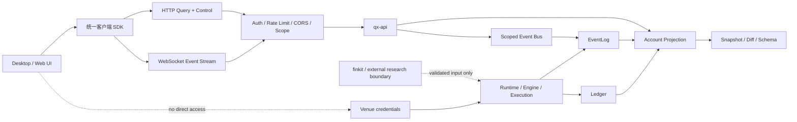

# Qianxing 桌面/Web 客户端接入与三轮终版架构优化方案

> 审计基线：`f574572ca039f4553ce9a4362ebfb827c3768302`（2026-10-03）
> 审计范围：`workspace/crates`、核心领域模型、runtime/engine、事件与执行链路、资产/市场抽象、插件与扩展、多语言绑定、finkit 集成边界、配置/存储/错误/可观测性、测试、CI、发布，以及桌面/Web 客户端接入边界。
> 结论状态：三轮审计已完成，问题清单与方案见下。**但"已修复并复验"这句只对基线 `f574572` 那一棵树成立，不对当前工作树成立**（V13 R1-F 补注，2026-10-04）：该基线现在是 HEAD `c07ad22` 的祖先、相隔 3 个提交，而 `c07ad22` 是一次按上游树整体裁定 22 份冲突的合流——下游第 8 轮（`532cea0` + `7e8f3db`）交付的一批门禁判据与模块被上游版本覆盖，已按用户裁定「以上游发布线为准（现状）」登记为**已回退，未排期**，不整批重落（名册见 `docs/自研量化框架审计与重构方案-V13.md` §9.48 / 台账 #283）。因此本文的行号引用、门禁条数与"已修复"结论在用于 HEAD 之前必须重新实测。
> 已在当前树上按代码事实复核过并落地的部分（V13 R1 轮）：浏览器接入边界——CORS 精确 allowlist、`OPTIONS` 预检、并发连接预算回 503、查询串百分号解码（R1-B）；WS 升级判定只看 `Upgrade` 头部（不读正文，防请求体劫持）并接作用域事件总线、`after` 游标与轮次上界（R1-A）——**注意：这不是"升级路径 allowlist"**，升级分支在路径路由之前按头部短路，任何路径带 `Upgrade: websocket` 都会进准入，随后由查询串作用域/游标准入把关（详见 §5 第一轮）；传输层已从 `crates/qx-api/src/lib.rs` 外置到 `crates/qx-api/src/ws.rs` 与 `transport.rs`（R1-A），本文凡引用 `lib.rs` 里的 WS/accept 行号处均已随之漂移。

## 1. 结论摘要

Qianxing 当前已经具备桌面客户端和 Web 客户端的后端接入基础。推荐把客户端定位为查询、订阅、控制和运维界面，不把客户端变成交易内核、账簿、事件日志或凭据持有者。

已经贯通并复核的主链路如下：

```text
配置与拓扑校验
    -> runtime wiring
    -> worker / strategy / scheduler
    -> market adapter / Paper execution
    -> EventLog + Ledger + control audit
    -> account projection / snapshot / diff
    -> HTTP query + WebSocket event stream
    -> desktop / Web client
```

本轮确认：

- API 请求、WebSocket 握手、账户投影、事件游标、认证、限流和 CORS 现在走统一准入边界。
- WebSocket 已按 `account_id + venue_id` 选择账户事件总线，并支持 `after` 游标续接；首次批量事件不会重复发送。
- 服务停止使用每个服务实例独立的 shutdown token；旧连接不会被下一次启动误关闭，也不会因为共享全局令牌提前退出。
- WebSocket 升级判定只看 `Upgrade` 头部、不读正文（防请求体劫持），随后由查询串作用域（`account_id + venue_id`）与 `after` 游标准入把关——**不是按路径 allowlist 拦升级**：升级分支在路径路由前短路，任何路径带 `Upgrade: websocket` 都进准入，非法/越权作用域在准入处被拒。连接数有进程级上限，查询参数支持百分号解码并拒绝非法编码。
- 前端不需要直接理解 EventLog、Ledger、存储锁、worker 队列或 finkit 内部结构。
- 仓库内已验证的是本地/Paper/回放/查询控制闭环；真实交易所生产接入、外部沙盒凭据、生产 HA 和真实 finkit 运行证据仍属于发布前置条件，不能用单元测试替代。

## 2. 推荐目标架构



### 2.1 客户端分层

建议新增一个独立的客户端契约层，不让桌面端和 Web 端各自手写 JSON：

1. `qx-client-contract`：由账户快照 schema、事件投影信封、控制命令和错误码生成稳定类型；Rust 客户端可直接复用，TypeScript 客户端从同一份 schema 生成。
2. `qx-client-transport`：封装 HTTP、WebSocket、TLS/mTLS、请求超时、重试、游标和错误映射。
3. `qx-client-store`：维护当前快照、最后事件游标、状态哈希、连接状态和 resync 状态；所有事件先经过 reducer，再更新 UI。
4. `qx-client-ui`：桌面和 Web 只消费 store，不直接拼接服务端 JSON。

客户端禁止做以下事情：

- 直接写 EventLog、Ledger、快照文件或控制状态文件。
- 在浏览器中保存交易所 API secret、Operator 私钥或 mTLS 私钥。
- 自己计算订单终态、余额权益、账户哈希或事件顺序。
- 把 `null` 钱字段解释为零。
- 把一次性 `GET /events/live` 当成永久流，或把 WebSocket 事件当成可跳过的通知。

### 2.2 桌面客户端

桌面端有两种部署模式：

| 模式 | 连接方式 | 适用场景 |
| --- | --- | --- |
| 本机开发/Paper | loopback HTTP；需要跨进程时使用本机 WebSocket | 本地回测、Paper、策略调试、开发诊断 |
| 远程运维/交易 | HTTPS + mTLS，或桌面端连接同源 BFF | 多机部署、运维控制、受管生产环境 |

桌面端建议使用 Tauri、Qt、JavaFX 或现有企业桌面壳，但壳层只负责窗口、凭据代理和本地生命周期；业务状态仍由统一客户端 SDK 管理。桌面端关闭窗口时应先取消订阅，再等待服务端 `server_shutdown` 或正常 close，不要用进程强杀代替协议收口。

### 2.3 Web 客户端

Web 端推荐同源 BFF/反向代理：

```text
Browser -> HTTPS same-origin BFF -> qx-api
                         |
                         +-> mTLS / private network / operator identity
```

这样可以把 mTLS、Operator 身份、请求审计、CSRF 防护和 venue 凭据留在服务端。若必须浏览器直连 qx-api，必须同时满足：

- 配置 `api.cors_allowed_origins` 为完整、精确的 `http(s)://host[:port]` Origin。
- 不使用 `*`，不允许路径、查询串、片段、尾斜杠和首尾空白。
- 生产环境使用 TLS/mTLS 或可信上游身份边界。
- `OPTIONS` 预检只对 allowlist Origin 返回 204，其他 Origin 403。
- 前端永远不拿 venue secret；控制请求仍需 Operator 认证和服务端授权。

## 3. 客户端与 API 的闭环协议

### 3.1 首次加载

推荐顺序：

1. `GET /health` 判断进程存活。
2. `GET /ready` 判断依赖和投影是否可用。
3. `GET /schema/account-snapshot-v1` 加载契约版本。
4. `GET /account/snapshot/envelope?account_id=&venue_id=` 获取基线、`state_hash`、`lineage` 和数据。
5. 记录 `event_seq` 作为客户端游标。
6. 连接 `GET /events/live?account_id=&venue_id=&after=<event_seq>` 的 WebSocket。

投影不存在时返回 `404 account_projection_not_found`；投影存在但尚未有快照时，列表和钱字段仍按契约返回空数组或 `null`，不能把两种情况合并。

### 3.2 增量事件和断线重连

客户端必须持久化以下状态：

| 状态 | 作用 |
| --- | --- |
| `account_id`、`venue_id` | 订阅范围 |
| `event_seq` | 续接位置 |
| `state_hash` | 快照一致性校验 |
| `schema_version` | 协议兼容判断 |
| `connection_generation` | 防止旧连接覆盖新连接 |

重连流程：

```text
WebSocket close / network error
  -> 用最后 event_seq 重连
  -> 409 event_cursor_requires_snapshot ?
       yes -> GET snapshot/envelope 或 snapshot/diff -> 校验 target_state_hash -> 重置游标
       no  -> 继续消费事件
  -> 收到 server_shutdown -> 标记计划内停机，不显示为交易故障
```

服务端发送 `resync_required` 或返回 409 时，客户端不能继续应用后续事件；必须重新获取基线。事件按序到达但 reducer 发现 `event_seq` 跳跃时，也必须主动 resync。

### 3.3 控制命令

控制操作统一使用 `POST /control/commands`，每个命令必须带请求标识、操作者身份、原因和审计上下文。客户端只显示服务端的受理状态和审计结果，不自行把 HTTP 202 当成最终成功。

推荐 UI 状态机：

```text
draft -> submitting -> accepted -> queued -> applied / rejected / manual_review
                    |
                    +-> network_unknown -> query audit / snapshot -> reconcile
```

同一 `request_id` 的重复点击必须由客户端去重，服务端仍必须保留幂等和审计语义。`accepted` 不是 `applied`，这条区别应直接体现在桌面和 Web UI 上。

## 4. 当前主体架构与实现边界

### 4.1 workspace/crates 与核心领域

- `qx-core`：金额、交易、事件、身份、重试、费用和基础领域类型，是跨 crate 的稳定语义层。
- `qx-protocol`：账户快照、投影信封、差分、跨语言 JSON/C ABI 契约。
- `qx-runtime`：运行时配置、拓扑、worker 角色、凭据可见性和环境准入。
- `qx-api`：HTTP/WS 读面、控制面、认证、限流、投影和事件订阅。
- `qx-execution`：统一执行网关、多腿屏障和提交前安全判定。
- `qx-zhenlu`：Paper 和执行侧的状态归约、成交、持仓及账簿连接。
- `qx-storage`：带 envelope、原子替换、锁和状态一致性约束的持久化。
- `qx-scheduler`：任务状态、租约、超时升级和调度时钟。
- `qx-cli`：启动、配置、回测、Paper、服务编排和发布入口。
- `qx-adapter`：Binance、CCXT 等市场适配边界；不得把远端模型直接泄漏到核心 Ledger。

领域模型的唯一事实来源仍应保持：事件是事实输入，Ledger 是账簿归约，Projection 是读模型，API 是边界，不在 UI 或适配器中复制第二套裁决。

### 4.2 runtime/engine 与执行链路

完整执行链路应保持以下顺序：

```text
runtime config validate
  -> role / environment / credential visibility
  -> market spec / fee / latency / risk binding
  -> strategy intent
  -> ExecutionGateway
  -> accepted command
  -> fill / rejection / reconcile fact
  -> Ledger reduction
  -> EventLog
  -> account projection
```

本轮没有发现生产链路中的死循环。服务 accept loop、worker loop、scheduler loop 和 WebSocket poll loop 都有明确停机条件；重试使用有界退避，不把错误重新包装成无限重试。剩余自动重试能力不足已经在能力矩阵中声明为 limitation，不是未登记的孤儿逻辑。

### 4.3 资产、市场与插件扩展

市场适配器只负责远端协议、产品规格、精度、余额和订单回报转换；交易核心只消费冻结后的产品规格和标准事件。新增 venue 时应扩展适配器注册、能力矩阵、配置模板、错误映射、回报精度门和行为测试，不得在 CLI、Paper、Ledger 和 API 各自新增一套 venue 判断。

插件或扩展机制建议采用能力接口而不是动态修改核心状态：

- `MarketDataProvider`：只读行情和数据质量。
- `ExecutionAdapter`：提交、撤销、查询、回报归一化。
- `ResearchSnapshotProvider`：提供带 lineage 和 fingerprint 的候选快照。
- `ProjectionProvider`：只读账户投影和运维报告。

扩展必须声明协议版本、能力、生命周期、超时、幂等键和错误标签；未声明能力必须 fail closed。

### 4.4 多语言绑定与 finkit 边界

Python、C ABI 和 Rust 之间只共享已经声明的稳定契约：版本、字段名、定点金额、枚举名、快照 envelope、BarFrame 和策略意图。C ABI 结构体字段顺序和宽度必须继续由头文件与 `repr(C)` 双侧门禁核对。

finkit 应被视为研究数据和因子输入边界，不是交易事实源：

- finkit 输出先经过 schema、血缘、指纹、窗口和版本校验。
- Qianxing 核心只接收已验证的 snapshot/candidate，不直接让 finkit 改 Ledger 或 EventLog。
- 物化、增量物化、计划编译、finkit 校验和动量计算当前没有完整的仓库内生产装配，应继续在能力矩阵中标为外部或未接线能力。
- 桌面/Web 客户端不直接连接 finkit；由后端编排层将已验证研究结果投影为可查询状态。

## 5. 三轮架构与链路审计

### 第一轮：主体流程和核心链路

检查重点：配置、启动、worker、执行、账簿、事件、投影、API、客户端接入是否逐段贯通。

发现并修复：

- WebSocket 在 HTTP 准入之前返回，绕过认证和限流；现已统一走 admission gate。
- WebSocket 使用全局事件总线，无法安全支撑多账户客户端；现已根据账户投影选择 scoped bus、snapshot 和 event log。
- `after` 游标只影响校验，不完整作用于首次批量事件；现已保证首批只发送游标之后的事件。
- WebSocket 升级判定改为只看 `Upgrade` 头部、不读正文（防请求体劫持），并把认证/限流/作用域统一到 admission gate。**修正（V13 R2，2026-10-04）：先前本文写的"现已限制为 `/events/live` 及兼容别名 `/ws`、`/stream`"不成立——代码里没有升级路径 allowlist，也没有 `/ws`、`/stream` 这两条路由（现有路由是 `/events` 与 GET `/events/live`）。** 升级分支在路径路由之前按头部短路，把关口在查询串作用域（`account_id + venue_id`）与 `after` 游标准入，越权/非法作用域在准入处被拒，而不是靠路径名单拦。
- 浏览器没有明确 CORS 配置和预检行为；现已增加精确 Origin allowlist 和 fail-closed 校验。
- 查询串只支持字面量账户键；现已增加 `%XX`、`+` 和非法编码处理。

第一轮结论：本地/Paper/查询控制链路已闭合，客户端可以从快照基线进入事件增量，再通过控制端点提交动作。

### 第二轮：孤儿逻辑、重复抽象、循环依赖、状态机、并发和生命周期

检查重点：是否存在无人调用的生产入口、重复裁决、循环依赖、状态跳跃、共享状态污染、无界循环和服务重启风险。

发现并修复：

- 服务实例共享 `session_shutdown`，重启或多实例时会误伤其他连接；现改为每个 serve 实例独立 shutdown token。
- WebSocket 没有进程级连接预算；现增加连接 guard 和 256 连接上限，超限明确返回 503。
- API 文件测试块使主源码超过单文件预算；现拆为受 `#[cfg(test)]` 挂载的 `qx-api/src/tests.rs`，并同步预算登记。
- 事件、账簿、执行和存储的重复口径继续由架构门禁约束；本轮未发现新增生产重复实现。
- accept、worker 和事件轮询均存在可观察停止条件；未发现死循环。测试专用依赖关系不作为生产循环依赖。

第二轮结论：核心状态机没有发现无法到达终态的新增分支；`accepted`、`queued`、`applied/rejected/manual_review` 的边界仍需由客户端显式呈现。

### 第三轮：扩展性、性能、API 稳定性和工程化成熟度

检查重点：客户端并发、长连接、跨域、兼容别名、协议版本、可观测性、测试、门禁、CI 和发布。

发现并修复：

- WebSocket 现在具有认证、限流、账户范围、游标恢复和连接上限。
- CORS 只接受精确 Origin，拒绝通配符、路径、查询串、片段、尾斜杠和空白。
- API 仍保持账户快照 schema、事件 envelope、错误码和 `null` 钱字段的稳定语义。
- 架构门禁发现测试迁移后的行数登记缺口，已补充 `maturity/line_budgets.yaml`，不是降低门禁。
- `cargo fmt`、qx-api/qx-runtime 测试和 clippy 已复验。

第三轮结论：当前 API 已适合作为桌面/Web 的受控后端；若进入公网或真实交易环境，仍必须完成外部沙盒、TLS/mTLS、部署 HA、凭据轮换和生产压力测试。

## 6. 问题清单与优先级

### P0：发布或真实交易前必须完成

| 项目 | 当前状态 | 完成标准 |
| --- | --- | --- |
| 外部 sandbox/production 验证 | 仓库无真实外部证据 | 用真实 venue sandbox 跑提交、撤单、回报迟到、重复回报、断线重连、对账和恢复演练，并保存不可篡改报告 |
| mTLS、Operator 和凭据生命周期 | 代码有边界，部署需落地 | 证书轮换、吊销、密钥不进客户端、权限最小化、审计可追溯 |
| 账户级余额生产者 | 五个账户级钱字段仍按 `null` 表示未计算 | 接入真实来源后逐字段撤销 limitation，并补 schema、哈希、端点和回放测试 |
| 生产 HA 与存储恢复 | 文件/SQLite/Postgres 有不同能力边界 | 明确单写者、锁、故障转移、备份恢复和事件游标恢复策略 |
| Web 控制安全 | API 有认证和审计，浏览器部署仍需 BFF/CSRF 策略 | 通过安全评审，控制端点不允许跨站伪造，不向浏览器暴露 venue 凭据 |

### P1：建议在客户端 MVP 前后完成

- 生成 OpenAPI/TypeScript SDK，禁止前端手写路径、字段和错误字符串。
- 实现统一 snapshot + event reducer、resync、连接代际保护和状态哈希校验。
- 为 WebSocket 增加活跃连接数、断开原因、游标重放延迟、resync 次数和每账户事件 lag 指标。
- 事件发送从逐事件锁竞争优化为有界批量、每连接预算和背压策略。
- 把 `request_id`、`command_id`、`correlation_id`、`event_seq` 贯穿前端日志、API、EventLog 和审计。
- 补 scheduler calendar/event/manual 派发、自动重试策略和 venue live pipeline 指标的生产装配。
- 为桌面端加入离线只读模式：最近快照、最后游标和明确的 stale 标记，不允许离线控制。

### P2：工程化和体验增强

- 桌面端自动更新、签名、回滚、SBOM 和版本兼容提示。
- Web 端权限感知菜单、审计时间线、事件回放和故障诊断页。
- OpenTelemetry trace 与 Prometheus 指标关联。
- API 解析器、压测、模糊测试、长连接 soak test 和跨版本兼容矩阵。
- 将兼容 WebSocket 别名标记为迁移期能力，后续在客户端全部切换到 `/events/live` 后删除。

## 7. 迁移步骤

### M0：契约冻结

冻结 schema 版本、错误码、游标语义、`null` 语义、控制命令状态和账户范围。生成 TypeScript/Rust 客户端类型，先接只读页面。

### M1：客户端只读 MVP

实现 health/ready/schema/snapshot/envelope/balances/orders/positions/ledger 页面。所有请求带超时、请求 ID 和统一错误映射；无 WebSocket 时仍可用快照查看。

### M2：实时事件

接入 scoped WebSocket；首次用 snapshot 建基线，再用 `after` 游标消费事件。实现断线重连、409 resync、服务计划内停机和游标跳跃保护。

### M3：控制面

接入 pause/resume/submit 等命令，先做 dry-run 和审计展示，再开放真实控制。服务端继续是唯一裁决者；客户端只展示 accepted、queued 和最终状态。

### M4：桌面/Web 生产化

桌面端采用 mTLS 或本地代理；Web 采用同源 BFF。完成 CSRF、权限、证书轮换、凭据隔离、限流、CORS、连接预算和部署监控。

### M5：外部验收与发布

对 Paper、sandbox、production 分别执行回放、断线、迟到回报、重复回报、存储恢复、重启和升级兼容测试。只有外部证据完整后，才把能力矩阵中的 declared limitation 改为已验证能力。

## 8. 验收标准

### 8.1 功能闭环

- 新建账户投影后，客户端能区分投影不存在、投影存在但无快照、快照存在三种状态。
- 首次快照的 `state_hash` 与事件 reducer 收敛后的哈希一致。
- WebSocket 带账户范围时只收到该账户事件；不带范围时才读取全局投影。
- `after` 重连不重复首批事件；游标过旧或超前能明确触发 resync。
- 控制命令从 accepted 到最终状态全程可在审计和事件中追踪。
- 未计算钱字段在所有客户端显示为未知/null，不显示为 0。

### 8.2 安全和并发

- 未认证控制请求为 403；无权限请求为 403；限流拒绝为 429；限流后端故障为 503。
- 未 allowlist 的 CORS Origin 预检为 403；allowlist Origin 预检为 204。
- WebSocket 升级不按路径拦（升级分支在路由前按 `Upgrade` 头部短路）；把关口是查询串作用域与游标准入——非法 `after` 为 400、缺作用域键为 400、越权/不存在的作用域为 404、游标越界为 409。超过并发连接上限（默认 256）为 503。
- 服务停止能通知已有连接并在有限时间内退出；新服务实例不会关闭旧实例不属于自己的连接。
- 浏览器、桌面端日志和崩溃报告不出现 venue secret、Operator 私钥和完整认证材料。

### 8.3 工程门禁

- `cargo fmt --all -- --check` 通过。
- `cargo test --workspace` 通过；至少包含 qx-api 的 WebSocket 升级/CORS 预检/`after` 游标测试（`crates/qx-api/tests/browser_admission.rs`）。**修正（V13 R2，2026-10-04）：先前本文写的"qx-runtime CORS 配置测试"不存在——qx-runtime 只在 `runtime_config/schema.rs` 携带 `cors_allowed_origins` 字段并显式不复制第二份校验（委托给 `qx-api` 的 `admission::CorsPolicy::parse`），CORS 校验用例落在 qx-api 侧。**
- `cargo clippy --workspace --all-targets -- -D warnings` 通过。
- `python tools/check_architecture.py` 通过，单文件预算已登记且未通过放宽门禁。
- CI 覆盖 Linux/Windows、协议兼容、长连接、存储恢复和发布包校验。

## 9. 本轮最终判断

在仓库当前实现和本轮三遍审计范围内，主体流程已从 runtime 配置贯通到执行、账簿、事件、投影和 HTTP/WebSocket 客户端边界；未发现新的生产孤儿逻辑、死循环或无法收口的核心状态链。桌面端和 Web 端应围绕稳定的 snapshot + event cursor + command audit 契约建设，不应绕过 qx-api 直接接触核心状态。

“全部联通”在本方案中指仓库内已实现并通过测试的本地/Paper/回放/查询控制链路；真实 venue 生产可用性、外部 sandbox 证据、HA、凭据轮换和 finkit 生产装配仍需按 P0 验收，不能由仓库内测试结果替代。
