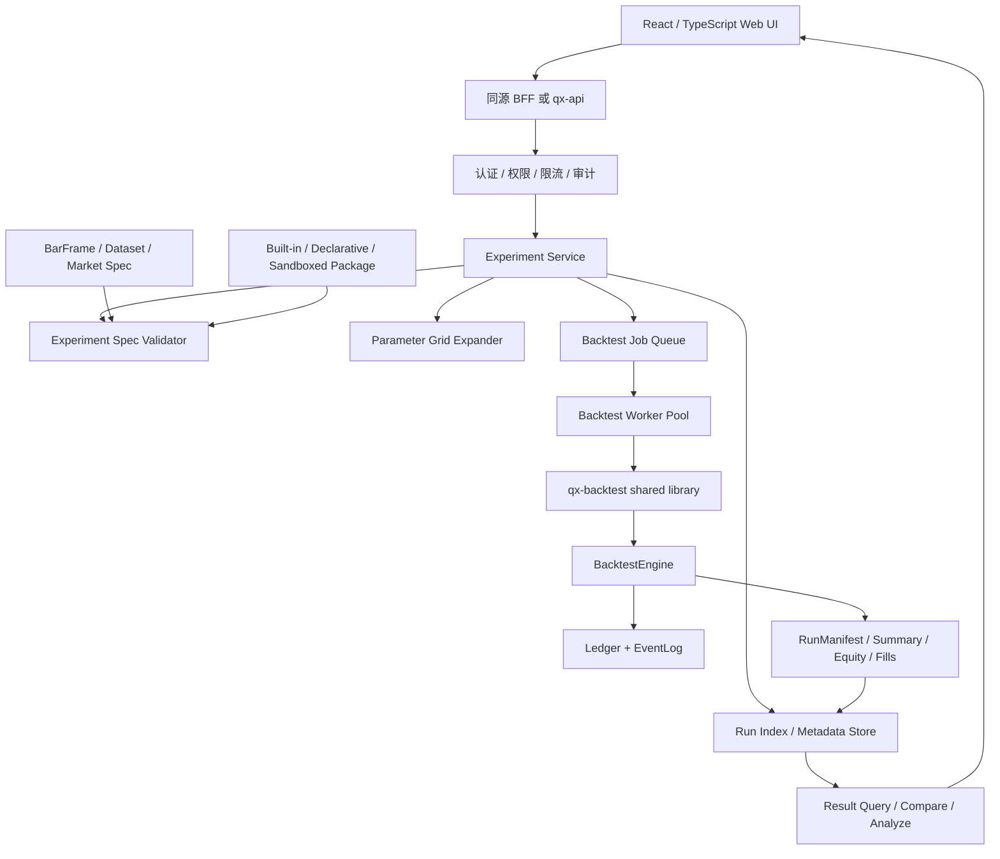

# Qianxing 量化回测 Web 平台终版优化方案

> 基于当前仓库审计基线：`f574572ca039f4553ce9a4362ebfb827c3768302`。
> 基线状态（V13 R1-F 补注，2026-10-04）：`f574572` 现在是 HEAD `c07ad22` 的祖先、相隔 3 个提交。`c07ad22` 是一次按上游树整体裁定 22 份冲突的合流——下游第 8 轮（`532cea0` + `7e8f3db`）交付的一批门禁判据与模块被上游版本覆盖，已按用户裁定「以上游发布线为准（现状）」登记为**已回退，未排期**，不整批重落（名册见 `docs/自研量化框架审计与重构方案-V13.md` §9.48 / 台账 #283）。因此本文的行号引用与"当前实现"清单在用于 HEAD 之前必须重新实测；回测 Web 化的**方案与分层边界不受此影响**。
> 目标：建设一个面向研究人员和策略开发者的 Web 回测系统，支持基础回测、自定义策略、多参数实验、结果对比和可复现分析。
> 原则：复用现有 Rust 回测内核、BarFrame、RunManifest、事件重放和产物校验，不在 Web 层复制第二套撮合、账簿或风控逻辑。

## 1. 终版结论

当前项目已经具备回测 Web 化的核心基础：

- 已有 Bar 回测、L1/L2 深度回测、双腿多策略回测和 `fast-backtest` 并行回测入口。
- 已有统一撮合、费用、延迟、市场规格、风险、Ledger、EventLog 和可重放产物链路。
- 已有 `summary.json`、`equity.csv`、`fills.csv`、`run_manifest.json`、`result_hash`、输入指纹和 schema 版本。
- 已有 `qx-api` 的认证、限流、账户投影、事件游标、WebSocket 和 CORS 边界，可作为 Web 平台的基础 API 层。

但当前 API 仍主要面向运行时查询和控制，尚未提供完整的回测实验 HTTP 编排接口。因此 Web 平台不能直接把 CLI 命令拼接到浏览器，也不能在 API 进程中直接执行用户上传代码。需要增加一层回测实验服务，将 Web 请求转换为受约束的实验、任务和结果查询。

推荐目标链路：

```text
Browser
  -> Web UI
  -> BFF / qx-api
  -> Experiment Service
  -> Scheduler / Backtest Worker
  -> qx-backtest shared library
  -> BacktestEngine / ExecutionGateway / Ledger
  -> EventLog + RunManifest + result artifacts
  -> Result Index / Analysis API
  -> Web charts and comparison tables
```

最终目标不是把 CLI 搬到浏览器，而是把现有确定性回测能力包装成可追踪、可取消、可复现、可比较的研究工作流。

## 2. 产品范围与边界

### 2.1 MVP 必须支持

1. 选择数据集、标的、周期、时间区间、撮合模型、费用模型、延迟模型和初始资金。
2. 选择内置策略或上传一个受控策略包。
3. 编辑策略参数并运行单次回测。
4. 配置参数网格或参数列表，批量运行实验。
5. 查看任务状态、运行日志、进度、错误和取消结果。
6. 查看收益曲线、净值、回撤、成交、费用、换手、胜率、盈亏比和风险指标。
7. 多参数结果表排序、筛选、二维热力图和 Pareto 前沿。
8. 对比多个 run，并查看参数、输入指纹、成本假设和结果哈希。
9. 导出 JSON、CSV、图表数据和可复现运行配置。

### 2.2 MVP 不包含

- 浏览器直接连接交易所并实盘下单。
- 浏览器执行任意 Python、JavaScript、Rust 或 C++ 代码。
- 在浏览器中生成或修改 EventLog、Ledger、RunManifest。
- 用前端公式重算收益、回撤、费用或资金曲线并作为最终结果。
- 把参数优化结果直接视为生产策略或自动下单信号。
- 未经验证的 finkit 因子结果直接进入交易或回测账簿。

这些边界必须写进产品权限和 API 契约，避免 Web 系统逐步演变成第二个交易内核。

## 3. 推荐系统架构



### 3.1 服务边界

| 层 | 职责 | 禁止事项 |
| --- | --- | --- |
| Web UI | 表单、实验配置、图表、结果对比、任务状态 | 不执行撮合、不写文件、不持有交易凭据 |
| BFF/qx-api | 会话、认证、CORS、CSRF、请求转发、审计 | 不复制回测算法 |
| Experiment Service | 实验规格、参数展开、幂等、队列、取消、状态机 | 不直接接受未经校验的任意命令 |
| Backtest Worker | 执行单个受控 run、写产物、发布事件 | 不直接暴露监听端口、不读用户私有网络 |
| qx-backtest | 复用现有回测装配、引擎、Ledger 和报告 | 不为 Web 再维护一套内核 |
| Result Index | 索引元数据和结果摘要，支持排序筛选比较 | 不替代 EventLog 和原始产物 |
| Artifact Store | 保存 RunManifest、summary、equity、fills、日志和输入快照 | 不允许客户端任意路径写入 |

## 4. 现有项目如何结合

### 4.1 提取共享回测服务库

当前回测入口主要位于 `qx-cli`。Web API 不应通过 shell 启动 `qx-cli backtest` 作为长期方案，因为这会带来进程回收、日志截断、取消、状态同步、重复装配和错误映射问题。

建议增加 `crates/qx-backtest` 或 `crates/qx-research`，把当前 `qx-cli/src/backtests` 中可复用的装配和运行入口下沉为库：

- `BacktestRequest`：单次回测输入。
- `BacktestAssembly`：数据、市场规格、成本、延迟、撮合、账户和规则绑定。
- `BacktestRunner`：执行、取消检查、进度事件和产物提交。
- `BacktestReport`：summary、metrics、result_hash、input_fingerprint 和 artifact refs。
- `BacktestError`：配置错误、数据错误、策略错误、运行时错误、存储错误和取消。

`qx-cli` 和 Experiment Service 都调用这套库；CLI 只负责命令行参数和标准输出，Web 只负责 HTTP/事件协议。这样可以保证同一输入在 CLI 和 Web 中得到相同的 `result_hash`。

### 4.2 复用现有回测能力

| 现有能力 | Web 化方式 |
| --- | --- |
| `backtest` / `strategy backtest` | 单次 Bar 回测任务 |
| `backtest builtin` | 内置策略选择器 |
| `backtest book --fill-tier l1/l2` | 深度回测模式，MVP 可先只开放 Bar |
| `backtest multi-builtin` | 双腿/多腿实验类型，P1 开放 |
| `fast-backtest` | 参数网格和多任务并行的底层执行模型 |
| BarFrame / DatasetBundle | 数据集选择、预览和输入指纹 |
| Market Spec / cost rules | 交易成本和产品规格面板 |
| RunManifest | 可复现性、运行详情和产物血缘 |
| summary/equity/fills | 结果详情、曲线、成交和导出 |

### 4.3 不改变核心事实来源

Web 平台必须遵守以下事实归属：

- 行情事实来自已验证的 BarFrame 或深度帧。
- 策略输出只是 OrderIntent，不是成交事实。
- 成交、拒单、费用和资金变化进入统一事件流。
- Ledger 是账户归约的唯一来源。
- summary 是运行产物，不是前端计算结果。
- Result Index 只索引已完成或明确失败的运行，不改写原始产物。

## 5. 实验领域模型

### 5.1 Experiment

实验是用户提交的一组研究意图，不等于单个运行：

```json
{
  "experiment_id": "exp_01J...",
  "name": "macd_grid_btc_1h",
  "owner_id": "user_123",
  "dataset_id": "bars_btcusdt_1h_2020_2025",
  "strategy_ref": "builtin:macd",
  "base_config": {
    "instrument": "BTC/USDT",
    "timeframe": "1h",
    "start": "2020-01-01T00:00:00Z",
    "end": "2025-01-01T00:00:00Z",
    "initial_cash_raw": 100000000000000,
    "fill_model": "next_bar_open",
    "cost_rules_ref": "cost:spot-default-v1"
  },
  "parameters": {
    "fast_period": [8, 12, 16],
    "slow_period": [24, 36, 48],
    "signal_threshold": [0.0, 0.001, 0.002]
  },
  "execution": {
    "max_parallel": 4,
    "max_runs": 100,
    "seed": 42
  }
}
```

实验提交时必须经过规范化和哈希：

```text
canonical experiment spec
  -> schema validation
  -> parameter type/range validation
  -> Cartesian product expansion
  -> max_runs / resource quota check
  -> experiment_hash
  -> deterministic run_id for each combination
```

### 5.2 Run

每一个参数组合生成一个不可变 run：

| 字段 | 说明 |
| --- | --- |
| `run_id` | 单次运行唯一标识 |
| `experiment_id` | 所属实验 |
| `parameter_hash` | 规范化参数哈希 |
| `input_fingerprint` | 数据集、规则和规格输入指纹 |
| `config_fingerprint` | 完整运行配置指纹 |
| `status` | queued/running/succeeded/failed/cancelled |
| `result_hash` | 运行结果哈希 |
| `artifact_refs` | summary/equity/fills/manifest/logs 引用 |
| `metrics` | 可排序的标准指标快照 |
| `error` | 稳定错误码、阶段和诊断 |

同一个 `experiment_hash + parameter_hash + input_fingerprint + engine_version` 默认幂等。重复提交应复用已有成功结果，或明确创建新的 rerun。

### 5.3 状态机

```text
draft
  -> validating
  -> queued
  -> running
  -> succeeded
  -> failed
  -> cancelled
  -> expired
```

状态约束：

- `queued` 只能由校验成功的实验生成。
- `running` 必须绑定一个 worker lease。
- `succeeded` 必须同时存在 summary、RunManifest、result_hash 和指标索引。
- `failed` 必须包含阶段、稳定错误码和可读诊断。
- `cancelled` 必须写入取消原因，不能伪装为失败。
- 终态不可回退；重新运行生成新 run。

## 6. 自定义策略方案

### 6.1 分阶段开放策略能力

| 阶段 | 支持方式 | 风险 |
| --- | --- | --- |
| MVP | 内置策略 + 声明式 JSON/YAML 策略参数 | 低，容易验证和复现 |
| P1 | 受控 Python 策略 worker，独立进程、只读输入、资源配额 | 中，需要沙箱和依赖锁定 |
| P1 | WASM 策略插件，固定 ABI、无网络、无文件写入 | 中低，适合跨平台 |
| P2 | Rust/C++ 编译策略包 | 高，需要编译隔离、签名和 ABI 兼容 |

MVP 不建议允许用户在服务端提交任意脚本并直接执行。策略包必须带 manifest：

- `strategy_id`、版本和作者。
- 入参 schema、默认值、类型、范围和枚举。
- 输出 schema，只允许 OrderIntent 或信号结果。
- 依赖锁定和代码/包哈希。
- 支持的数据层级、市场类型和时间周期。
- 资源预算、超时和最大输出量。

### 6.2 策略执行安全

策略执行环境必须：

- 无法访问公网和交易所凭据。
- 只能读取授权的数据快照。
- 只能写入临时沙箱目录。
- 有 CPU、内存、文件大小、日志量和 wall-clock 限制。
- 超时、崩溃、输出非法或输出过大时终止 run。
- 将 stdout/stderr 作为诊断附件保存，禁止把异常文本直接当成稳定错误码。

策略代码产生的任何数量都必须经过核心层的定点、精度、风险和产品规格检查；前端传入的 quantity、price 或资金数不能跳过核心闸门。

## 7. Web API 设计

现有 `/health`、`/ready`、`/schema/account-snapshot-v1`、`/metrics`、账户投影和 `/events/live` 继续保留。新增回测 API 建议使用 `/research` 命名空间，避免和交易控制面混淆。

### 7.1 实验接口

| 方法 | 路径 | 作用 |
| --- | --- | --- |
| `POST` | `/research/experiments` | 创建并校验实验 |
| `GET` | `/research/experiments` | 按 owner、状态、时间分页查询 |
| `GET` | `/research/experiments/{id}` | 查看实验规格和展开统计 |
| `POST` | `/research/experiments/{id}/runs` | 展开并入队运行 |
| `POST` | `/research/experiments/{id}/cancel` | 取消尚未完成的 run |
| `GET` | `/research/experiments/{id}/runs` | 分页查询运行结果 |
| `GET` | `/research/runs/{id}` | 查看单次运行状态和指标 |
| `POST` | `/research/runs/{id}/cancel` | 取消单次运行 |
| `GET` | `/research/runs/{id}/artifacts/{name}` | 下载受控产物 |
| `GET` | `/research/runs/{id}/events` | 查询运行事件 |
| `GET` | `/research/compare?run_ids=...` | 多 run 对比 |
| `POST` | `/research/analysis` | 创建指标、分组和排序分析任务 |
| `GET` | `/research/analysis/{id}` | 获取分析结果和图表数据 |

路径、错误码和字段应进入 OpenAPI/schema，并从同一份契约生成 TypeScript client。不要让前端直接拼接 CLI 参数。

### 7.2 实时任务事件

复用现有 scoped event bus 和 WebSocket，但增加 research job projection 或明确的事件 kind：

- `experiment_created`
- `run_queued`
- `run_started`
- `run_progress`
- `run_log_chunk`
- `run_succeeded`
- `run_failed`
- `run_cancelled`
- `analysis_completed`

`run_progress` 不应每个 Bar 都发送；按时间间隔、处理比例或固定批次做有界采样，避免事件总线被日志淹没。完整日志和每笔成交留在 artifact，客户端按需分页读取。

### 7.3 错误模型

错误必须分层：

| 类型 | 示例 | HTTP |
| --- | --- | --- |
| 请求错误 | schema_invalid、parameter_type_invalid | 400 |
| 权限错误 | authenticated_operator_required、forbidden | 403 |
| 资源错误 | dataset_not_found、run_not_found | 404 |
| 冲突错误 | duplicate_experiment、run_already_terminal | 409 |
| 配额错误 | max_runs_exceeded、quota_exceeded | 429 |
| 任务失败 | strategy_failed、data_invalid、engine_failed | 200 查询终态内表达；提交接口不伪装成功 |
| 服务错误 | queue_unavailable、artifact_store_unavailable | 503 |

用户看到的错误文案可以本地化，但稳定错误码、阶段、run_id、correlation_id 和诊断引用必须保留。

## 8. 多参数实验与分析设计

### 8.1 参数展开

参数展开必须在服务端完成并记录：

- 参数总数、实际 run 数和被拒参数数。
- 每个组合的规范化 JSON 和 `parameter_hash`。
- 参数类型、上下界、步长和枚举值。
- 最大组合数、并行度、超时和预计资源。
- 随机搜索或采样策略的 seed。

支持三种模式：

1. Grid Search：参数笛卡尔积，适合小规模可解释实验。
2. Random Search：有 seed 的随机采样，适合高维参数。
3. User List：用户直接提交有限组合，适合复现实验。

Bayesian optimization、遗传算法和在线优化放到 P2；在没有稳定结果索引和资源隔离前，不要过早引入。

### 8.2 指标口径

基础指标必须由服务端统一计算并写入结果快照：

- final_equity、total_return、annualized_return。
- max_drawdown、drawdown_duration、volatility、sharpe。
- trade_count、win_rate、profit_factor、avg_win、avg_loss。
- turnover、fees、funding、rejected_count。
- exposure、cash_ratio、time_in_market。

每个指标必须声明：

- 输入字段。
- 时间窗口。
- 是否使用收盘后信息。
- 缺失值和零值语义。
- 年化基准和无风险利率。
- 版本号。

前端只能展示服务端指标，不能在不同页面分别实现 Sharpe、回撤或年化收益公式。

### 8.3 对比分析

结果页分为四层：

1. 运行概览：状态、策略、数据集、参数、版本和结果哈希。
2. 指标表：每行一个 run，支持排序、筛选、固定基准和导出。
3. 可视化：净值曲线、回撤曲线、月度收益、成交分布、费用占比和参数热力图。
4. 归因与复核：参数差异、输入指纹、成本假设、成交明细和失败原因。

对比必须先检查兼容维度：dataset fingerprint、instrument、timeframe、时间区间、currency、fill model、cost rules、engine version。不可兼容的 run 只能并列展示，不能计算差值或合并曲线。

## 9. 数据、存储和可复现性

### 9.1 数据集注册

增加 Dataset Registry，记录：

- dataset_id、名称、版本、schema_version。
- instrument、venue、timeframe、start、end、行数。
- BarFrame digest、数据来源、复权和公司行为规则。
- 文件/object 引用和可用状态。
- owner、权限、创建时间和过期策略。

Web 页面展示的数据集不能只扫描目录；必须从 Registry 查询并验证文件指纹。

### 9.2 存储分层

| 数据 | 推荐存储 | 原因 |
| --- | --- | --- |
| Experiment/Run 元数据 | SQLite/Postgres | 分页、状态、索引、并发更新 |
| 原始 BarFrame/深度帧 | 文件或对象存储 | 大文件、不可变、按 digest 寻址 |
| summary/metrics | 数据库索引 + 原始 JSON | 查询快且保留原文 |
| equity/fills/logs | 对象存储或受控文件存储 | 体积大、按需下载 |
| EventLog | 现有事件存储 | 保持事实流唯一性 |

Run Index 不能替代原始产物。任何指标索引都必须能通过 `artifact_refs` 回到 summary 和 RunManifest，并可以重新计算。

### 9.3 失败恢复

- worker 获得 lease 后必须有超时和心跳。
- API 重启不应丢失 queued/running 的可恢复状态。
- worker 崩溃后 run 进入 retryable_failed 或 failed，不得永久卡在 running。
- artifact 写完后再写 succeeded 索引。
- 取消必须可观测；不能只中断进程而留下成功结果。
- 结果索引与原始产物不一致时，读取接口 fail closed 并标记 corruption。

## 10. 性能和资源治理

### 10.1 并发模型

按三个维度限流：

- 用户级：最大并发实验、最大运行数、每日 CPU 时间。
- 项目级：数据集并发读取、对象存储带宽、分析任务数量。
- 服务级：worker 数、单 worker 并发、队列长度、WebSocket 连接数。

`max_parallel` 由服务端最终裁剪，不能由用户无限增大。参数组合总量超过上限时，在入队前拒绝。

### 10.2 执行优化

- 同一 dataset fingerprint 的多个 run 共享只读数据映射或缓存。
- 同一 experiment 的参数 run 可复用解析后的策略和市场规格，但不能共享可变 Ledger。
- 进度事件按批次发送，成交和 equity 结果按流式文件写入。
- 大结果页面使用分页、列裁剪和 downsampling；浏览器不加载全部 fills。
- 结果对比优先读取 metrics summary，用户展开时才读取完整曲线。

### 10.3 避免错误优化

- 不为 UI 响应而跳过输入指纹和重放校验。
- 不因为参数实验数量多而放宽精度、费用或风险校验。
- 不在数据库中保存一份会被前端修改的“最终收益”。
- 不用随机 worker 完成顺序作为实验结果排序依据；排序必须按指标和稳定 tie-breaker。

## 11. 安全、权限和审计

建议角色：

| 角色 | 能力 |
| --- | --- |
| Viewer | 查看已授权数据集和结果 |
| Researcher | 创建实验、运行回测、导出结果 |
| Maintainer | 注册数据集、策略包和成本规则 |
| Operator | 取消任务、维护队列和存储 |
| Admin | 用户、权限、配额和系统配置 |

数据集、策略包、实验和结果都要带 owner/project ACL。用户只能读取有权限的数据集和 artifact；结果比较不能通过传入任意 run_id 绕过权限。

策略代码和日志是潜在敏感内容：

- 上传文件做大小、类型、压缩炸弹和路径穿越检查。
- artifact 下载使用短期签名 URL 或受控代理。
- 运行日志脱敏，不输出环境变量、文件系统路径中的 secret 和服务凭据。
- 所有创建、取消、删除、下载和权限变更进入审计。

## 12. 前端页面规划

### 页面一：工作台

- 最近实验、运行中任务、失败任务和资源额度。
- 最近数据集、策略版本和收藏的对比视图。
- 显示系统版本、API 连接状态和事件游标状态。

### 页面二：实验配置

分为数据、策略、成本、执行和参数五个步骤：

1. 数据：选择 Dataset、标的、周期、时间范围和数据质量状态。
2. 策略：选择内置策略或策略包，自动显示参数 schema。
3. 成本：选择费用、滑点、延迟、资金费和市场规格。
4. 执行：初始资金、fill model、并行度、seed 和 run 上限。
5. 参数：单值、范围、枚举、网格、随机采样和预计组合数。

提交前显示“实际将运行 N 个组合”，并要求用户确认资源消耗。

### 页面三：运行监控

- 实验总进度和每个 run 状态。
- 当前阶段：queued、loading_data、running、writing_artifacts、indexing。
- 取消按钮、错误诊断和重试入口。
- 不直接显示每条内部日志；日志按阶段和级别筛选。

### 页面四：结果分析

- 指标排行表。
- 多曲线叠加。
- 参数二维热力图。
- Pareto 前沿。
- 成交、费用、回撤和月度收益明细。
- 选择多个 run 后进入对比模式。

### 页面五：运行详情和复现

- 展示完整实验规范化 JSON。
- 展示 input/config/engine/result hash。
- 展示数据集、规则、成本和策略版本。
- 一键导出复现包或生成 CLI 命令。
- 复现时必须使用相同输入指纹和引擎版本；环境不同只能标记为非严格复现。

## 13. 分阶段实施计划

### P0：后端基础和只读结果

- 抽取 `qx-backtest` 共享库，保证 CLI/Web 同源。
- 设计 Experiment、Run、Dataset、StrategyPackage、ArtifactRef schema。
- 增加 Run Index 和 artifact store 适配层。
- 增加单次回测 API和任务状态 API。
- 接入现有 summary、equity、fills、RunManifest。
- 建立 OpenAPI、TypeScript SDK、权限和审计。
- Web 完成数据集、实验、运行详情和基础指标页面。

### P1：参数实验和实时监控

- 参数 grid/list/random 展开。
- 复用 `fast-backtest` 的并行隔离能力。
- 增加 scoped research events、进度和取消。
- 增加指标表、曲线、回撤和成交分析。
- 增加结果兼容性检查、比较和导出。
- 接入资源配额、worker lease、失败恢复和重试。

### P1.5：受控自定义策略

- 先开放声明式策略。
- 再开放 Python 或 WASM 受控执行。
- 引入策略包签名、依赖锁定、资源配额和沙箱。
- 增加策略输出契约、非法输出测试和恶意策略测试。

### P2：高级研究能力

- 深度回测、多腿组合和跨市场结果归因。
- 参数优化器、实验模板、研究报告和版本对比。
- finkit 已验证快照接入，不直接接入交易事实链。
- 研究结果审批后才能进入 Paper；Paper 到实盘仍需独立权限和外部验收。

## 14. 测试与 CI 验收

### 14.1 契约测试

- OpenAPI 与实际 qx-api 路由集合一致。
- TypeScript 类型与 Rust schema 字段一致。
- 所有错误码在文档、服务端和客户端均有登记。
- `null`、空数组、资源不存在、游标过旧和运行失败语义一致。

### 14.2 回测一致性测试

- 同一输入从 CLI、API、队列 worker 执行得到相同 `result_hash`。
- 同一参数重复提交命中幂等结果。
- 改动数据集、成本、撮合、规则或策略版本会改变 input/config fingerprint。
- 篡改 BarFrame、RunManifest、summary 或 fills 会被发现并拒绝。
- 中途取消不会被报告为成功。

### 14.3 实验测试

- 参数展开数量与预估数量一致。
- 超过 max_runs、配额或并发上限时在入队前拒绝。
- 一个参数组合失败不会污染其他 run。
- worker 崩溃、超时、重启和重复消息不会产生重复成功结果。
- 对比结果拒绝混合不同数据指纹或不兼容维度。

### 14.4 安全测试

- 策略无法访问网络、凭据和未授权文件。
- 用户无法读取其他项目的 dataset、run 和 artifact。
- artifact 路径穿越、压缩炸弹、超大日志和恶意依赖被拒绝。
- WebSocket、CORS、CSRF、限流和审计与现有 API 边界一致。

### 14.5 工程门禁

- workspace test、clippy、fmt 和 architecture gate 全部通过。
- Linux/Windows 构建和发布包可安装。
- Web 前端做依赖锁定、静态扫描、source map 权限和版本兼容检查。
- 发布物包含 OpenAPI、schema、CLI 复现说明和变更日志。

## 15. 终版验收标准

系统达到 MVP 完成标准必须同时满足：

1. 用户可以从 Web 创建一个单次回测并查看结果。
2. 用户可以提交参数网格，看到每个组合的独立状态和结果。
3. 用户可以按指标筛选、排序、比较并导出结果。
4. Web 与 CLI 对同一输入得到相同结果哈希。
5. 结果页面可以回溯数据集、策略、成本、撮合、引擎和输入指纹。
6. 失败、取消、超时和 worker 崩溃都有明确终态。
7. 自定义策略不能越过沙箱、资源限制和核心风险校验。
8. 未授权用户无法访问数据集、实验和结果。
9. 前端不计算最终交易指标，不直接接触 EventLog、Ledger 或 venue secret。
10. 全部 API、事件、错误码和状态机都有契约测试。

## 16. 最终建议

实施顺序必须是：

```text
先抽共享回测库
  -> 再做 Experiment / Run / Dataset 契约
  -> 再做单次回测 API
  -> 再做参数实验和结果索引
  -> 再做实时监控与分析
  -> 最后开放受控自定义策略
```

最重要的架构决策是：Web 系统只做实验编排和结果呈现，Qianxing 核心继续负责唯一的撮合、账簿、事件、风险和可复现性口径。只要坚持这一边界，桌面/Web 客户端、参数实验、多策略对比和后续研究能力都可以在不破坏现有交易内核的前提下逐步扩展。
